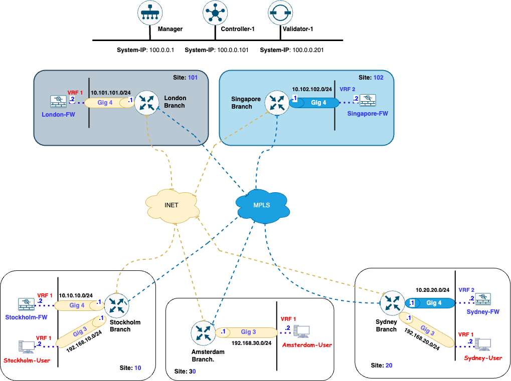
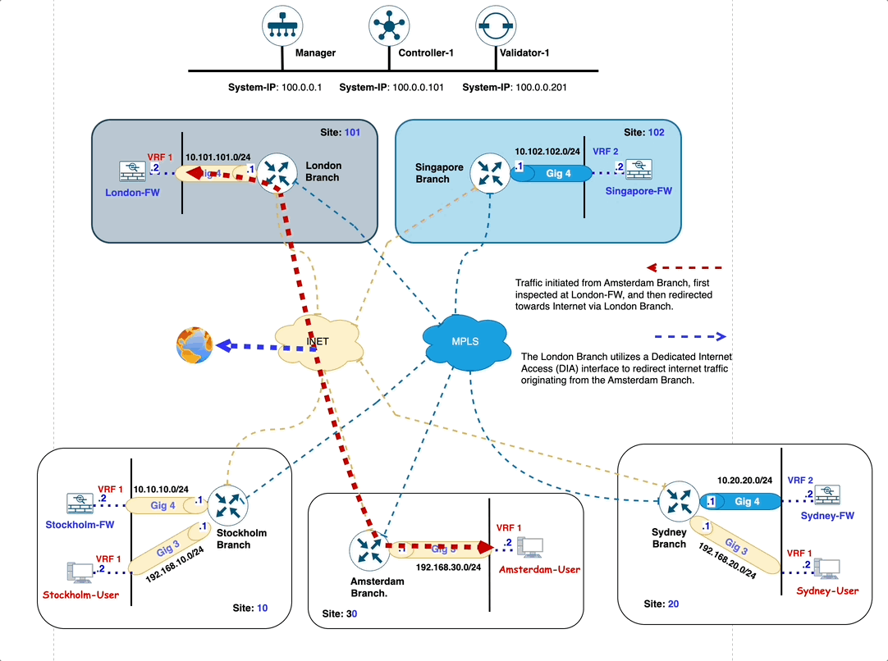

# Amsterdam-Branch WAN-Edge Router Unable to Join Fabric and Traffic Inspection Requirements

## Description:
The IT Administrator is in the process of bringing the **Amsterdam-Branch** online; however, the **Amsterdam-Branch** WAN-Edge router is facing issues and is unable to join the **SD-WAN fabric**. This is preventing the branch from establishing connectivity with other sites within the network and **Internet**.

Priority: **High**

### Topology Diagram

{usemap="#image-map"}
<map name="image-map">
     <area target="_self" alt="Stockholm-Branch" title="Stockholm-Branch" href="telnet://127.0.0.1:9009" coords="232,611,28" shape="circle">
     <area target="_self" alt="Stockholm-FW" title="Stockholm-FW" href="telnet://127.0.0.1:9010" coords="37,594,70,618" shape="rect">
     <area target="_self" alt="Stockholm-User" title="Stockholm-User" href="telnet://127.0.0.1:9011" coords="35,678,74,707" shape="rect">
     <area target="_self" alt="Amsterdam-Branch" title="Amsterdam-Branch" href="telnet://127.0.0.1:9000" coords="406,665,25" shape="circle">
     <area target="_self" alt="Amsterdam-User" title="Amsterdam-User" href="telnet://127.0.0.1:9001" coords="587,649,623,673" shape="rect">
     <area target="_self" alt="Sydney-Branch" title="Sydney-Branch" href="telnet://127.0.0.1:9012" coords="783,606,23" shape="circle">
     <area target="_self" alt="Sydney-FW" title="Sydney-FW" href="telnet://127.0.0.1:9013" coords="948,583,982,610" shape="rect">
     <area target="_self" alt="Sydney-User" title="Sydney-User" href="telnet://127.0.0.1:9014" coords="949,677,983,700" shape="rect">
     <area target="_self" alt="London-Branch" title="London-Branch" href="telnet://127.0.0.1:9004" coords="293,206,29" shape="circle">
     <area target="_self" alt="London-FW" title="London-FW" href="telnet://127.0.0.1:9005" coords="101,191,135,216" shape="rect">
     <area target="_self" alt="Singapore-FW" title="Singapore-FW" href="telnet://127.0.0.1:9008" coords="714,186,753,212" shape="rect">
     <area target="_self" alt="Controller-1" title="Controller-1" href="telnet://127.0.0.1:9002" coords="429,29,30" shape="circle">
</map>

### Intent

The IT Administrator aims to achieve full connectivity between all sites, ensuring seamless communication across the SD-WAN fabric.
Additionally, any traffic destined for the **Internet** must be inspected by the **London-Firewall** before being routed through the **London-Branch** WAN-Edge router to the **Internet**.

### Action Required

- Investigate and resolve the issue preventing the **Amsterdam-Branch** WAN-Edge router from joining the fabric.
- Verify and ensure that the configuration aligns with the desired intent of achieving **site-to-site connectivity**.
- Implement the necessary policies to ensure that all **Internet-bound** traffic is directed to the **London-Firewall** for inspection and subsequently routed to the Internet through the **London-Branch** WAN-Edge router.
- The IT Administrator has already **configured** the **Amsterdam-Branch policy** on the SD-WAN Manager. **Activate the policy** and verify that it is correctly configured to achieve the intended objectives.
### Intended Traffic Flow Diagram

The following diagram illustrates the **flow of traffic for the Amsterdam-Branch**.

<figure markdown>
  
</figure>