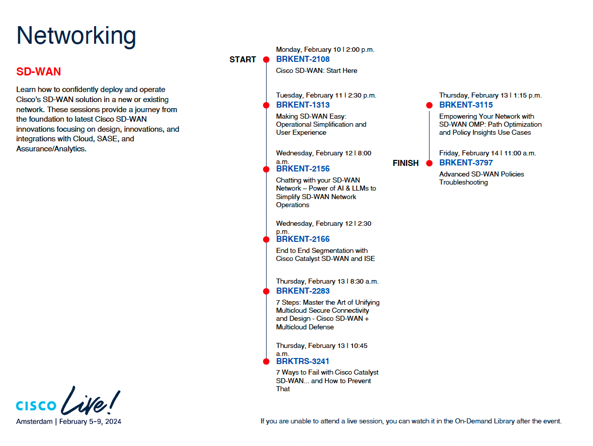

# Conclusion

By participating in this lab, you’ve gained a deeper understanding of critical SD-WAN concepts like route leaking and service insertion, as well as practical experience in troubleshooting common deployment challenges. With these new skills, you’re equipped to enhance your network’s performance, security, and cost-efficiency by implementing seamless VPN communication and optimizing your Catalyst SD-WAN architecture. Whether you're optimizing traffic flow across multiple VPNs or embedding essential network services into your infrastructure, the strategies and best practices you’ve learned will empower you to create a more resilient and efficient network.

As you apply these techniques in your real-world deployments, you’ll be able to solve complex issues, improve operational agility, and deliver better outcomes for your organization’s network needs.

## SD-WAN Learning Map 

If you're eager to dive deeper into SD-WAN technology and discover more advanced techniques, we invite you to explore additional sessions and resources that will further expand your expertise in this transformative field.

<figure markdown>
  
</figure>
