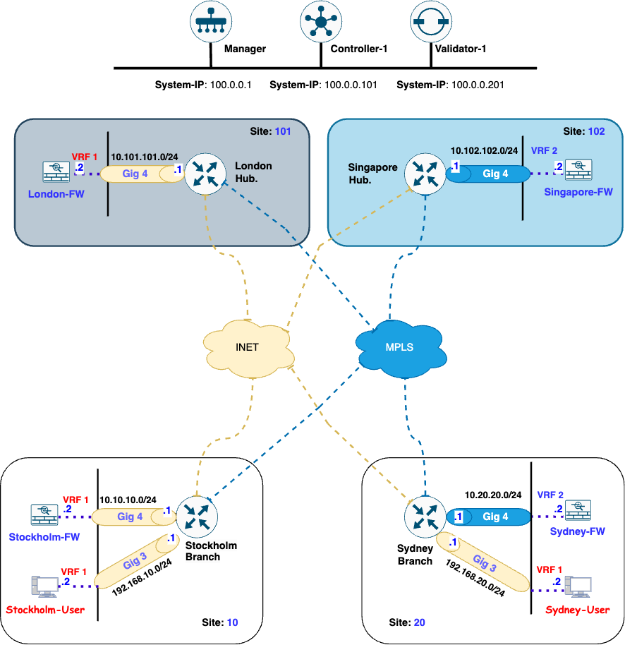

# Lab Topology Overview and Connectivity Verification

## Understanding the Lab Topology
This lab features a topology comprising four WAN-Edge routers strategically deployed across two regions: **EMEA** and **APAC**. In the **EMEA region**, the routers are located in **London** and **Stockholm**, while in the **APAC region**, they are deployed in **Singapore** and **Sydney**. Each WAN-Edge router is integrated with a <font color="red">**firewall**</font>, which is essential for redirecting traffic for inspection across various use cases. The deployment leverages two transport types ***Internet*** and ***MPLS*** to provide reliable connectivity between the WAN-Edge routers across regions. This setup creates a robust environment for simulating real-world traffic routing and inspection scenarios.

## Device Connectivity and Interfaces

In the lab topology, each WAN-Edge router is configured with dual transport connectivity: the **GigabitEthernet 1** interface is connected to the **Internet transport**, while the **GigabitEthernet 2** interface is connected to the **MPLS transport**. For simplification, the deployment includes a single SD-WAN validator (vBond) and a single SD-WAN controller (vSmart), each assigned the following **system ip** mentioned in below table.

| Device               | System IP   |
|----------------------|-------------|
| Validator  (vBond)   | 100.0.0.201 |
| Controller (vSmart)  | 100.0.0.101 |
| Manager    (vManage) | 100.0.0.1   |

Additionally, the **GigabitEthernet 4** interface on each region WAN-Edge router is connected to a <font color="red">**firewall**</font> within the service VPN. <font color="orange">***Branch users***</font> are also part of the service VPN and are connected to the WAN-Edge routers through the **GigabitEthernet 3** interface, as shown in the topology diagram. This setup enables seamless traffic flow and inspection while ensuring a realistic representation of enterprise network environments.

Each WAN-Edge router is uniquely identified by a **system ip** address, as detailed in the table below. These system IPs are critical for establishing secure communication and management within the SD-WAN fabric, enabling streamlined routing, control, and policy enforcement across the network. The table provides a clear mapping of each WAN-Edge router to its respective system IP address for reference throughout the lab.

| Device             | System IP |
|:-------------------|-----------|
| London    WAN-Edge | 10.0.0.1  |
| Singapore WAN-Edge | 10.0.0.2  |
| Stockholm WAN-Edge | 10.1.1.1  |           
| Sydney    WAN-Edge | 10.1.1.2  |


## Topology diagram

<figure markdown>
  
</figure>

## Lab Connectivity

To verify the SD-WAN fabric's control connections, we can utilize following show commands to confirm that each WAN-Edge router has established a control connection with the SD-WAN controllers, including the **SD-WAN Manager (vManage, System IP: 100.0.0.1)** and the **SD-WAN Controller (vSmart, System IP: 100.0.0.101)**. Additionally, it is crucial to validate that OMP (Overlay Management Protocol) peering is established with the SD-WAN Controller, as this is essential for route exchange and policy enforcement.

- show sdwan control local-properties
- show sdwan control connections
- show sdwan omp peers
- show sdwan bfd sessions table
- show sdwan tunnel statistics table 

!!! info
    Each WAN-Edge router in the topology is configured with the default username and password combination (**admin**/**admin**).


Initially, the WAN-Edge routers are configured for full mesh connectivity. Due to the use of the **restrict** option under the TLOC configuration, IPSec tunnels and BFD sessions are established only among TLOCs with matching colors. As a result, each WAN-Edge router will establish a total of **6 IPSec tunnels and 6 BFD sessions**, ensuring robust and efficient connectivity within the SD-WAN fabric.


## Verifying Lab Connectivity

The first step is to verify that the certificates are correctly installed on each WAN-Edge router, as they are essential for establishing secure communication within the SD-WAN fabric. 

``` { .ios, .no-copy }
Stockholm-Branch#show sdwan control local-properties 
personality                       vedge
sp-organization-name              cml-sdwan-lab-tool
organization-name                 cml-sdwan-lab-tool
root-ca-chain-status              Installed
root-ca-crl-status                Not-Installed

certificate-status                Installed
certificate-validity              Valid
certificate-not-valid-before      Nov 26 14:23:05 2024 GMT
certificate-not-valid-after       Nov 24 14:23:05 2034 GMT

enterprise-cert-status            Not Applicable
enterprise-cert-validity          Not Applicable
enterprise-cert-not-valid-before  Not Applicable
enterprise-cert-not-valid-after   Not Applicable

dns-name                          validator.sdwan.local
site-id                           10
domain-id                         1
protocol                          dtls
tls-port                          0
system-ip                         10.1.1.1
chassis-num/unique-id             C8K-3D1A8960-6E76-532C-DA93-50626FC5797E
serial-num                        42F4AE15
subject-serial-num                N/A
enterprise-serial-num             No certificate installed
token                             Invalid
keygen-interval                   1:00:00:00
retry-interval                    0:00:00:17
no-activity-exp-interval          0:00:00:20
dns-cache-ttl                     0:00:00:00
port-hopped                       TRUE
time-since-last-port-hop          13:12:53:22
embargo-check                     success
device-role                       edge-router
region-id-set                     N/A
mrf-migration-mode                disabled
mrf-management-region             no
number-vbond-peers                1

INDEX   IP                                      PORT
----------------------------------------------------
0       172.16.0.201                            12346  

number-active-wan-interfaces      2

          
 NAT TYPE: E -- indicates End-point independent mapping
           A -- indicates Address-port dependent mapping
           N -- indicates Not learned
           Note: Requires minimum two vbonds to learn the NAT type

                         PUBLIC          PUBLIC PRIVATE         PRIVATE                                 PRIVATE                        WAN   MAX   RESTRICT/           LAST         SPI TIME    NAT  VM          BIND
INTERFACE                IPv4            PORT   IPv4            IPv6                                    PORT    VS/VM COLOR            STATE CNTRL CONTROL/     LR/LB  CONNECTION   REMAINING   TYPE CON REG     INTERFACE
                                                                                                                                                   STUN                                              PRF IDs
--------------------------------------------------------------------------------------------------------------------------------------------------------------------------------------------------------------------------
GigabitEthernet1              172.16.1.10     12386  172.16.1.10     ::                                      12386    1/1  biz-internet     up     2     yes/yes/no   No/No  0:00:00:00   0:11:17:15  N    5  Default N/A                           
GigabitEthernet2              172.16.2.10     12386  172.16.2.10     ::                                      12386    1/0  mpls             up     2     yes/yes/no   No/No  0:00:00:00   0:11:17:15  N    5  Default N/A                           
```

Additionally, ensure that all interfaces are operational and in an "up" state. This validation is critical to confirm that the devices are properly configured and ready for subsequent tasks in the lab.

```{ .ios, .no-copy}
Stockholm-Branch#show ip interface brief 
Interface              IP-Address      OK? Method Status                Protocol
GigabitEthernet1       172.16.1.10     YES other  up                    up      
GigabitEthernet2       172.16.2.10     YES other  up                    up      
GigabitEthernet3       192.168.10.1    YES other  up                    up      
GigabitEthernet4       10.10.10.1      YES other  up                    up      
GigabitEthernet5       unassigned      YES unset  up                    up      
GigabitEthernet6       unassigned      YES unset  up                    up      
GigabitEthernet7       unassigned      YES unset  up                    up      
GigabitEthernet8       unassigned      YES unset  up                    up      
Sdwan-system-intf      10.1.1.1        YES unset  up                    up      
vmanage_system         unassigned      YES unset  up                    up      
Loopback65528          192.168.1.1     YES other  up                    up      
Loopback65529          11.1.1.1        YES other  up                    up      
NVI0                   unassigned      YES unset  up                    up      
Tunnel1                172.16.1.10     YES TFTP   up                    up      
Tunnel2                172.16.2.10     YES TFTP   up                    up      
Stockholm-Branch#
```

Next, verify that the control connections are successfully established with the SD-WAN Manager (vManage) and the SD-WAN Controller (vSmart) on each WAN-Edge device. This step ensures that the WAN-Edge routers are fully integrated into the SD-WAN fabric. 

```{ .ios, .no-copy}
Stockholm-Branch#show sdwan control connections
                                                                                          PEER                                          PEER                                          CONTROLLER
PEER    PEER    PEER            SITE       DOMAIN PEER                                    PRIV  PEER                                    PUB                                           GROUP
TYPE    PROT    SYSTEM IP       ID         ID     PRIVATE IP                              PORT  PUBLIC IP                               PORT  ORGANIZATION            LOCAL COLOR     PROXY STATE UPTIME      ID
-------------------------------------------------------------------------------------------------------------------------------------------------------------------------------------------------------------
vsmart  dtls    100.0.0.101     100        1      172.16.0.101                            12346 172.16.0.101                            12346 cml-sdwan-lab-tool      biz-internet    No    up     0:00:45:19 0           
vsmart  dtls    100.0.0.101     100        1      172.16.0.101                            12346 172.16.0.101                            12346 cml-sdwan-lab-tool      mpls            No    up     0:00:45:19 0           
vmanage dtls    100.0.0.1       100        0      172.16.0.1                              12746 172.16.0.1                              12746 cml-sdwan-lab-tool      biz-internet    No    up     0:00:45:19 0           
```

Additionally, confirm that OMP (Overlay Management Protocol) peering is active on each WAN-Edge router, as this is critical for route exchange and the implementation of SD-WAN policies.

```{ .ios, .no-copy}
Stockholm-Branch#show sdwan omp peers 
R -> routes received
I -> routes installed
S -> routes sent

TENANT                             DOMAIN    OVERLAY   SITE      REGION                                
ID        PEER             TYPE    ID        ID        ID        ID        STATE    UPTIME           R/I/S  
-----------------------------------------------------------------------------------------------------------------
0         100.0.0.101      vsmart  1         1         100       None      up       13:13:06:55      6/6/4
```

Verify that if BFD session established among all the WAN-Edges in the topology.

``` { .ios, .no-copy}
Stockholm-Branch#show sdwan bfd sessions 
                                      SOURCE TLOC      REMOTE TLOC                                      DST PUBLIC                      DST PUBLIC         DETECT      TX                              
SYSTEM IP        SITE ID     STATE       COLOR            COLOR            SOURCE IP                                       IP                                              PORT        ENCAP  MULTIPLIER  INTERVAL(msec  UPTIME          TRANSITIONS   
-----------------------------------------------------------------------------------------------------------------------------------------------------------------------------------------------------------------------------------------------------
10.1.1.2         20          up          biz-internet     biz-internet     172.16.1.10                                     172.16.1.20                                     12366       ipsec  7           1000           0:00:46:34      2             
10.0.0.1         101         up          biz-internet     biz-internet     172.16.1.10                                     172.16.1.101                                    12346       ipsec  7           1000           0:00:46:34      4             
10.0.0.2         102         up          biz-internet     biz-internet     172.16.1.10                                     172.16.1.102                                    12346       ipsec  7           1000           0:00:46:33      2             
10.1.1.2         20          up          mpls             mpls             172.16.2.10                                     172.16.2.20                                     12366       ipsec  7           1000           0:00:46:34      2             
10.0.0.1         101         up          mpls             mpls             172.16.2.10                                     172.16.2.101                                    12346       ipsec  7           1000           0:00:46:34      4             
10.0.0.2         102         up          mpls             mpls             172.16.2.10                                     172.16.2.102                                    12346       ipsec  7           1000           0:00:46:34      2             

Stockholm-Branch# 
```

!!! hint
    To quickly verify OMP peering across the SD-WAN fabric, log in to the SD-WAN Controller (vSmart) and confirm that OMP peering is successfully established with all WAN-Edge routers using show command **show omp peers**. This step ensures that the control plane is fully operational, allowing the exchange of routes and policies between the vSmart controller and all WAN-Edge devices.