# Lab 1a - Route traffic from Stockholm to Sydney via local firewall in Stockholm in same VRF using <font color="grey">**Data Policy**</font>

## Introduction

In this lab exercise, you will explore the traffic flow from a user located in the **EMEA-Stockholm-Branch (site-10)** to a user situated at the **APAC-Sydney-Branch (site-20)**.

Here is a breakdown of the key components involved in the network path:

- **Source:** The traffic originates from a **Stockholm-User** user in the **EMEA-Stockholm-Branch (site-10)**.
- **Destination:** The intended recipient is a **Sydney-User** in the **APAC-Sydney-Branch (site-20)**.
- **Firewall:** All traffic passes through a **firewall (Stockholm-FW)**, which is hosted locally at the **EMEA-Stockholm-Branch (site-10)**.
- **WAN Edge Router:** The **Stockholm-Branch** WAN-Edge router, facilitates the traffic's reachability to the firewall, configured in ***<font color="#9AAFCB">VRF-1</font>***, and subsequent routing towards the destination.

Ensure that each component is properly configured and verify the traffic flow is going through **Stockholm-FW**.

!!! note
    Through this lab, firewall is configured to inspect traffic automatically in **inspect mode**, ***<font color="red"> without requiring any additional configuration</font>***. This inspection ensures that only safe and authorized traffic flows through the network, enhancing security and protecting against potential threats.

## Intended Traffic Flow Diagram

The following diagram illustrates the **<font color="orange">flow of traffic within the network for this scenario</font>**. Traffic is initiated from the **Stockholm-User** and is first redirected to the **Stockholm-Firewall** for <font color="orange">**inspection**</font>. After the traffic undergoes inspection, it is then forwarded to the **Sydney-User** in the **Sydney Branch**. This scenario demonstrates how traffic is securely routed through the firewall for inspection before reaching its final destination, ensuring that security policies are applied effectively within the SD-WAN fabric.
<figure markdown>
  
</figure>

## Traffic flow without any policy

In the initial configuration, without applying any traffic policies, the routes learned from the **Sydney-Branch** are distributed equally across both TLOCs, leveraging ECMP (Equal-Cost Multi-Path) for optimal path selection.

```{.ios, .no-copy}

Stockholm-Branch#show sdwan omp routes vpn 1 192.168.20.0/24  
Generating output, this might take time, please wait ...
Code:
C   -> chosen
I   -> installed
Red -> redistributed
Rej -> rejected
L   -> looped
R   -> resolved
S   -> stale
Ext -> extranet
Inv -> invalid
Stg -> staged
IA  -> On-demand inactive
U   -> TLOC unresolved
BR-R -> Border-Router reoriginated
TGW-R -> Transport-Gateway reoriginated
R-TGW-R -> Reoriginated Transport-Gateway reoriginated

                                                                                                                                                AFFINITY                                 
                                                      PATH                      ATTRIBUTE                                                       GROUP                                    
TENANT    VPN    PREFIX              FROM PEER        ID     LABEL    STATUS    TYPE       TLOC IP          COLOR            ENCAP  PREFERENCE  NUMBER      REGION ID   REGION PATH      
-----------------------------------------------------------------------------------------------------------------------------------------------------------------------------------------
0         1      192.168.20.0/24     100.0.0.101      1      1003     C,I,R     installed  10.1.1.2         mpls             ipsec  -           None        None        -                
                                     100.0.0.101      2      1003     C,I,R     installed  10.1.1.2         biz-internet     ipsec  -           None        None        -                
```

To verify this, we initiate a ping from the **Stockholm-User** (**<font color="#9AAFCB">IP: 192.168.10.2</font>**) to the **Sydney-User** (**<font color="#9AAFCB">IP: 192.168.20.2</font>**). A successful ping response confirms that reachability between the two branches is intact.

```{.ios, .no-copy}
Stockholm-User:~$ ping 192.168.20.2
PING 192.168.20.2 (192.168.20.2): 56 data bytes
64 bytes from 192.168.20.2: seq=0 ttl=42 time=4.002 ms
64 bytes from 192.168.20.2: seq=1 ttl=42 time=4.058 ms
64 bytes from 192.168.20.2: seq=2 ttl=42 time=2.677 ms
64 bytes from 192.168.20.2: seq=3 ttl=42 time=2.955 ms
64 bytes from 192.168.20.2: seq=4 ttl=42 time=3.034 ms
^C
--- 192.168.20.2 ping statistics ---
5 packets transmitted, 5 packets received, 0% packet loss
round-trip min/avg/max = 2.677/3.345/4.058 ms
Stockholm-User:~$ 
```
Additionally, traffic originating from the **Stockholm-Branch** flows directly to the **Sydney-Branch** via the available TLOCs, ensuring efficient and balanced connectivity in the absence of traffic policies.

```{.ios, .no-copy}
Stockholm-User:~$ traceroute 192.168.20.2 -n 
traceroute to 192.168.20.2 (192.168.20.2), 30 hops max, 46 byte packets
 1  192.168.10.1  1.048 ms  0.582 ms  0.548 ms
 2  172.16.1.20  1.449 ms  172.16.2.20  1.098 ms  1.440 ms
 3  192.168.20.2  2.551 ms  2.358 ms  1.750 ms
```

!!! note
    In the traceroute above, we observe that the traffic is currently routed over the **INET** TLOC. However, it is also possible for the traffic to use the **MPLS** TLOC, as SD-WAN employs ECMP (Equal-Cost Multi-Path) to balance traffic across all available TLOCs.

Following Table exhibit how traffic is flowing from **Stockholm-User** to **Sydney-User**.

| Interface         | IP Address   | Description                                                                                                                                   |
|-------------------|--------------|-----------------------------------------------------------------------------------------------------------------------------------------------|
| GigabitEthernet 3 | 192.168.10.1 | <font color="#9AAFCB"> **Stockholm-Branch** WAN-Edge interface in **<font color="#A8C6A5">VRF 1</font>** connected with **Stockholm-User**.   |
| GigabitEthernet 1 | 172.16.1.20  | <font color="#9AAFCB"> **Sydney-Branch** WAN-Edge interface **INET TLOC**.</font>                                                             |
| eth0              | 192.168.20.2 | <font color="#9AAFCB"> **Sydney-User** IP address.</font>                                                                                     |

## Configuring Service-Chain in Configuration Group

Next, we will configure a service chain within the service-profile parcel in the configuration group by following the 
below steps. 

This service chain defines the sequence of services that will be applied to traffic originating 
from the **Stockholm-Branch** and destined for the **Sydney-Branch**. 

By specifying the service chain in the configuration, we instruct the **Stockholm WAN-Edge** on the type of services to be applied to the traffic, 
such as redirection through a firewall. 

This configuration ensures that the desired service policies are enforced 
as traffic flows between the branches.

1. From the vManage Landing Page, navigate to the left-hand panel, select Configuration, and click Configuration Groups.
   { .off-glb }
2. Locate and click on the **EMEA-Stockholm-Branch** Configuration Group as illustrated below.
   { .off-glb }
3. Click the edit { .off-glb, width=25 } icon for the **EMEA-Stockholm-Branch - Service Profile** as illustrated below.   
   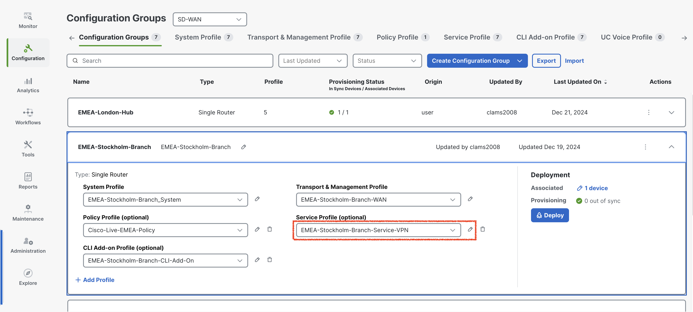{ .off-glb }
4. Select **<font color="#9AAFCB">Add New Feature</font>** and add a <font color="orange">**Service Chain Attachment Gateway**</font> as illustrated below.
   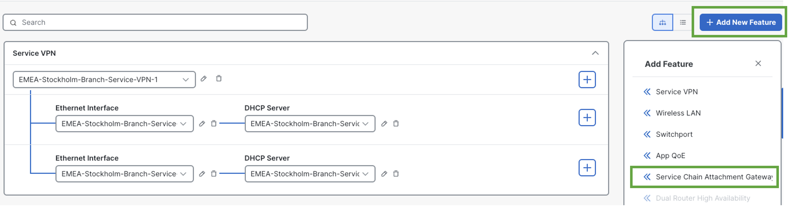{ .off-glb }
5. In the <font color="orange">**Service Chain Attachment Gateway**</font> configuration parcel, click the dropdown arrow and select **Add New**.
   { .off-glb }
6. On the **Service Chain Attachment Gateway** configuration page, provide ***Name*** and ***Description*** for the attachment gateway. For example, use the name **<font color="orange">Stockholm-Branch-Service-Attachment</font>**.
   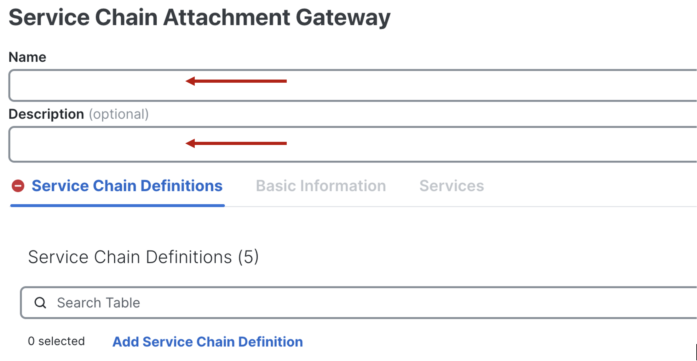{ .off-glb }
7. Click **Add Service Chain Definition** to define the service chain. 
   { .off-glb }
8. Enter the name **Stockholm-Firewall-SC-Def** and Description **Stockholm-Firewall-SC-Def** for the service chain definition.
9. Select a **Service Type** <font color="red">**Firewall**</font> by click dropdown and click **<font color="orange">Save</font>**
   { .off-glb }
10. Under Basic Information, enter **VPN** <font color="orange">**1**</font>.
11. Scroll down to **IPv4 Attachment**: <font color="orange">(1 Interface)</font>.
    { .off-glb }
12. Enter **Service IPv4 Address <font color="#9AAFCB">10.10.10.2</font>**. This is the IP address of **Stockholm Firewall (***<font color="green">Stockholm-FW</font>***)**.
13. Enter SD-WAN Router Interface as **GigabitEthernet4** and click <font color="orange">**Save**</font>. 
    { .off-glb }
    The **GigabitEthernet4** interface on the **Stockholm-Branch** WAN-Edge router serves as the connection point for the **Stockholm-FW firewall**. This interface facilitates the integration of the firewall into the service chain, allowing traffic to be redirected through the firewall for inspection or policy enforcement as configured. The proper configuration of this interface is crucial for ensuring seamless communication between the WAN-Edge router and the firewall, enabling the desired security and traffic management features within the SD-WAN environment.
14. Click **Back** at bottom left.
    { .off-glb }
15. As we add the **Service Attachment Gateway Definition**, now configuration group for **EMEA-Stockholm-Branch** is now marked as <font color="red">out of sync</font>.Click **Stockholm-Branch** Configuration Group -> Click **<font color="green">Deploy**</font>.
    { .off-glb }
16. In **Deploy Configuration Group** page, select **EMEA-Stockholm-Branch** by clicking the square Radio Button and Click **Next**.  
    { .off-glb }
17. Click **Import**, and load **EMEA-Stockholm-Branch.csv** file which loads all the values for the variables.
    { .off-glb }
18. After uploading the **CSV files**, click on **Preview CLI** to review the configuration changes before deployment. This step ensures that the service-chain gateway definition is correctly included in the configuration. By previewing the CLI, you can verify that all required parameters have been accurately applied and are ready for deployment. This validation step is critical to confirm that the service chain configuration aligns with the intended design and will function as expected once deployed.
    { .off-glb }
19. Scroll down the **New Configuration** section to locate the **service-chain number** highlighted in <font color="#9AAFCB">**blue**</font>. <font color="red">Make a note of this number</font>, as it will be required when configuring the data policy in later sections.
    The **service-chain number** is a <font color="red">critical identifier</font> used to link the service chain definition to the appropriate policy, ensuring that traffic is processed through the configured service chain as intended.
    { .off-glb } 
20. After finalizing the configuration, click **Cancel** to exit the current screen and then click **Deploy** to initiate the deployment process. Once the deployment is triggered, navigate to the **View Deployment Status** section to monitor the progress. Wait until the deployment status indicates **<font color="green">Success</font>**, confirming that the configuration has been successfully applied to the relevant devices.
    { .off-glb } 
21. To verify the configuration group status, click on the **EMEA-Stockholm-Branch** configuration group. Ensure that the **Associated row indicates <font color="orange">1</font> device**, confirming that the configuration group is correctly linked to the **Stockholm-Branch** WAN-Edge router. Additionally, check that the Provisioning row displays **<font color="orange">0 out of sync</font>** indicating that the configuration has been successfully deployed and is fully synchronized with the device. This step ensures that the configuration group is correctly applied and functioning as intended.
    { .off-glb }

## Verification of Service Chain configuration on Stockholm-Branch

In the Cisco SD-WAN architecture, service nodes communicate their available services to the **SD-WAN Controller (vSmart)** using the **Overlay Management Protocol (OMP)** with the service route address family. Each WAN-Edge router is responsible for advertising its service routes to the SD-WAN Controller (vSmart), which then maintains these service routes within its **Routing Information Base (RIB)**. 

**<font color="green">Notably, the SD-WAN Controller (vSmart) controller does not propagate these service routes to other WAN-Edge routers within the SD-WAN fabric</font>**. Instead, the service label, which is advertised by WAN-Edge router in the service route to the SD-WAN Controller (vSmart), plays a crucial role. If traffic destined for a particular vRoute needs to traverse a service, the SD-WAN Controller (vSmart) controller replaces the vRoute’s label with the service label.

```{ .ios, .no-copy, linenums="1", hl_lines="23 24"}
Stockholm-Branch#show sdwan omp services       
C   -> chosen
I   -> installed
Red -> redistributed
Rej -> rejected
L   -> looped
R   -> resolved
S   -> stale
Ext -> extranet
Stg -> staged
IA  -> On-demand inactive
Inv -> invalid
BR-R -> Border-Router reoriginated
TGW-R -> Transport-Gateway reoriginated
R-TGW-R -> Reoriginated Transport-Gateway reoriginated

                                                                                 AFFINITY                            
ADDRESS                                                         PATH   REGION    GROUP                               
FAMILY   TENANT    VPN    SERVICE  ORIGINATOR  FROM PEER        ID     ID        NUMBER      LABEL    STATUS    VRF  
---------------------------------------------------------------------------------------------------------------------
ipv4     0         1      VPN      10.1.1.1    0.0.0.0          66     None      None        1003     C,Red,R   1    
                                               0.0.0.0          68     None      None        1003     C,Red,R   1    
         0         1      SC7      10.1.1.1    0.0.0.0          66     None      None        1009     C,Red,R   1    
                                               0.0.0.0          68     None      None        1009     C,Red,R   1    
ipv6     0         1      VPN      10.1.1.1    0.0.0.0          66     None      None        1003     C,Red,R   1    
                                               0.0.0.0          68     None      None        1003     C,Red,R   1    
```

To verify the service chain configuration on the **Stockholm-Branch** WAN-Edge router, access the device CLI and execute the command:

- **show platform software sdwan service-chain database**. 

Review the output to confirm the following details: the **<font color="green">Service Chain ID (e.g., SC7)</font>**, the **<font color="green">VRF (e.g., vrf: 1)</font>**, and the State, which should display **UP** to indicate proper functionality. 

Additionally, verify that the Service is set to **<font color="green">FW (Firewall)</font>**, the TX and RX interface is **GigabitEthernet4**, and the associated IP address is **10.10.10.2**. This verification ensures that the service chain configuration is active and correctly aligned with the intended design.

```{ .ios, .no-copy, linenums="1", hl_lines="3 4 5 6 9 17 20" }
Stockholm-Branch#show platform software sdwan service-chain database 

Service Chain: SC7
   vrf: 1
   label: 1009
   state: up
   description:  Stockholm-Firewall-SC-Def

   service: FW
      sequence: 1
      track-enable: true
      state: up
      ha_pair: 1
         type: ipv4
         posture: trusted
         active: [current]
            tx: GigabitEthernet4, 10.10.10.2
                endpoint-tracker: auto
                state: up
            rx: GigabitEthernet4, 10.10.10.2
                endpoint-tracker: auto
                state: up
```
## Configuring Centralized Data Policy for Traffic Steering 

Next, we will configure a **centralized data policy** to ensure that traffic initiated from the **Stockholm-User** destined for the **Sydney-User** is first inspected by the **Stockholm-FW** before reaching its destination. This policy enforces the required traffic inspection by leveraging the service chain defined earlier. During the configuration, we will use the **service-chain number** that was previously configured and noted in **<font color="green">step 19</font>**. This centralized policy ensures that traffic adheres to the intended security and inspection workflow within the SD-WAN fabric.

1. To begin configuring the centralized data policy, navigate to the left-hand pane in the SD-WAN Manager (vManage) interface. From there, select Configuration, followed by Classic, and then click on Policies. 
   { .off-glb .small .center }
2. Under the Centralized Policy section, click Add Policy to create a new policy. This will initiate the process of defining and implementing the centralized data policy to enforce traffic inspection and routing as per the lab requirements.
   { .off-glb .small .center }
3. To create the required **Groups of Interest**, start by selecting **Data Prefix** from the left navigation pane within the **Centralized Policy** configuration window. Follow these steps:
   { .off-glb .small .center }
   1. Click **New Data Prefix List** to define the first prefix list:
      1. Data Prefix List Name: **Internet**
      2. Internet Protocol: IPv4 
      3. Add Data Prefix: **8.8.8.8/32, 4.2.2.2/32**
   2. Click **New Data Prefix List** again to define the second prefix list:
      1. Data Prefix List Name: **Stockholm-Branch-User**
      2. Internet Protocol: IPv4 
      3. Add Data Prefix: **192.168.10.0/24**
   3. Click **New Data Prefix List** once more to define the third prefix list:
      1. Data Prefix List Name: **Sydney-Branch-User**
      2. Internet Protocol: IPv4 
      3. Add Data Prefix: **192.168.20.0/24**
  { .off-glb .small .center }
4. To configure the required **Site Lists** and **VPN List** for the centralized data policy, follow these steps:
   1. Navigate to **Site** in the left navigation pane:
      1. Click **New Site List** to create the first site list:
         1. Site List Name: **Stockholm-Branch**
         2. Add Site: **10** 
      2. Click **New Site List** again to create the second site list:
         1. Site List Name: **Sydney-Branch**
         2. Add Site: **20**
   { .off-glb .small .center }
   2. Navigate to **VPN** in the left navigation pane. 
      1. Click **New VPN List** to create the **VPN list**:
      2. VPN List Name: **VPN-1**
      3. Add VPN: <font color="orange">1</font>
   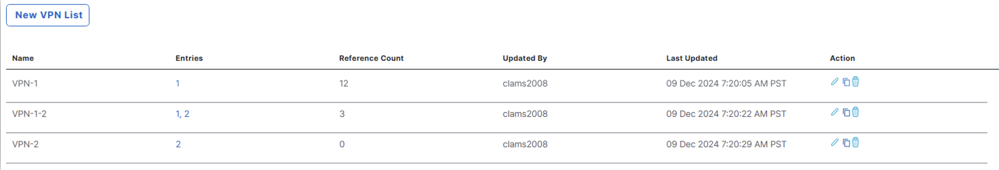{ .off-glb .small .center }
   3. Once the lists are configured, scroll down and click **<font color="green">Next</font>** to proceed with the policy creation process.
5. To proceed with configuring traffic rules for the centralized data policy, click **Next** to navigate to the **Configure Traffic Rules** configuration section. 
   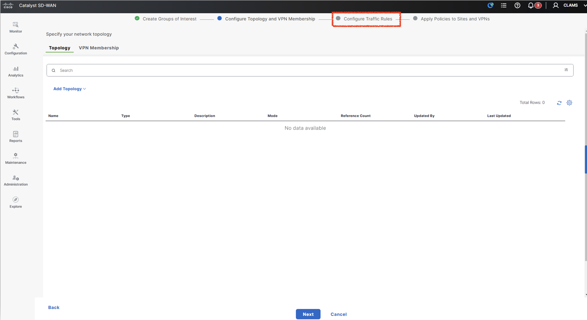{ .off-glb .small .center }
6. Under the heading Choose a tab and add **Traffic rules** under the selected type, select the **Traffic Data** tab.
   { .off-glb .small .center }
7. Next, click on the **Add Policy** dropdown menu and choose **Create New** to begin defining the traffic rules for the policy. 
   This step allows you to specify how traffic should be handled within the SD-WAN fabric based on the configured criteria.
   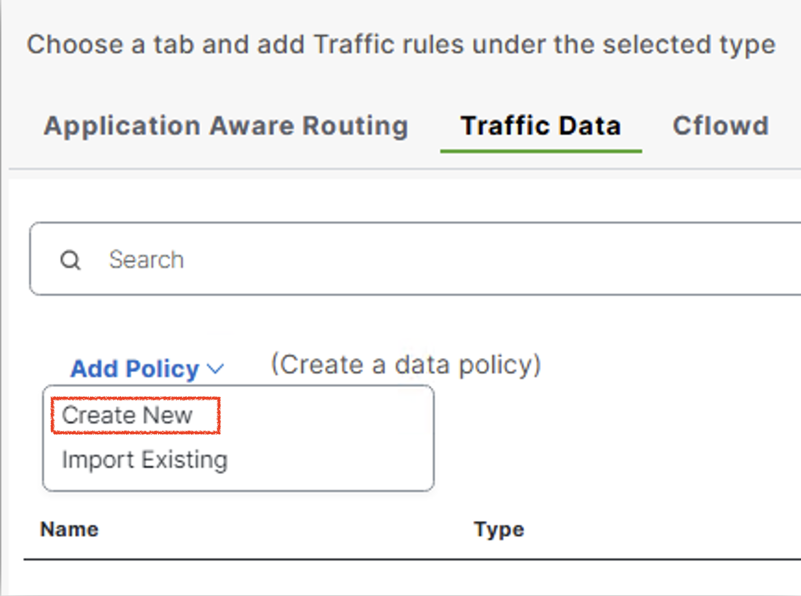{ .off-glb .small .center }
8. To create a new data policy, enter the **Name** as **Scenario-1-Data-Policy** and provide the **Description** as **Scenario-1-Data-Policy**. 
   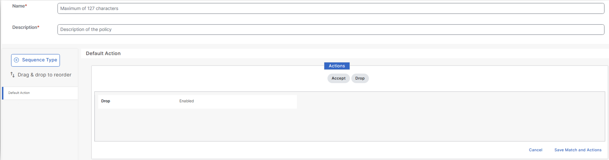{ .off-glb .small .center }
9. Next, click on the **Default Action** icon to configure the **default behavior** of the policy. 
   Under the **Actions section**, select **<font color="green">Accept</font>** to ensure that unmatched traffic is allowed by default. Once done, click **Save** and **Match** to confirm the settings.
10. To configure the data policy, begin by clicking **Sequence Type**. In the Add Data Policy pop-up window, select **Custom** as the sequence type to define a tailored policy.
    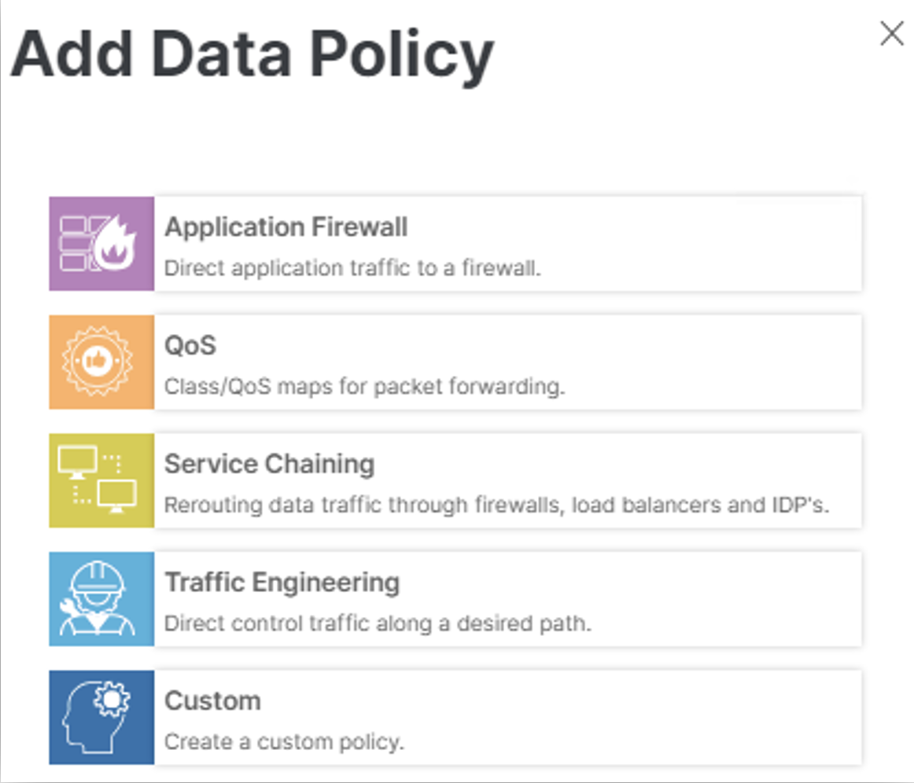{ .off-glb .small .center }
11. Click **Sequence Rule**.
    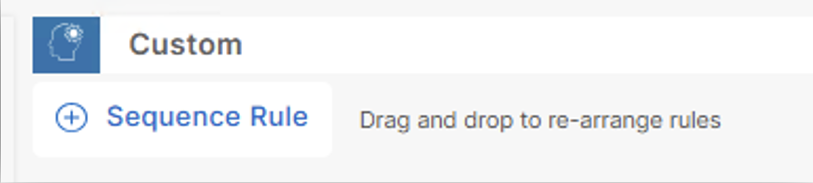{ .off-glb .small .center }
12. Click **Match** and **<font color="green">Scroll right</font>** to select and click **Source Data Prefix**. 
    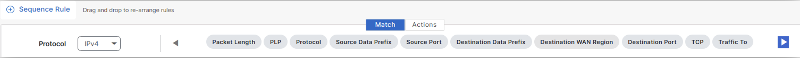{ .off-glb .small .center }
13. Under **Match Conditions**. Click in box with **Source Data Prefix List** and select > **Stockholm-Branch-User**.
    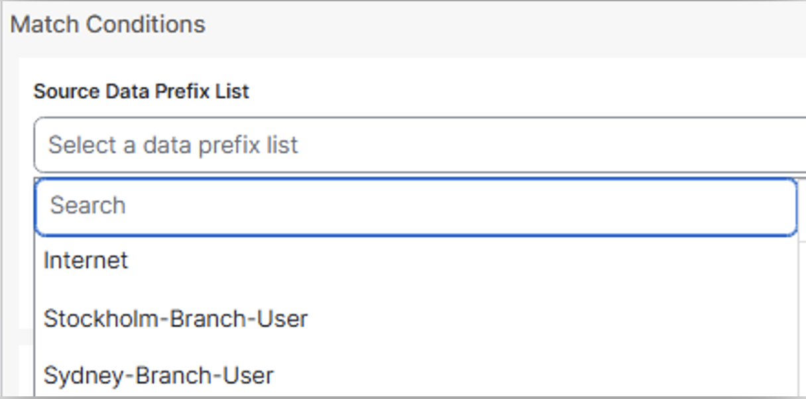{ .off-glb .small .center }
14. Click **Match** and **<font color="green">Scroll right</font>** to select and click **Destination Data Prefix**.
    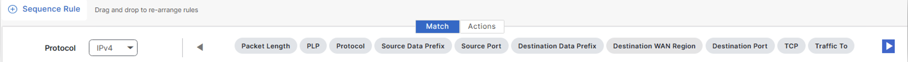{ .off-glb .small .center }
15. Under **Match Conditions**, Scroll down and click in box with **Destination Data Prefix List** and select > **Sydney-Branch-User**.
    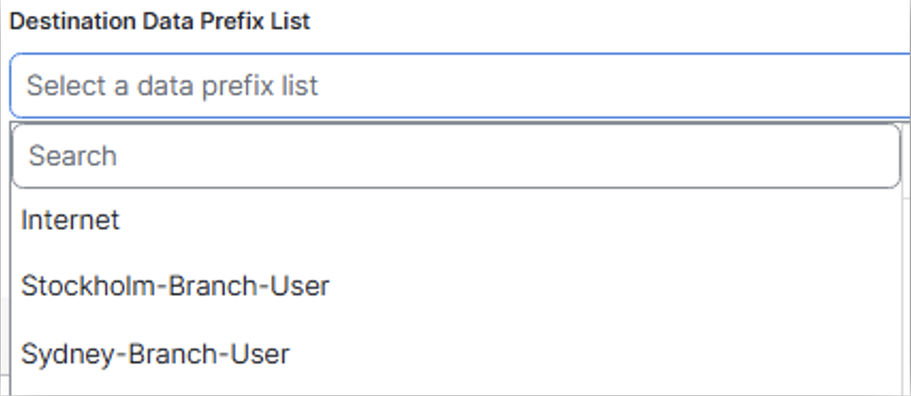{ .off-glb .small .center }
16. Scroll up and select **Actions**, and Click **Accept** radio button.
    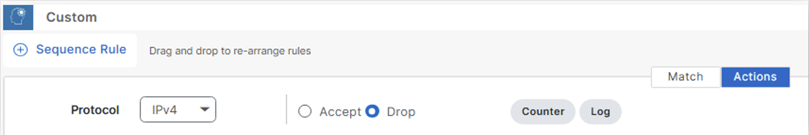{ .off-glb .small .center }
17. Scroll to the **right** to select <font color="green">**Service Chain**</font>.
    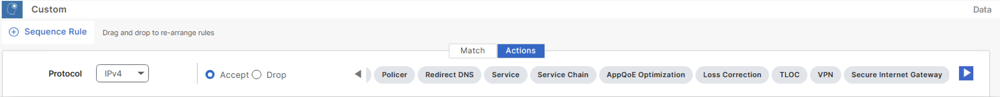{ .off-glb .small .center }
18. Click **Service Chain Type** and scroll the options down a bit and select **Service Chain Type** – **<font color="red">SC7</font>**.
    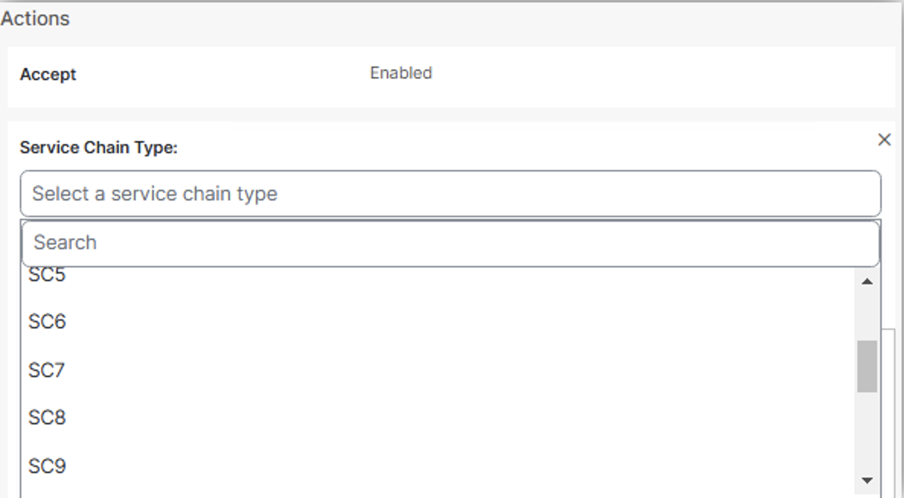{ .off-glb .small .center }
19. Under **TLOC List** select **Local** and uncheck **Restrict**.
    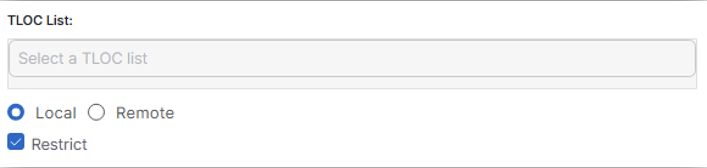{ .off-glb .small .center }
!!! info
    When **restrict** is configured in the set service-chain action, packets are dropped if a service chain goes down or if the **TLOCs** that are specified in a policy are **NOT** available. The restrict behavior is suitable for security services such as a <font color="green">firewall</font>.
20. Click **Save Match and Actions** and after that click **_Save Data Policy_**. 
    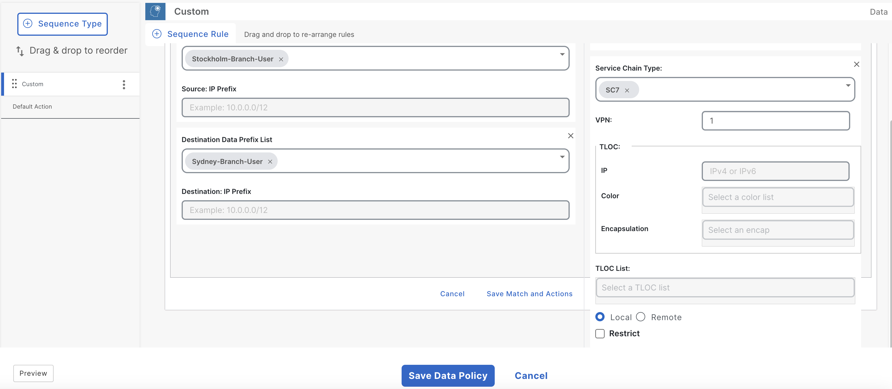{ .off-glb .small .center }
21. Enter **Policy Name** – **Scenario-1**. 
22. Enter **Policy Description** - **Scenario-1**.
    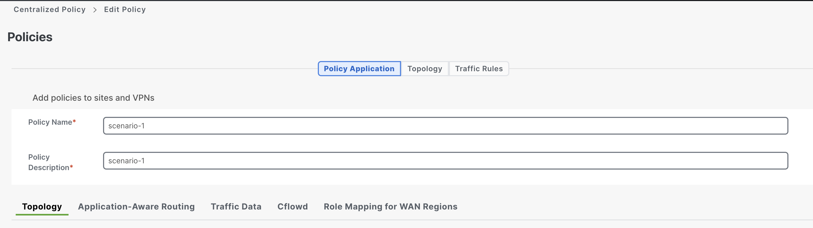{ .off-glb .small .center }
23. Click **Traffic Data** and then click **New Site/WAN Region List and VPN List**
24. Keep **From Service** radio button checked.
25. Keep **Site List** radio button checked
26. **Select Site List** by clicking in the box – **Stockholm-Branch**
    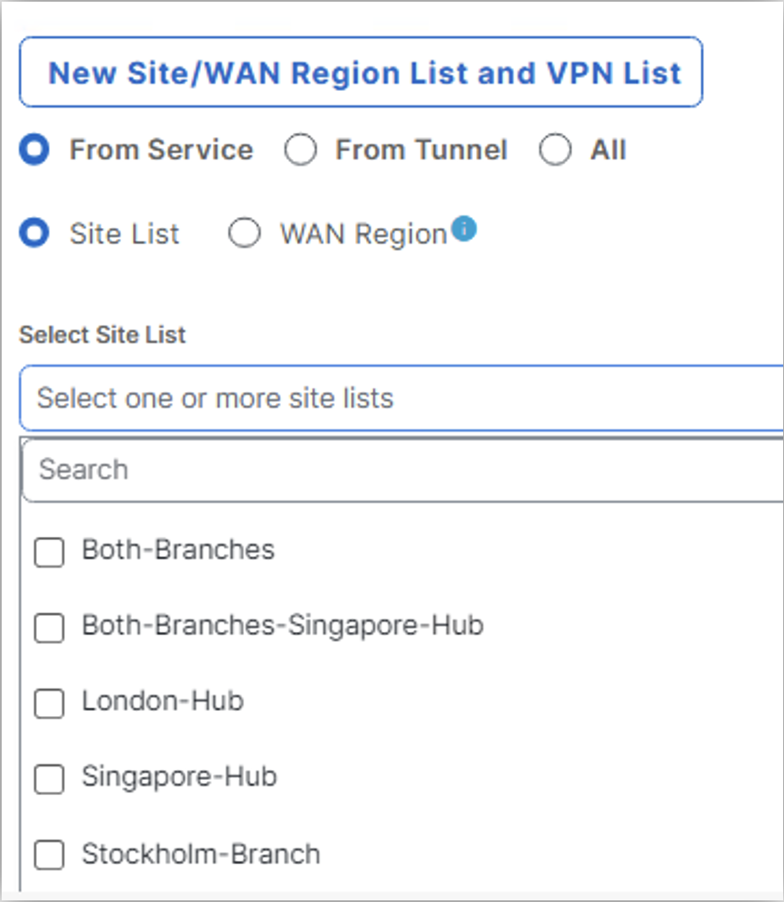{ .off-glb .small .center }
27. Click outside the selection box to expose **Select VPN List**. Select VPN List by clicking in the box **VPN-1**
    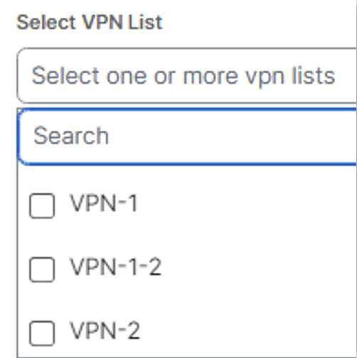{ .off-glb }
28. Click outside selection box and click **Add** and after that click **Save** Policy at the bottom.
    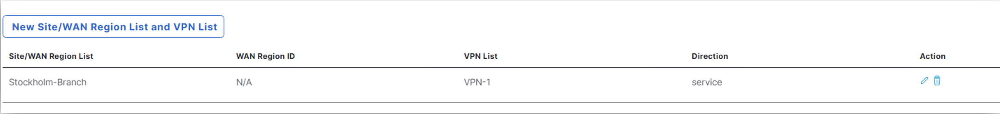{ .off-glb }
29. On **Policies > Centralized Policy** page, click { .off-glb width="25" } on the **Scenario-1** policy.
    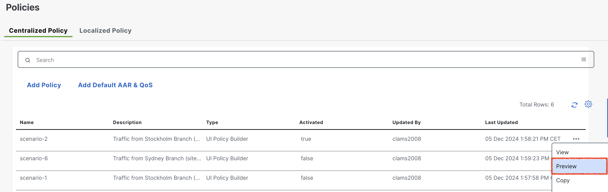{ .off-glb } 
30. Click Preview to review the policy and after reviewing click **OK**.
    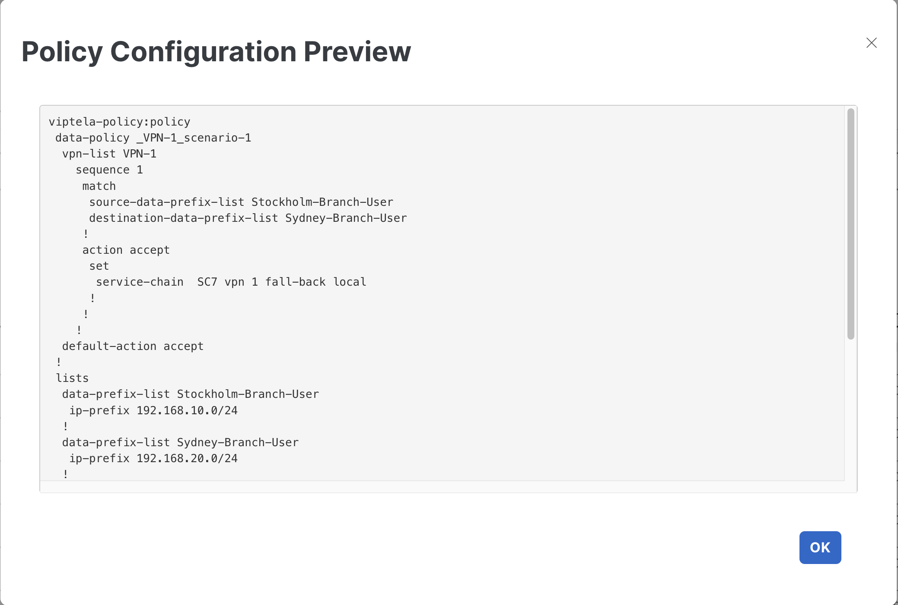{ .off-glb }
31. Now go to **Policies > Centralized Policy** page, click 3 dots on the **Scenario-1** policy.
    1. Click **Activate**. 
    2. Click **Activate** on **Activate Policy** pop-up. 
    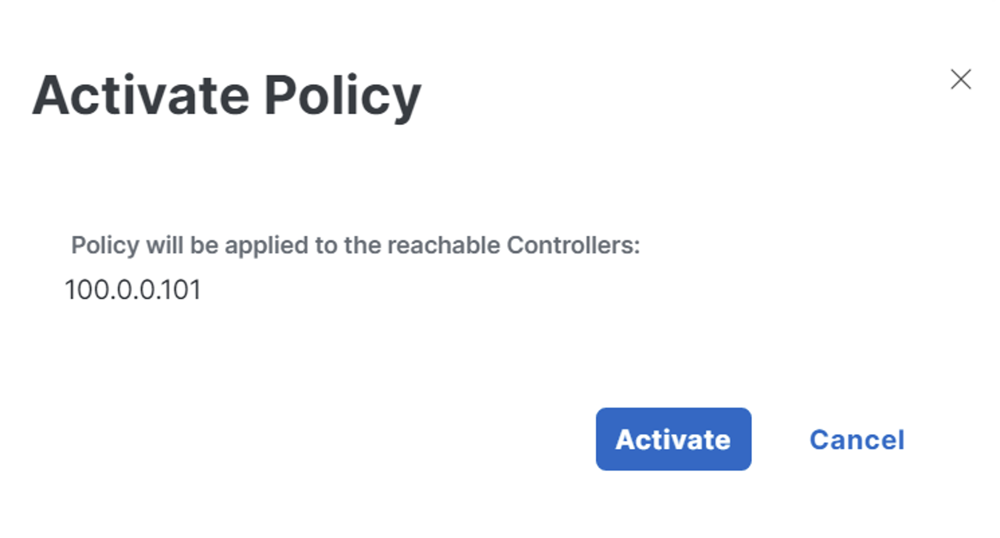{ .off-glb }
32. Click **Activate** and observe **Push vSmart Policy** <font color="green">**Validation success**</font> and <font color="orange">Message</font> **Done – Push vSmart Policy**. 
    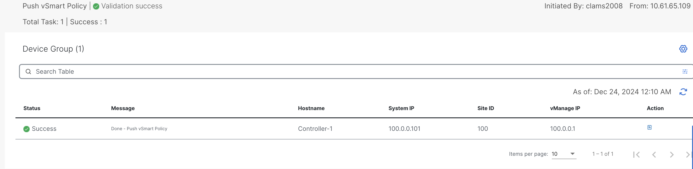{ .off-glb }

## Verification

After the centralized data policy has been successfully deployed, the next step is to confirm that the policy has been propagated by the SD-WAN controller (vSmart) to the WAN-Edges. 
In this case, we need to ensure that the **Stockholm-Branch** WAN-Edge has received the policy via OMP and is correctly steering traffic through the **Stockholm-FW** as intended. 
To verify this, we can utilize the following show command on the **Stockholm-Branch** WAN-Edge. This will help confirm whether the centralized data policy has been effectively pushed 
from the SD-WAN controller (vSmart) to the **Stockholm-Branch** router through OMP.

```{ .ios, .no-copy, title="Stockholm-Branch Centralized Policy"}
Stockholm-Branch#show sdwan policy from-vsmart 
from-vsmart data-policy _VPN-1_scenario-1
 direction from-service
 vpn-list VPN-1
  sequence 1
   match
    source-data-prefix-list      Stockholm-Branch-User
    destination-data-prefix-list Sydney-Branch-User
   action accept
    set
     service-chain SC7
     service-chain vpn 1
     service-chain fall-back
     service-chain local
  default-action accept
from-vsmart lists vpn-list VPN-1
 vpn 1
from-vsmart lists data-prefix-list Stockholm-Branch-User
 ip-prefix 192.168.10.0/24
from-vsmart lists data-prefix-list Sydney-Branch-User
 ip-prefix 192.168.20.0/24
```
To verify that the centralized data policy is functioning as intended, navigate back to the **Stockholm-User** in the **Stockholm-Branch** site. 

- Perform a traceroute to the **Sydney-User** located in the **Sydney-Branch** site using the **traceroute** command: 
    - _traceroute 192.168.20.2 -n_
- Observe the traceroute output to confirm that traffic is hitting the **Stockholm firewall (Stockholm-FW)** at IP address **10.10.10.2**.

```{.ios .no-copy }
Stockholm-User:~$ traceroute 192.168.20.2 -n 
traceroute to 192.168.20.2 (192.168.20.2), 30 hops max, 46 byte packets
 1  192.168.10.1  0.605 ms  0.327 ms  0.425 ms
 2  10.10.10.2  1.206 ms  0.989 ms  1.104 ms
 3  192.168.10.1  1.321 ms  1.045 ms  1.204 ms
 4  172.16.2.20  1.802 ms  1.752 ms  2.030 ms
 5  192.168.20.2  2.023 ms  1.990 ms  2.198 ms
Stockholm-User:~$ 
```
- Next, verify on the **Stockholm-FW** itself to ensure that the traffic is being **inspected** before continuing its journey toward the Sydney-User. This step confirms that the traffic is correctly following the service chain configuration as defined in the centralized data policy.

```{.ios .no-copy title="Stockholm Firewall traffic inspection"}
Stockholm-FW# show conn all
12 in use, 13 most used

UDP inside  192.168.10.2:53460 inside  192.168.20.2:33447, idle 0:00:03, bytes 18, flags - 
UDP inside  192.168.10.2:53460 inside  192.168.20.2:33440, idle 0:00:03, bytes 0, flags - 
UDP inside  192.168.10.2:53460 inside  192.168.20.2:33449, idle 0:00:03, bytes 18, flags - 
UDP inside  192.168.10.2:53460 inside  192.168.20.2:33438, idle 0:00:03, bytes 0, flags - 
UDP inside  192.168.10.2:53460 inside  192.168.20.2:33442, idle 0:00:03, bytes 18, flags - 
UDP inside  192.168.10.2:53460 inside  192.168.20.2:33439, idle 0:00:03, bytes 0, flags - 
UDP inside  192.168.10.2:53460 inside  192.168.20.2:33446, idle 0:00:03, bytes 18, flags - 
UDP inside  192.168.10.2:53460 inside  192.168.20.2:33444, idle 0:00:03, bytes 18, flags - 
UDP inside  192.168.10.2:53460 inside  192.168.20.2:33448, idle 0:00:03, bytes 18, flags - 
UDP inside  192.168.10.2:53460 inside  192.168.20.2:33443, idle 0:00:03, bytes 18, flags - 
UDP inside  192.168.10.2:53460 inside  192.168.20.2:33441, idle 0:00:03, bytes 18, flags - 
UDP inside  192.168.10.2:53460 inside  192.168.20.2:33445, idle 0:00:03, bytes 18, flags - 
Stockholm-FW# 
```
## Conclusion
In conclusion, the configuration group and centralized traffic data policy implemented in this lab successfully ensured 
that traffic originating from the **Stockholm-User** at **Stockholm-Branch (site-10)** and destined for the 
**Sydney-User** at **Sydney-Branch (site-20)** was routed through the locally hosted **firewall (Stockholm-FW)** 
at **Stockholm-Branch**. The firewall, reachable via the Stockholm-Branch WAN-Edge in **VRF-1**, effectively 
inspected the traffic before allowing it to proceed to its destination. This demonstrates the practical application 
of service chaining and centralized data policies in steering traffic through desired network functions within the 
Cisco SD-WAN fabric.

!!! info
    Before proceeding to the **next lab**, it is essential to **<font color="red">deactivate</font>** the centralized data policy configured in the current exercise. **Deactivating** the policy ensures that no unintended traffic steering or service chaining configurations remain active, which could interfere with subsequent lab tasks. Once the centralized data policy is successfully deactivated and confirmed, you can confidently move forward to the next lab. This step is critical to maintain a clean and controlled environment for the upcoming configurations and scenarios.