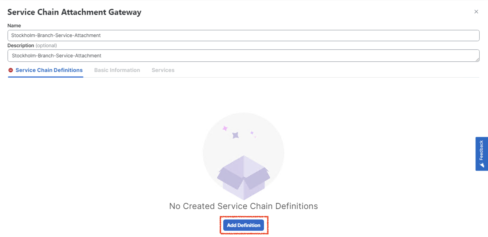

# Lab 1b - Route traffic from Stockholm to Sydney via local firewall in Stockholm in same VRF using <font color="grey">**Access Control List (ACL)**</font>

## Introduction

In this lab exercise, you will explore the traffic flow from a user located in the **EMEA-Stockholm-Branch (site-10)** to a user situated at the **APAC-Sydney-Branch (site-20)**.

Here is a breakdown of the key components involved in the network path:

- **Source:** The traffic originates from a **Stockholm-User** user in the **EMEA-Stockholm-Branch (site-10)**.
- **Destination:** The intended recipient is a **Sydney-User** in the **APAC-Sydney-Branch (site-20)**.
- **Firewall:** All traffic passes through a **firewall (Stockholm-FW)**, which is hosted locally at the **EMEA-Stockholm-Branch (site-10)**.
- **WAN Edge Router:** The **Stockholm-Branch** WAN-Edge router, configured in ***<font color="#9AAFCB">VRF-1</font>***, facilitates the traffic's reachability to the firewall and subsequent routing towards the destination.

Ensure that each component is properly configured and verify the traffic flow is going through **Stockholm-FW**.

!!! note
    Through this lab, firewall is configured to inspect traffic automatically in **inspect mode**, ***<font color="red"> without requiring any additional configuration</font>***. This inspection ensures that only safe and authorized traffic flows through the network, enhancing security and protecting against potential threats.

## Intended Traffic Flow Diagram

The following diagram illustrates the **<font color="orange">flow of traffic within the network for this scenario</font>**. Traffic is initiated from the **Stockholm-User** and is first redirected to the **Stockholm-Firewall** for <font color="orange">**inspection**</font>. After the traffic undergoes inspection, it is then forwarded to the **Sydney-User** in the **Sydney Branch**. This scenario demonstrates how traffic is securely routed through the firewall for inspection before reaching its final destination, ensuring that security policies are applied effectively within the SD-WAN fabric.
<figure markdown>
  
</figure>

## Traffic flow without any policy

In the initial configuration, without applying any traffic policies, the routes learned from the **Sydney-Branch** are distributed equally across both TLOCs, leveraging ECMP (Equal-Cost Multi-Path) for optimal path selection.

```{.ios, .no-copy}

Stockholm-Branch#show sdwan omp routes vpn 1 192.168.20.0/24  
Generating output, this might take time, please wait ...
Code:
C   -> chosen
I   -> installed
Red -> redistributed
Rej -> rejected
L   -> looped
R   -> resolved
S   -> stale
Ext -> extranet
Inv -> invalid
Stg -> staged
IA  -> On-demand inactive
U   -> TLOC unresolved
BR-R -> Border-Router reoriginated
TGW-R -> Transport-Gateway reoriginated
R-TGW-R -> Reoriginated Transport-Gateway reoriginated

                                                                                                                                                AFFINITY                                 
                                                      PATH                      ATTRIBUTE                                                       GROUP                                    
TENANT    VPN    PREFIX              FROM PEER        ID     LABEL    STATUS    TYPE       TLOC IP          COLOR            ENCAP  PREFERENCE  NUMBER      REGION ID   REGION PATH      
-----------------------------------------------------------------------------------------------------------------------------------------------------------------------------------------
0         1      192.168.20.0/24     100.0.0.101      1      1003     C,I,R     installed  10.1.1.2         mpls             ipsec  -           None        None        -                
                                     100.0.0.101      2      1003     C,I,R     installed  10.1.1.2         biz-internet     ipsec  -           None        None        -                
```

To verify this, we initiate a ping from the **Stockholm-User** (**<font color="#F0D99F">IP: 192.168.10.2</font>**) to the **Sydney-User** (**<font color="#F0D99F">IP: 192.168.20.2</font>**). A successful ping response confirms that reachability between the two branches is intact.

```{.ios, .no-copy}
Stockholm-User:~$ ping 192.168.20.2
PING 192.168.20.2 (192.168.20.2): 56 data bytes
64 bytes from 192.168.20.2: seq=0 ttl=42 time=4.002 ms
64 bytes from 192.168.20.2: seq=1 ttl=42 time=4.058 ms
64 bytes from 192.168.20.2: seq=2 ttl=42 time=2.677 ms
64 bytes from 192.168.20.2: seq=3 ttl=42 time=2.955 ms
64 bytes from 192.168.20.2: seq=4 ttl=42 time=3.034 ms
^C
--- 192.168.20.2 ping statistics ---
5 packets transmitted, 5 packets received, 0% packet loss
round-trip min/avg/max = 2.677/3.345/4.058 ms
Stockholm-User:~$ 
```
Additionally, traffic originating from the **Stockholm-Branch** flows directly to the **Sydney-Branch** via the available TLOCs, ensuring efficient and balanced connectivity in the absence of traffic policies.

```{.ios, .no-copy}
Stockholm-User:~$ traceroute 192.168.20.2 -n 
traceroute to 192.168.20.2 (192.168.20.2), 30 hops max, 46 byte packets
 1  192.168.10.1  1.048 ms  0.582 ms  0.548 ms
 2  172.16.1.20  1.449 ms  172.16.2.20  1.098 ms  1.440 ms
 3  192.168.20.2  2.551 ms  2.358 ms  1.750 ms
```

!!! note
    In the traceroute above, we observe that the traffic is currently routed over the **INET** TLOC. However, it is also possible for the traffic to use the **MPLS** TLOC, as SD-WAN employs ECMP (Equal-Cost Multi-Path) to balance traffic across all available TLOCs.

Following Table exhibit how traffic is flowing from **Stockholm-User** to **Sydney-User**.

| Interface         | IP Address   | Description                                                                                                                            |
|-------------------|--------------|----------------------------------------------------------------------------------------------------------------------------------------|
| GigabitEthernet 3 | 192.168.10.1 | <font color="#9AAFCB"> **Stockholm-Branch** WAN-Edge interface in **<font color="#A8C6A5">VRF 1</font>** connected with **Stockholm-User**. |
| GigabitEthernet 1 | 172.16.1.20  | <font color="#9AAFCB"> **Sydney-Branch** WAN-Edge interface **INET TLOC**.</font>                                                         |
| eth0              | 192.168.20.2 | <font color="#9AAFCB"> **Sydney-User** IP address.</font>                                                                                  |

## Configuring Service-Chain in Configuration Group

Next, we will configure a service chain within the service-profile parcel in the configuration group by following the below steps. 

This service chain defines the sequence of services that will be applied to traffic originating from the **Stockholm-Branch** and destined for the **Sydney-Branch**. 

By specifying the service chain in the configuration, we instruct the **Stockholm WAN-Edge** on the type of services to be applied to the traffic, such as redirection through a firewall. 

This configuration ensures that the desired service policies are enforced as traffic flows between the branches.

1. From the vManage Landing Page, navigate to the left-hand panel, select Configuration, and click Configuration Groups.
   { .off-glb }
2. Locate and click on the **EMEA-Stockholm-Branch** Configuration Group as illustrated below.
   { .off-glb }
3. Click the edit { .off-glb, width=25 } icon for the **EMEA-Stockholm-Branch - Service Profile** as illustrated below.   
   { .off-glb }
4. Select **<font color="blue">Add New Feature</font>** and add a <font color="orange">**Service Chain Attachment Gateway**</font> as illustrated below.
   { .off-glb }
5. In the <font color="orange">**Service Chain Attachment Gateway**</font> configuration parcel, click the dropdown arrow and select **Add New**.
   { .off-glb }
6. On the **Service Chain Attachment Gateway** configuration page, provide ***Name*** and ***Description*** for the attachment gateway. For example, use the name **<font color="orange">Stockholm-Branch-Service-Attachment</font>**.
   { .off-glb }
7. Click **Add Service Chain Definition** to define the service chain. 
   { .off-glb }
8. Enter the name **Stockholm-Firewall-SC-1b** and Description **Stockholm-Firewall-SC-1b** for the service chain definition.
9. Select a **Service Type** <font color="red">**Firewall**</font> by click dropdown and click **<font color="orange">Save</font>**
   { .off-glb }
10. Under Basic Information, enter **VPN** <font color="orange">**1**</font>.
11. Scroll down to **IPv4 Attachment**: <font color="orange">(1 Interface)</font>.
    { .off-glb }
12. Enter **Service IPv4 Address <font color="blue">10.10.10.2</font>**. This is the IP address of **Stockholm Firewall (***<font color="green">Stockholm-FW</font>***)**.
13. Enter SD-WAN Router Interface as **GigabitEthernet4** and click <font color="orange">**Save**</font>. 
    { .off-glb }
    The **GigabitEthernet4** interface on the **Stockholm-Branch** WAN-Edge router serves as the connection point for the **Stockholm-FW firewall**. This interface facilitates the integration of the firewall into the service chain, allowing traffic to be redirected through the firewall for inspection or policy enforcement as configured. The proper configuration of this interface is crucial for ensuring seamless communication between the WAN-Edge router and the firewall, enabling the desired security and traffic management features within the SD-WAN environment.
14. Click **Back** at bottom left.
    { .off-glb }
15. As we add the **Service Attachment Gateway Definition**, now configuration group for **EMEA-Stockholm-Branch** is now marked as <font color="red">out of sync</font>.Click **Stockholm-Branch** Configuration Group -> Click **<font color="green">Deploy**</font>.
    { .off-glb }
16. In **Deploy Configuration Group** page, select **EMEA-Stockholm-Branch** by clicking the square Radio Button and Click **Next**.  
    { .off-glb }
17. Click **Import**, and load **EMEA-Stockholm-Branch.csv** file which loads all the values for the variables.
    { .off-glb }

    !!! info
        All CSV files are located in the **<font color="green">CSV files</font>** folder on the **Desktop** of **_jump-host_**.

18. After uploading the **CSV files**, click **next** then click on **Preview CLI** then select the device from the **left hand** navigation pane to review the configuration changes before deployment. This step ensures that the service-chain gateway definition is correctly included in the configuration. By previewing the CLI, you can verify that all required parameters have been accurately applied and are ready for deployment. This validation step is critical to confirm that the service chain configuration aligns with the intended design and will function as expected once deployed.
    { .off-glb } 
19. Scroll down the **New Configuration** section to locate the **service-chain number** highlighted in <font color="blue">**blue**</font>. <font color="red">Make a note of this number</font>, as it will be required when configuring the data policy in later sections.
    The **service-chain number** is a <font color="red">critical identifier</font> used to link the service chain definition to the appropriate policy, ensuring that traffic is processed through the configured service chain as intended.
    { .off-glb } 
20. After finalizing the configuration, click **Cancel** to exit the current screen and then click **Deploy** to initiate the deployment process. Once the deployment is triggered, navigate to the **View Deployment Status** section to monitor the progress. Wait until the deployment status indicates **<font color="green">Success</font>**, confirming that the configuration has been successfully applied to the relevant devices.
    { .off-glb } 
21. To verify the configuration group status, click on the **Configuration > Configuration Groups > EMEA-Stockholm-Branch** configuration group. Ensure that the **Associated row indicates <font color="orange">1</font> device**, confirming that the configuration group is correctly linked to the **Stockholm-Branch** WAN-Edge router. Additionally, check that the Provisioning row displays **<font color="orange">0 out of sync</font>** indicating that the configuration has been successfully deployed and is fully synchronized with the device. This step ensures that the configuration group is correctly applied and functioning as intended.
    { .off-glb }

## Configuring Access Control List (ACL)
In SD-WAN environments, an interface **Access Control List (ACL)** can be used to direct traffic through a service chain based on the specified interface for incoming or outgoing traffic. 
This method is particularly useful when traffic forwarding decisions need to account for prior routing lookups or data policies. By applying an ACL, you can enforce that all traffic originating 
from or destined for a specific interface is steered through the designated service chain, ensuring consistent and predictable traffic inspection or processing.

!!! warning
    In SD-WAN software release **20.15.1/17.15.1**, there is a _known limitation_ where the service-chaining feature **does not function as expected**, <font color ="green">**as we cannot select the service chain number**</font>, when applied using **Policy Groups** or **Access Control Lists (ACLs)**. 
    Due to this issue, we will configure the service chaining through a **CLI Add-On** parcel, which provides a reliable alternative. This template will be linked to the Configuration Group of the **Stockholm-Branch WAN-Edge** router, 
    ensuring proper implementation of the service-chaining feature. By leveraging this approach, we can bypass the limitations and achieve the desired traffic flow and service chaining functionality.

1. To configure the **ACL** for service chaining, begin by navigating to the **CLI Add-On** Profile associated with the **Stockholm-Branch** WAN-Edge router. 
   Locate the profile and click the edit { .off-glb, width=25 } icon to open the configuration editor. This step allows you 
   to modify the CLI Add-On parcel to include the necessary Access Control List (ACL) settings required for implementing the service-chaining functionality. 
   By editing the profile directly, we ensure that the ACL configurations are properly applied to the router, enabling effective traffic steering as per the lab requirements.
   { .off-glb }
2. In this step, **copy and paste (append)** the provided **Access Control List (ACL)** configuration into the **CLI Add-On** parcel editor. This ACL configuration is specifically designed to 
   enable service chaining and is applied to the **GigabitEthernet3** interface. By applying the ACL directly to this interface, all traffic passing through it will be directed as per the 
   service chaining requirements. Ensure the configuration is accurate before saving, as it plays a critical role in steering the traffic through the intended service path.

!!! note 
    In the following policy configuration, an **Access Control List (ACL)** is created to redirect traffic to the **Stockholm Firewall (Stockholm-FW)**. Within the ACL, a variable name **<font color="green">{{Stockholm-Service-Chain-Number}}</font>** is used to define the service chain, allowing flexibility during deployment. 
    The specific value for the service chain, which was previously noted in **Step 19**, will be applied during the deployment of the configuration group to the Stockholm-Branch. This approach ensures consistency and adaptability, as the service chain value can be dynamically assigned at the time of deployment.

!!! warning 
    Do not overwrite the existing CLI-Add on configuration. Make sure you append the ACL configuration in existing CLI-Add on configuration.

```{.ios linenums="1", hl_lines="20", Title="ACL Configuration for CLI Add-ON for Stockholm-Branch"}
!
policy
!
 lists
  data-prefix-list Stockholm-Branch-User
   ip-prefix 192.168.10.0/24
  !
  data-prefix-list Sydney-Branch-User
   ip-prefix 192.168.20.0/24
  !
 access-list CL-ACL-Service-Chain
  sequence 10
   match
    source-data-prefix-list      Stockholm-Branch-User
    destination-data-prefix-list Sydney-Branch-User
   !
   action accept
    count MATCH-SYDNEY-DATA-TRAFFIC
    set
     service-chain {{Stockholm-Service-Chain-Number}}
     service-chain vpn 1
     service-chain fall-back
    !
   !
  !
  default-action accept
 !
!
sdwan
 interface GigabitEthernet3
  access-list CL-ACL-Service-Chain in
 exit
!
```
3. Once verified that variable name and ACL configuration is correct, we can click **Save and Done**.
   { .off-glb }
4. As we modify the **CLI Add-On parcel**, now configuration group for **EMEA-Stockholm-Branch** is now marked as <font color="red">out of sync</font>. 
   Click **Stockholm-Branch** Configuration Group -> Click **<font color="green">Deploy**</font>.
   { .off-glb }                            
5. In **Deploy Configuration Group** page, select **EMEA-Stockholm-Branch** by clicking the square Radio Button and Click **Next**.  
   { .off-glb }
6. Click **Import**, and load **EMEA-Stockholm-Branch.csv** file which loads all the values for the variables.
   { .off-glb }
7. Click **EMEA-Stockholm-Branch** from the left navigation pane and enter the value of the variable _**Stockholm-Service-Chain-Number**_ for **service-chain** number which we noted down in **step 19** above.
   { .off-glb }
   To retrieve the service chain number configured on the **Stockholm-Branch** WAN-Edge router, we can also use the following command on **Stockholm-Branch** WAN-Edge router.
   </br>
   - **show platform software sdwan service-chain database**
   </br>
8. Select **EMEA-Stockholm-Branch** from the left navigation pane and scroll down the **New Configuration** section to locate the **ACL configuration and service-chain number**.
   { .off-glb } 
9. After finalizing the configuration, click **Cancel** to exit the current screen and then click **Deploy** to initiate the deployment process. Once the deployment is triggered, navigate to the **View Deployment Status** section to monitor the progress. Wait until the deployment status indicates **<font color="green">Success</font>**, confirming that the configuration has been successfully applied to the relevant devices.
   { .off-glb } 
10. To verify the configuration group status, click on the **Configuration -> Configuration Groups > EMEA-Stockholm-Branch** configuration group. Ensure that the **Associated column indicates <font color="orange">1</font> device**, confirming that the configuration group is correctly linked to the **Stockholm-Branch** WAN-Edge router. Additionally, check that the Provisioning column displays **<font color="orange">0 out of sync</font>** indicating that the configuration has been successfully deployed and is fully synchronized with the device. This step ensures that the configuration group is correctly applied and functioning as intended.
    { .off-glb }

## Verification of Service Chain configuration on Stockholm-Branch

In the Cisco SD-WAN architecture, service nodes communicate their available services to the **SD-WAN Controller (vSmart)** using the **Overlay Management Protocol (OMP)** with the service route address family. 
Each WAN-Edge router is responsible for advertising its service routes to the SD-WAN Controller (vSmart), which then maintains these service routes within its **Routing Information Base (RIB)**. 

```{.ios linenums="1", hl_lines="23 24"}
Stockholm-Branch#show sdwan omp services 
C   -> chosen
I   -> installed
Red -> redistributed
Rej -> rejected
L   -> looped
R   -> resolved
S   -> stale
Ext -> extranet
Stg -> staged
IA  -> On-demand inactive
Inv -> invalid
BR-R -> Border-Router reoriginated
TGW-R -> Transport-Gateway reoriginated
R-TGW-R -> Reoriginated Transport-Gateway reoriginated

                                                                                 AFFINITY                            
ADDRESS                                                         PATH   REGION    GROUP                               
FAMILY   TENANT    VPN    SERVICE  ORIGINATOR  FROM PEER        ID     ID        NUMBER      LABEL    STATUS    VRF  
---------------------------------------------------------------------------------------------------------------------
ipv4     0         1      VPN      10.1.1.1    0.0.0.0          66     None      None        1003     C,Red,R   1    
                                               0.0.0.0          68     None      None        1003     C,Red,R   1    
         0         1      SC7      10.1.1.1    0.0.0.0          66     None      None        1010     C,Red,R   1    
                                               0.0.0.0          68     None      None        1010     C,Red,R   1    
ipv6     0         1      VPN      10.1.1.1    0.0.0.0          66     None      None        1003     C,Red,R   1    
                                               0.0.0.0          68     None      None        1003     C,Red,R   1    
```
To verify the service chain configuration on the **Stockholm-Branch** WAN-Edge router, access the device CLI and execute the command:

- **show platform software sdwan service-chain database**. 

Review the output to confirm the following details: the **<font color="green">Service Chain ID (e.g., SC7)</font>**, the **<font color="green">VRF (e.g., vrf: 1)</font>**, and the State, which should display **UP** to indicate proper functionality. 

Additionally, verify that the Service is set to **<font color="green">FW (Firewall)</font>**, the TX and RX interface is **GigabitEthernet4**, and the associated IP address is **10.10.10.2**. This verification ensures that the service chain configuration is active and correctly aligned with the intended design.

!!! note
    You might notice **two** service-chain numbers due to similar configuration task in <font color="green">**Lab 1a**</font>.

```{.ios .no-copy, linenums="1", hl_lines="3 4 5 6 9 17 20"}
Stockholm-Branch#show platform software sdwan service-chain database

Service Chain: SC7
   vrf: 1
   label: 1010
   state: up
   description:  Stockholm-Firewall-SC-1b

   service: FW
      sequence: 1
      track-enable: true
      state: up
      ha_pair: 1
         type: ipv4
         posture: trusted
         active: [current]
            tx: GigabitEthernet4, 10.10.10.2
                endpoint-tracker: auto
                state: up
            rx: GigabitEthernet4, 10.10.10.2
                endpoint-tracker: auto
                state: up
```

!!! warning
    It could be possible that Service-chain number might be different.


## Verification of Access Control List(ACL) on Stockholm-Branch WAN-Edge

As the ACL is applied to the service-side interface **<font color="green">GigabitEthernet3</font>**, any traffic originating from the **Stockholm-User** subnet (**<font color="green">192.168.10.0/24</font>**) and destined for the **Sydney-Branch** subnet (**<font color="green">192.168.20.0/24</font>**) will be redirected through the **<font color="orange">Stockholm-FW</font>** for inspection. 
To ensure that the ACL is correctly applied to the **<font color="green">GigabitEthernet3</font>** interface and verify its behavior, we can execute specific commands to observe and confirm the traffic redirection. These verification steps are essential to validate the service-chaining functionality.

- **show sdwan policy access-list-names** 
- **show sdwan policy access-list-associations**

```{.ios linenums="1", hl_lines="4 10"}
Stockholm-Branch#show sdwan policy access-list-names 
NAME                  
----------------------
CL-ACL-Service-Chain  

Stockholm-Branch#show sdwan policy access-list-associations 
                                        INTERFACE  
NAME                  INTERFACE NAME    DIRECTION  
---------------------------------------------------
CL-ACL-Service-Chain  GigabitEthernet3  in         
```
To enhance the verification process, we incorporated a **counter functionality** within the ACL. This allows us to monitor and confirm whether traffic is matching the ACL during testing and verification. By observing the counters, we can ensure that the ACL is actively processing traffic as expected. 
To check the counter values and confirm their increment during testing, the following show command can be executed. This provides a clear indication of the ACL's effectiveness in handling traffic redirection.

- **show sdwan policy access-list-counters** 

```{.ios linenums="1", hl_lines="5"}
Stockholm-Branch#show sdwan policy access-list-counters              
NAME                  COUNTER NAME                      PACKETS       BYTES             
----------------------------------------------------------------------------------------
CL-ACL-Service-Chain  default_action_count              0             0                 
                      MATCH-SYDNEY-DATA-TRAFFIC         0             0                 
```
## Verification
To verify that the Access Control List(ACL) is functioning as intended, navigate back to the **Stockholm-User** in the **Stockholm-Branch** site. 

- Perform a traceroute to the **Sydney-User** located in the **Sydney-Branch** site using the **traceroute** command: 
    - _traceroute 192.168.20.2 -n_
- Observe the traceroute output to confirm that traffic is hitting the **Stockholm firewall (Stockholm-FW)** at IP address **10.10.10.2**.

```{.ios .no-copy linenums="1", hl_lines="4" }
Stockholm-User:~$ traceroute 192.168.20.2 -n
traceroute to 192.168.20.2 (192.168.20.2), 30 hops max, 46 byte packets
 1  192.168.10.1  0.813 ms  0.399 ms  0.405 ms
 2  10.10.10.2  1.379 ms  1.164 ms  1.077 ms
 3  192.168.10.1  1.126 ms  1.135 ms  0.577 ms
 4  172.16.1.20  1.581 ms  1.412 ms  1.329 ms
 5  192.168.20.2  2.513 ms  2.479 ms  1.808 ms
Stockholm-User:~$ 
```
Perform a ping to the **Sydney-User** from **Stockholm-Branch**: 

```{.ios .no-copy}
Stockholm-User:~$ ping 192.168.20.2
PING 192.168.20.2 (192.168.20.2): 56 data bytes
64 bytes from 192.168.20.2: seq=0 ttl=42 time=3.165 ms
64 bytes from 192.168.20.2: seq=1 ttl=42 time=3.063 ms
64 bytes from 192.168.20.2: seq=2 ttl=42 time=3.359 ms
64 bytes from 192.168.20.2: seq=3 ttl=42 time=4.132 ms
64 bytes from 192.168.20.2: seq=4 ttl=42 time=2.740 ms
64 bytes from 192.168.20.2: seq=5 ttl=42 time=2.887 ms
64 bytes from 192.168.20.2: seq=26 ttl=42 time=3.622 ms
^C
--- 192.168.20.2 ping statistics ---
27 packets transmitted, 27 packets received, 0% packet loss
round-trip min/avg/max = 2.165/4.039/11.590 ms
```
 Next, verify on the **Stockholm-FW** itself to ensure that the traffic is being **inspected** before continuing its journey toward the Sydney-User. 
 This step confirms that the traffic is correctly following the service chain configuration as defined in the centralized data policy.

```{.ios .no-copy title="Stockholm Firewall traffic inspection"}
Stockholm-FW# show conn all
13 in use, 36 most used

UDP inside  192.168.10.2:58180 inside  192.168.20.2:33445, idle 0:00:08, bytes 18, flags - 
UDP inside  192.168.10.2:58180 inside  192.168.20.2:33447, idle 0:00:08, bytes 18, flags - 
UDP inside  192.168.10.2:58180 inside  192.168.20.2:33442, idle 0:00:08, bytes 18, flags - 
UDP inside  192.168.10.2:58180 inside  192.168.20.2:33448, idle 0:00:08, bytes 18, flags - 
UDP inside  192.168.10.2:58180 inside  192.168.20.2:33441, idle 0:00:08, bytes 18, flags - 
UDP inside  192.168.10.2:58180 inside  192.168.20.2:33440, idle 0:00:08, bytes 0, flags - 
ICMP inside 192.168.10.2:76 inside  192.168.20.2:0, idle 0:00:00, bytes 112, flags  
UDP inside  192.168.10.2:58180 inside  192.168.20.2:33439, idle 0:00:08, bytes 0, flags - 
UDP inside  192.168.10.2:58180 inside  192.168.20.2:33449, idle 0:00:08, bytes 18, flags - 
UDP inside  192.168.10.2:58180 inside  192.168.20.2:33438, idle 0:00:08, bytes 0, flags - 
UDP inside  192.168.10.2:58180 inside  192.168.20.2:33444, idle 0:00:08, bytes 18, flags - 
UDP inside  192.168.10.2:58180 inside  192.168.20.2:33443, idle 0:00:08, bytes 18, flags - 
UDP inside  192.168.10.2:58180 inside  192.168.20.2:33446, idle 0:00:08, bytes 18, flags - 
```
To verify that packets are matching the ACL configuration, we can use the following CLI command:

```{.ios .no-copy linenums="1", hl_lines="5" }
Stockholm-Branch#show sdwan policy access-list-counters 
NAME                  COUNTER NAME                      PACKETS       BYTES             
----------------------------------------------------------------------------------------
CL-ACL-Service-Chain  default_action_count              0             0                 
                      MATCH-SYDNEY-DATA-TRAFFIC         58            4772              
```
We can use the following show commands to see packets are matching and service chaining is working on **Stockholm** WAN-Edge router. 

- **show platform software sdwan service-chain stats detail**
- **show platform hardware qfp active feature sdwan datapath service-chain stats**

```{.ios .no-copy linenums="1", hl_lines="1 3 4 5 6 9"}
Stockholm-Branch#show platform software sdwan service-chain stats detail

Service Chain: SC7
   vrf: 1
   label: 1009
   state: up
   description:  Stockholm-Firewall-SC-1b

   service: FW
      tx: 12 rx: 9
      ha_pair 1: ipv4
         active
            tx: 12 rx: 9 
            tx tracker: sent: 3 dropped: 0 rtt: 3
            rx tracker: sent: 0 dropped: 0 rtt: 0
         backup
            tx: 0 rx: 0 
            tx tracker: sent: 0 dropped: 0 rtt: 0
            rx tracker: sent: 0 dropped: 0 rtt: 0
```

```{ .ios .no-copy linenums="1", hl_lines="1 2 7 8" }
Stockholm-Branch#show platform hardware qfp active feature sdwan datapath service-chain stats 
Service-Chain ID: 7
  Global stats: 131
  Global stats v6: 0
  Per Service stats 
    Service: Firewall
      Tx pkt: 131
      Rx pkt: 110
      Tx pkt v6: 0
      Rx pkt v6: 0
```

## Conclusion
In conclusion, the configuration group and **Access Control List(ACL)** implemented in this lab successfully ensured that traffic originating 
from the **Stockholm-User** at **Stockholm-Branch (site-10)** and destined for the **Sydney-User** at **Sydney-Branch (site-20)** was routed through 
the locally hosted **firewall (Stockholm-FW)** at **Stockholm-Branch**. The firewall, reachable via the Stockholm-Branch WAN-Edge in **VRF-1**, effectively 
inspected the traffic before allowing it to proceed to its destination. This demonstrates the practical application of service chaining and ACL 
in steering traffic through desired network functions within the Cisco SD-WAN fabric.

!!! info
    Before proceeding to the **next lab**, it is essential to **<font color="red">remove</font>** the **ACL configuration** from **<font color="green">CLI Add-On</font>** parcel and 
    also the **<font color="green">Service-Chain definition</font>** from the **Stockholm-Branch** configuration group. 
    **Removing** the **ACL policy** ensures that no unintended traffic steering or service chaining configurations remain active, which 
    could interfere with subsequent lab tasks. Once the ACL policy is successfully removed and confirmed, you can confidently move forward 
    to the next lab. This step is critical to maintain a clean and controlled environment for the upcoming configurations and scenarios.
    !!! note 
        ONLY **remove service-chain ACL configuration** and **platform console serial** command remain in the CLI-Add on configuration.