# Lab 2 - Route traffic from Stockholm to Sydney via London Firewall in same VRF

## Introduction

In this lab exercise, you will analyze the traffic flow between a user in the **<font color="Green">EMEA-Stockholm-Branch (site-10)</font>** and a user in the **<font color="Green">APAC-Sydney-Branch (site-20)</font>**, with the traffic routed through a **firewall** **<font color="Green">(London-Hub-Firewall)</font>** hosted at the 
**EMEA-London-Hub (site-101)**. The **London-Hub-Firewall**, accessible via the **London-Hub** WAN-Edge router in **<font color="blue">VRF-1</font>**, plays a critical role in inspecting and securing the traffic as it traverses the network. This exercise will focus on understanding the configuration and verification of service chaining, 
centralized policies, and the interactions between network elements to ensure the intended traffic flow through the designated security device.

Here is a breakdown of the key components involved in the network path:

- **Source:** The traffic originates from a **Stockholm-User** user in the **EMEA-Stockholm-Branch (site-10)**.
- **Destination:** The intended recipient is a **Sydney-User** in the **APAC-Sydney-Branch (site-20)**.
- **Firewall:** All traffic passes through a **firewall (London-FW)**, which is hosted locally at the **EMEA-London-Branch (site-101)**.
- **WAN Edge Router:** The **London-Branch** WAN-Edge router, configured in ***<font color="blue">VRF-1</font>***, facilitates the traffic's reachability to the firewall and subsequent routing towards the destination.

Ensure that each component is properly configured and verify the traffic flow is going through **London-FW**.

!!! note
    Through this lab, firewall is configured to inspect traffic automatically in **inspected mode**, ***<font color="red"> without requiring any additional configuration</font>***. This inspection ensures that only safe and authorized traffic flows through the network, enhancing security and protecting against potential threats.

## Intended Traffic Flow Diagram

The following diagram illustrates the **<font color="orange">flow of traffic within the network for this scenario</font>**. Traffic is initiated from the **Stockholm-User** and is first redirected to the **London-Firewall** for <font color="orange">**inspection**</font>. After the traffic undergoes inspection, it is then forwarded to the **Sydney-User** in the **Sydney Branch**. 

This scenario demonstrates how traffic is securely routed through the firewall for inspection before reaching its final destination, ensuring that security policies are applied effectively within the SD-WAN fabric.

<figure markdown>
  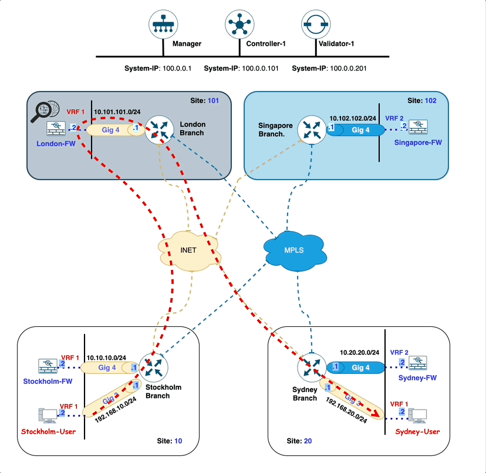
</figure>

## Traffic flow without any policy

In the initial configuration, without applying any traffic policies, the routes learned from the **Sydney-Branch** are distributed equally across both TLOCs, leveraging ECMP (Equal-Cost Multi-Path) for optimal path selection.

```{.ios, .no-copy}

Stockholm-Branch#show sdwan omp routes vpn 1 192.168.20.0/24  
Generating output, this might take time, please wait ...
Code:
C   -> chosen
I   -> installed
Red -> redistributed
Rej -> rejected
L   -> looped
R   -> resolved
S   -> stale
Ext -> extranet
Inv -> invalid
Stg -> staged
IA  -> On-demand inactive
U   -> TLOC unresolved
BR-R -> Border-Router reoriginated
TGW-R -> Transport-Gateway reoriginated
R-TGW-R -> Reoriginated Transport-Gateway reoriginated

                                                                                                                                                AFFINITY                                 
                                                      PATH                      ATTRIBUTE                                                       GROUP                                    
TENANT    VPN    PREFIX              FROM PEER        ID     LABEL    STATUS    TYPE       TLOC IP          COLOR            ENCAP  PREFERENCE  NUMBER      REGION ID   REGION PATH      
-----------------------------------------------------------------------------------------------------------------------------------------------------------------------------------------
0         1      192.168.20.0/24     100.0.0.101      1      1003     C,I,R     installed  10.1.1.2         mpls             ipsec  -           None        None        -                
                                     100.0.0.101      2      1003     C,I,R     installed  10.1.1.2         biz-internet     ipsec  -           None        None        -                
```

To verify this, we initiate a ping from the **Stockholm-User** (**<font color="blue">IP: 192.168.10.2</font>**) to the **Sydney-User** (**<font color="blue">IP: 192.168.20.2</font>**). A successful ping response confirms that reachability between the two branches is intact.

```{.ios, .no-copy}
Stockholm-User:~$ ping 192.168.20.2
PING 192.168.20.2 (192.168.20.2): 56 data bytes
64 bytes from 192.168.20.2: seq=0 ttl=42 time=4.002 ms
64 bytes from 192.168.20.2: seq=1 ttl=42 time=4.058 ms
64 bytes from 192.168.20.2: seq=2 ttl=42 time=2.677 ms
64 bytes from 192.168.20.2: seq=3 ttl=42 time=2.955 ms
64 bytes from 192.168.20.2: seq=4 ttl=42 time=3.034 ms
^C
--- 192.168.20.2 ping statistics ---
5 packets transmitted, 5 packets received, 0% packet loss
round-trip min/avg/max = 2.677/3.345/4.058 ms
```
Additionally, traffic originating from the **Stockholm-Branch** flows directly to the **Sydney-Branch** via the available TLOCs, ensuring efficient and balanced connectivity in the absence of traffic policies.

```{.ios, .no-copy}
Stockholm-User:~$ traceroute 192.168.20.2 -n 
traceroute to 192.168.20.2 (192.168.20.2), 30 hops max, 46 byte packets
 1  192.168.10.1  1.006 ms  3.488 ms  3.607 ms
 2  172.16.2.20  1.600 ms  4.836 ms  172.16.1.20  3.940 ms
 3  192.168.20.2  2.127 ms  9.074 ms  2.078 ms
```

!!! note
    In the traceroute above, we observe that the traffic is currently routed over the **MPLS** TLOC. However, it is also possible for the traffic to use the **INET** TLOC, as SD-WAN employs ECMP (Equal-Cost Multi-Path) to balance traffic across all available TLOCs.

Following Table exhibit how traffic is flowing from **Stockholm-User** to **Sydney-User**.

| Interface         | IP Address   | Description                                                                                                                            |
|-------------------|--------------|----------------------------------------------------------------------------------------------------------------------------------------|
| GigabitEthernet 3 | 192.168.10.1 | <font color="blue"> **Stockholm-Branch** WAN-Edge interface in **<font color="black">VRF 1</font>** connected with **Stockholm-User**. |
| GigabitEthernet 2 | 172.16.2.20  | <font color="blue"> **Sydney-Branch** WAN-Edge interface **MPLS TLOC**.</font>                                                         |
| eth0              | 192.168.20.2 | <font color="blue"> **Sydney-User** IP address.</font>                                                                                 |

The **London-Branch** WAN-Edge router establishes connectivity with the **London-FW** firewall through its **<font color="blue">GigabitEthernet 4</font>** interface. This interface facilitates the secure and efficient inspection of traffic passing through the firewall. 

The following table provides a detailed overview of the IP addressing configuration assigned to the **London-Branch** WAN-Edge router, ensuring clarity and ease of reference for subsequent tasks in the lab.

| Interface         | IP Address   | Description                                                                      |
|-------------------|--------------|----------------------------------------------------------------------------------|
| GigabitEthernet 4 | 10.101.101.2 | <font color="blue"> **London-FW** GigabitEthernet 4 interface IP address.</font> |


## Configuring Service-Chain in Configuration Group
Next, we will configure a service chain within the service-profile parcel in the configuration group by following the below setps. 
This service chain defines the sequence of services that will be applied to traffic originating from the **Stockholm-Branch** and destined 
for the **Sydney-Branch**. By specifying the service chain in the configuration, we instruct the **Stockholm WAN-Edge** on the type of services 
to be applied to the traffic, such as redirection through a **London-FW** firewall in **<font color="bluw">VRF 1</font>**. 
This configuration ensures that the desired service policies are enforced as traffic flows between the branches.

1. From the vManage Landing Page, navigate to the left-hand panel, select Configuration, and click Configuration Groups.
   { .off-glb }
2. Locate and click on the **EMEA-London-Branch** Configuration Group as illustrated below.
   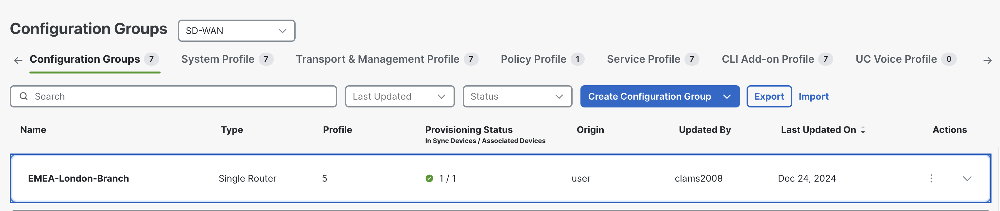{ .off-glb }
3. Click the edit { .off-glb, width=25 } icon for the **EMEA-London-Branch - Service Profile** as illustrated below.   
   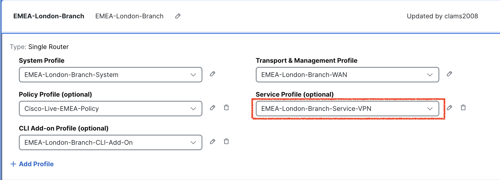{ .off-glb }
4. Select **<font color="blue">Add New Feature</font>** and add a <font color="orange">**Service Chain Attachment Gateway**</font> as illustrated below.
   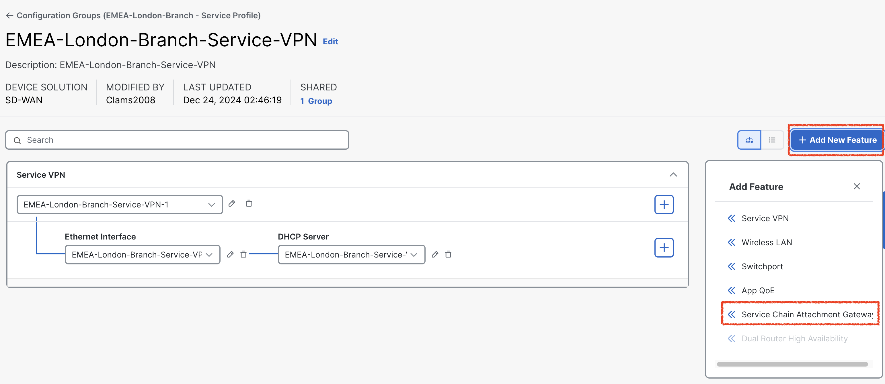{ .off-glb }
5. In the <font color="orange">**Service Chain Attachment Gateway**</font> configuration parcel, click the dropdown arrow and select **Add New**.
   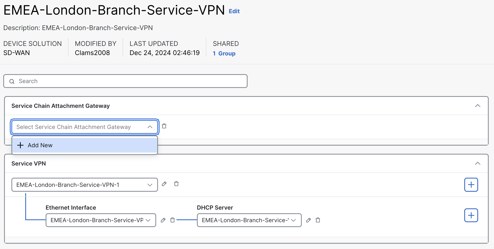{ .off-glb }
6. On the **Service Chain Attachment Gateway** configuration page, provide ***Name*** and ***Description*** for the attachment gateway. For example, use the name **<font color="orange">London-Branch-Service-Attachment</font>**.
   { .off-glb }
7. Click **Add Service Chain Definition** to define the service chain. 
   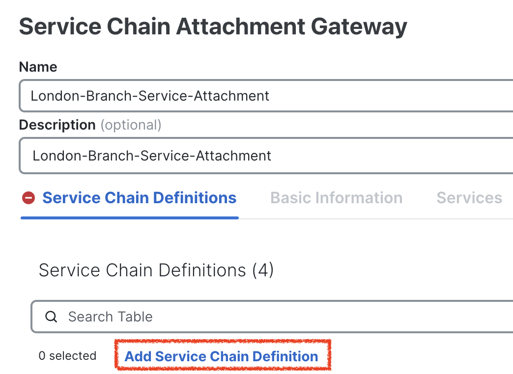{ .off-glb }
8. Enter the name **London-Firewall-SC-Def** and Description **London-Firewall-SC-Def** for the service chain definition.
9. Select a **Service Type** <font color="red">**Firewall**</font> by click dropdown and click **<font color="orange">Save</font>**
   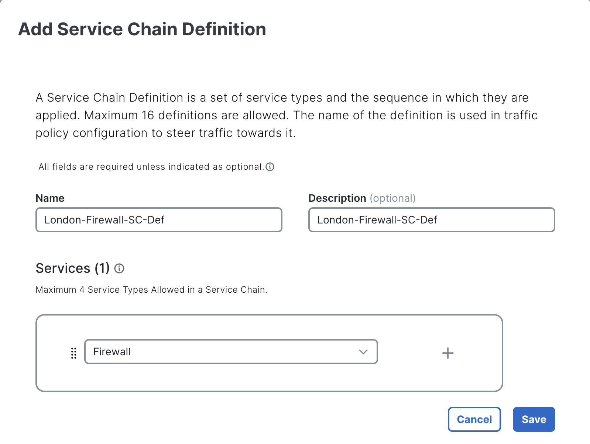{ .off-glb }
10. Under Basic Information, enter **VPN** <font color="orange">**1**</font>.
11. Scroll down to **IPv4 Attachment**: <font color="orange">(1 Interface)</font>.
    { .off-glb }
12. Enter **Service IPv4 Address <font color="blue">10.101.101.2</font>**. This is the IP address of **London Firewall (***<font color="green">London-FW</font>***)**.
13. Enter SD-WAN Router Interface as **GigabitEthernet4** and click <font color="orange">**Save**</font>.
    { .off-glb }
    The **GigabitEthernet4** interface on the **London-Branch** WAN-Edge router serves as the connection point for the **London-FW firewall**. 
    This interface facilitates the integration of the firewall into the service chain, allowing traffic to be redirected through the firewall for inspection or policy enforcement as configured. The proper configuration of this interface is crucial for ensuring seamless communication between the WAN-Edge router and the firewall, enabling the desired security and traffic management features within the SD-WAN environment.
14. Click **Back** at bottom left.
    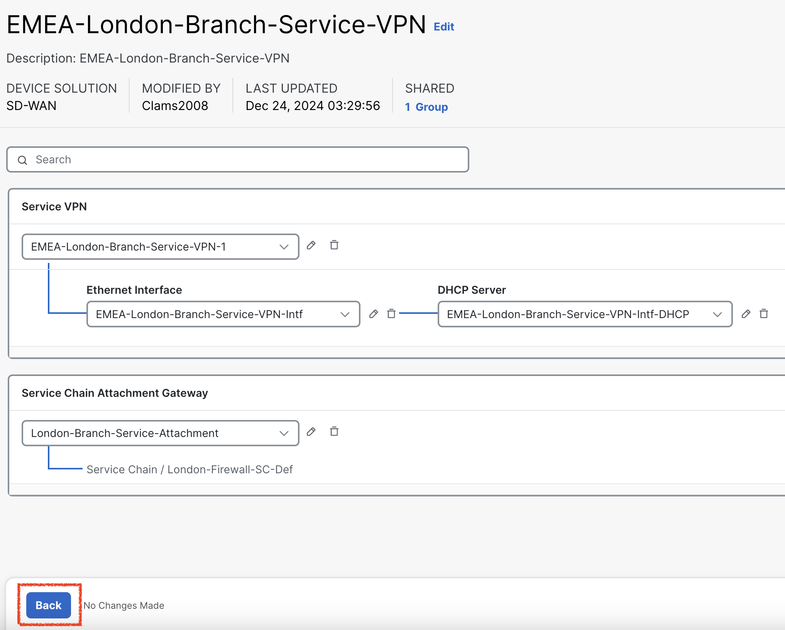{ .off-glb }
15. As we add the **Service Attachment Gateway Definition**, now configuration group for **EMEA-London-Branch** goes <font color="red">out of sync</font>. 
16. Click **London-Branch** Configuration Group -> Click **<font color="green">Deploy**</font>.
    { .off-glb }
17. In **Deploy Configuration Group** page, select **EMEA-London-Branch** by clicking the square Radio Button and Click **Next**.  
    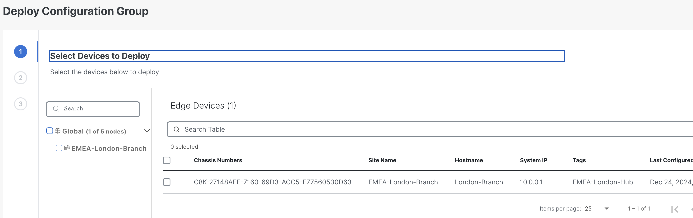{ .off-glb }
18. Click **Import**, and load **EMEA-London-Branch.csv** file which loads all the values for the variables.
    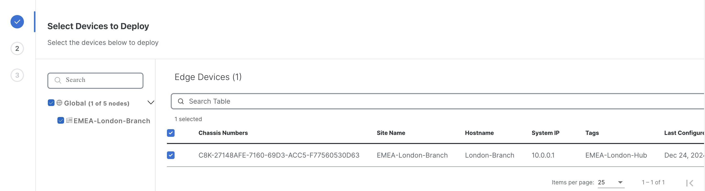{ .off-glb }
19. After uploading the CSV files, click on **Preview CLI** to review the configuration changes before deployment. This step ensures that the service-chain gateway definition 
    is correctly included in the configuration. By previewing the CLI, you can verify that all required parameters have been accurately applied and are ready for deployment. 
    This validation step is critical to confirm that the service chain configuration aligns with the intended design and will function as expected once deployed.
    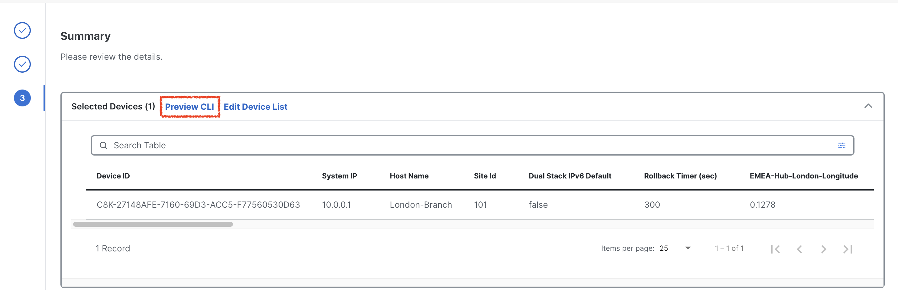{ .off-glb }
20. Scroll down the **New Configuration** section to locate the **service-chain number** highlighted in <font color="blue">**blue**</font>. <font color="red">Make a note of this number</font>, as it will be required when configuring the data policy in later sections.
    The **service-chain number** is a <font color="red">critical identifier</font> used to link the service chain definition to the appropriate policy, ensuring that traffic is processed through the configured service chain as intended.
    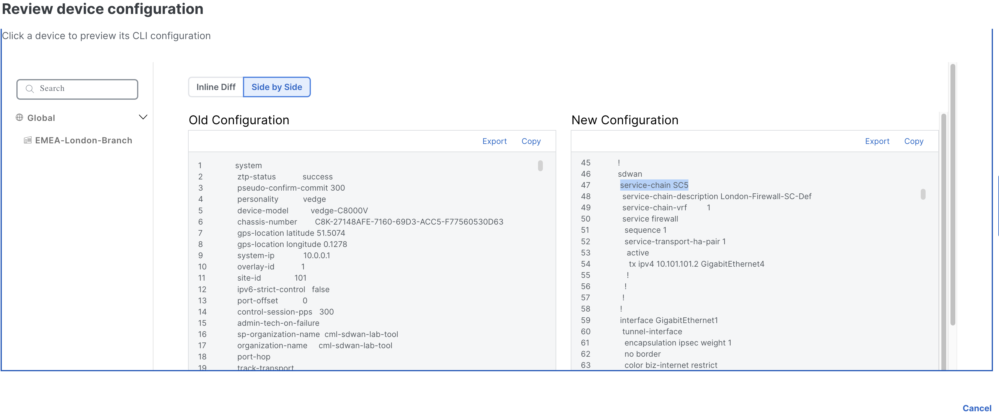{ .off-glb } 
