# Lab 2b - Route traffic from Stockholm to Sydney via London Firewall in same VRF using <font color="grey">**Control Policy**</font>

## Introduction

In this lab exercise, you will analyze the traffic flow between a user in the **<font color="Green">EMEA-Stockholm-Branch (site-10)</font>** and a user in the **<font color="Green">APAC-Sydney-Branch (site-20)</font>**, with the traffic routed through a **firewall** **<font color="Green">(London-Hub-Firewall)</font>** hosted at the 
**EMEA-London-Hub (site-101)**. The **London-Hub-Firewall**, accessible via the **London-Hub** WAN-Edge router in **<font color="#9AAFCB">VRF-1</font>**, plays a critical role in inspecting and securing the traffic as it traverses the network. This exercise will focus on understanding the configuration and verification of service chaining, 
centralized policies, and the interactions between network elements to ensure the intended traffic flow through the designated security device.

Here is a breakdown of the key components involved in the network path:

- **Source:** The traffic originates from a **Stockholm-User** user in the **EMEA-Stockholm-Branch (site-10)**.
- **Destination:** The intended recipient is a **Sydney-User** in the **APAC-Sydney-Branch (site-20)**.
- **Firewall:** All traffic passes through a **firewall (London-FW)**, which is hosted locally at the **EMEA-London-Branch (site-101)**.
- **WAN Edge Router:** The **London-Branch** WAN-Edge router, configured in ***<font color="#9AAFCB">VRF-1</font>***, facilitates the traffic's reachability to the firewall and subsequent routing towards the destination.

Ensure that each component is properly configured and verify the traffic flow is going through **London-FW**.

!!! note
    Through this lab, firewall is configured to inspect traffic automatically in **inspect mode**, ***<font color="red"> without requiring any additional configuration</font>***. This inspection ensures that only safe and authorized traffic flows through the network, enhancing security and protecting against potential threats.

## Intended Traffic Flow Diagram

The following diagram illustrates the **<font color="orange">flow of traffic within the network for this scenario</font>**. Traffic is initiated from the **Stockholm-User** and is first redirected to the **London-Firewall** for <font color="orange">**inspection**</font>. After the traffic undergoes inspection, it is then forwarded to the **Sydney-User** in the **Sydney Branch**. 

This scenario demonstrates how traffic is securely routed through the firewall for inspection before reaching its final destination, ensuring that security policies are applied effectively within the SD-WAN fabric.

<figure markdown>
  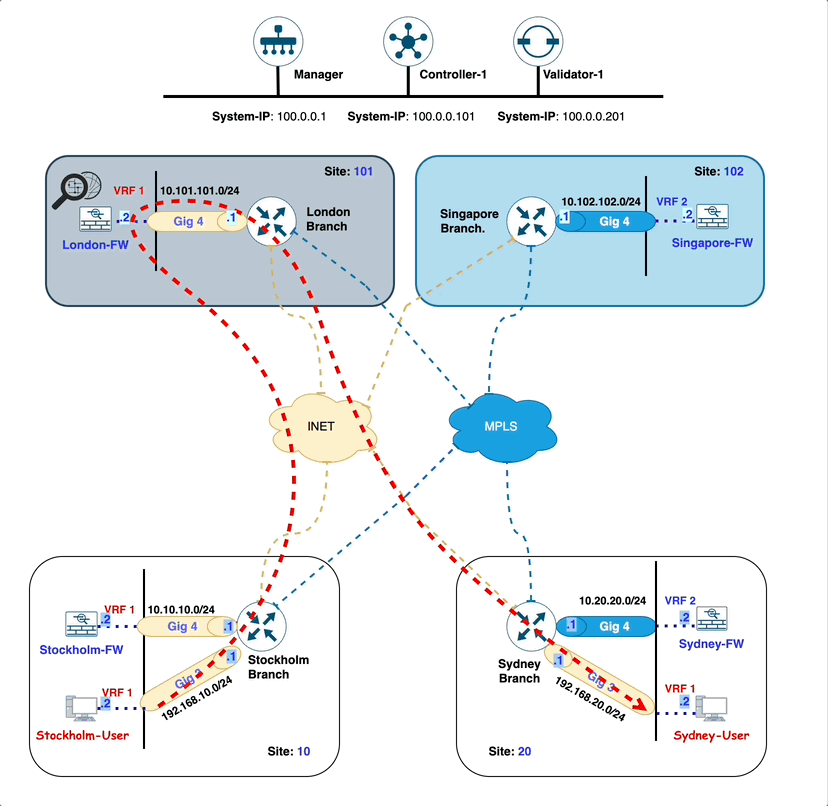
</figure>

## Traffic flow without any policy

In the initial configuration, without applying any traffic policies, the routes learned from the **Sydney-Branch** are distributed equally across both **Sydney-Branch** WAN-Edge TLOCs (**biz-internet:10.1.1.2**, **mpls:10.1.1.2**), leveraging ECMP (Equal-Cost Multi-Path) for optimal path selection.

```{.ios, .no-copy, linenums="1", hl_lines="32 33"}
Stockholm-Branch#show sdwan omp routes 
Generating output, this might take time, please wait ...
Code:
C   -> chosen
I   -> installed
Red -> redistributed
Rej -> rejected
L   -> looped
R   -> resolved
S   -> stale
Ext -> extranet
Inv -> invalid
Stg -> staged
IA  -> On-demand inactive
U   -> TLOC unresolved
BR-R -> Border-Router reoriginated
TGW-R -> Transport-Gateway reoriginated
R-TGW-R -> Reoriginated Transport-Gateway reoriginated

                                                                                                                                                AFFINITY                                 
                                                      PATH                      ATTRIBUTE                                                       GROUP                                    
TENANT    VPN    PREFIX              FROM PEER        ID     LABEL    STATUS    TYPE       TLOC IP          COLOR            ENCAP  PREFERENCE  NUMBER      REGION ID   REGION PATH      
-----------------------------------------------------------------------------------------------------------------------------------------------------------------------------------------
0         1      10.10.10.0/24       0.0.0.0          66     1003     C,Red,R   installed  10.1.1.1         mpls             ipsec  -           None        None        -                
                                     0.0.0.0          68     1003     C,Red,R   installed  10.1.1.1         biz-internet     ipsec  -           None        None        -                
0         1      10.101.101.0/24     100.0.0.101      1      1003     C,I,R     installed  10.0.0.1         mpls             ipsec  -           None        None        -                
                                     100.0.0.101      2      1003     C,I,R     installed  10.0.0.1         biz-internet     ipsec  -           None        None        -                
0         1      10.102.102.102/32   100.0.0.101      1      1008     C,I,R     installed  10.0.0.2         biz-internet     ipsec  -           None        None        -                
                                     100.0.0.101      2      1008     C,I,R     installed  10.0.0.2         mpls             ipsec  -           None        None        -                
0         1      192.168.10.0/24     0.0.0.0          66     1003     C,Red,R   installed  10.1.1.1         mpls             ipsec  -           None        None        -                
                                     0.0.0.0          68     1003     C,Red,R   installed  10.1.1.1         biz-internet     ipsec  -           None        None        -                
0         1      192.168.20.0/24     100.0.0.101      1      1003     C,I,R     installed  10.1.1.2         biz-internet     ipsec  -           None        None        -                
                                     100.0.0.101      2      1003     C,I,R     installed  10.1.1.2         mpls             ipsec  -           None        None        -                
```

To verify this, we initiate a ping from the **Stockholm-User** (**<font color="#9AAFCB">IP: 192.168.10.2</font>**) to the **Sydney-User** (**<font color="#9AAFCB">IP: 192.168.20.2</font>**). A successful ping response confirms that reachability between the two branches is intact.

```{.ios, .no-copy}
Stockholm-User:~$ ping 192.168.20.2
PING 192.168.20.2 (192.168.20.2): 56 data bytes
64 bytes from 192.168.20.2: seq=0 ttl=42 time=4.002 ms
64 bytes from 192.168.20.2: seq=1 ttl=42 time=4.058 ms
64 bytes from 192.168.20.2: seq=2 ttl=42 time=2.677 ms
64 bytes from 192.168.20.2: seq=3 ttl=42 time=2.955 ms
64 bytes from 192.168.20.2: seq=4 ttl=42 time=3.034 ms
^C
--- 192.168.20.2 ping statistics ---
5 packets transmitted, 5 packets received, 0% packet loss
round-trip min/avg/max = 2.677/3.345/4.058 ms
```
Additionally, traffic originating from the **Stockholm-Branch** flows directly to the **Sydney-Branch** via the available TLOCs, ensuring efficient and balanced connectivity in the absence of traffic policies.

```{.ios, .no-copy}
Stockholm-User:~$ traceroute 192.168.20.2 -n 
traceroute to 192.168.20.2 (192.168.20.2), 30 hops max, 46 byte packets
 1  192.168.10.1  1.006 ms  3.488 ms  3.607 ms
 2  172.16.2.20  1.600 ms  4.836 ms  172.16.1.20  3.940 ms
 3  192.168.20.2  2.127 ms  9.074 ms  2.078 ms
```

!!! note
    In the traceroute above, we observe that the traffic is currently routed over the **MPLS** TLOC. However, it is also possible for the traffic to use the **INET** TLOC, as SD-WAN employs ECMP (Equal-Cost Multi-Path) to balance traffic across all available TLOCs.

Following Table exhibit how traffic is flowing from **Stockholm-User** to **Sydney-User**.

| Interface         | IP Address   | Description                                                                                                                            |
|-------------------|--------------|----------------------------------------------------------------------------------------------------------------------------------------|
| GigabitEthernet 3 | 192.168.10.1 | <font color="#9AAFCB"> **Stockholm-Branch** WAN-Edge interface in **<font color="black">VRF 1</font>** connected with **Stockholm-User**. |
| GigabitEthernet 2 | 172.16.2.20  | <font color="#9AAFCB"> **Sydney-Branch** WAN-Edge interface **MPLS TLOC**.</font>                                                         |
| eth0              | 192.168.20.2 | <font color="#9AAFCB"> **Sydney-User** IP address.</font>                                                                                 |

The **London-Branch** WAN-Edge router establishes connectivity with the **London-FW** firewall through its **<font color="#9AAFCB">GigabitEthernet 4</font>** interface. This interface facilitates the secure and efficient inspection of traffic passing through the firewall. 

The following table provides a detailed overview of the IP addressing configuration assigned to the **London-Branch** WAN-Edge router, ensuring clarity and ease of reference for subsequent tasks in the lab.

| Interface         | IP Address   | Description                                                                      |
|-------------------|--------------|----------------------------------------------------------------------------------|
| GigabitEthernet 4 | 10.101.101.2 | <font color="#9AAFCB"> **London-FW** GigabitEthernet 4 interface IP address.</font> |


## Configuring Firewall Service in Configuration Group

Next, we will configure a service chain within the service-profile parcel in the configuration group by following the below setps. 

This service chain defines the sequence of services that will be applied to traffic originating from the **Stockholm-Branch** and destined 
for the **Sydney-Branch**. 

By specifying the service chain in the configuration, we instruct the **Stockholm WAN-Edge** on the type of services 
to be applied to the traffic, such as redirection through a **London-FW** firewall in **<font color="#9AAFCB">VRF 1</font>**. 

This configuration ensures that the desired service policies are enforced as traffic flows between the branches.

1. From the vManage Landing Page, navigate to the left-hand panel, select Configuration, and click Configuration Groups.
   { .off-glb }
2. Locate and click on the **EMEA-London-Branch** Configuration Group as illustrated below.
   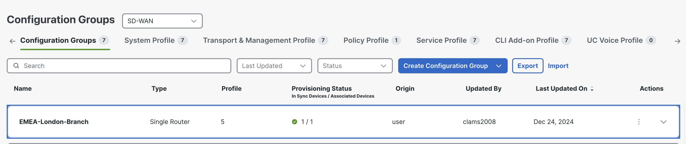{ .off-glb }
3. Click the edit { .off-glb, width=25 } icon for the **EMEA-London-Branch - Service Profile** as illustrated below.   
   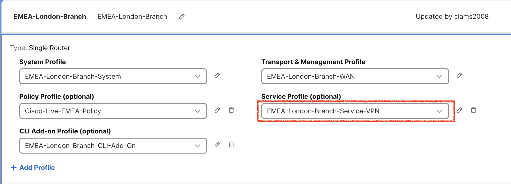{ .off-glb }
4. Click the edit { .off-glb, width=25 } icon of **EMEA-London-Branch-Service-VPN-1** service VPN parcel as illustrated below.
   { .off-glb }
5. Now click, **Service**, and in order to Add **<font color="green">FW service</font>** click **Add Service** like below.
   { .off-glb }
6. Select **FW** from the list and enter IP address of **FW** **<font color="green">10.101.101.2</font>** as exhibited below.
   { .off-glb }
7. After ensuring all the necessary details have been entered correctly, the next step involves adding and introducing **Firewall (FW)** services at the **London-Branch**. 
   This integration is critical to route and secure the traffic flow between **Stockholm** and **Sydney**. 
   { .off-glb }
8. As we introduce **FW** service in <font color="green">**VPN-1**</font>, so configuration group is now <font color="red">out of sync</font>.
   { .off-glb }
9. Now click **Deploy** and check select **EMEA-London-Branch**.
   { .off-glb }
10. Click **Import**, and load **EMEA-London-Branch.csv** file which loads all the values for the variables.
    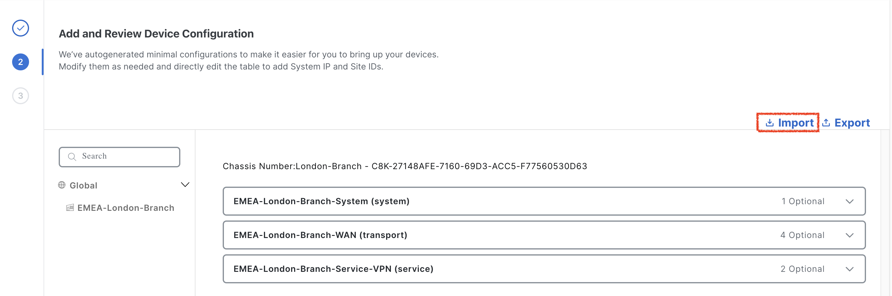{ .off-glb }
19. After uploading the **CSV files**, click on **Preview CLI** to review the configuration changes before deployment. This step ensures that the **FW service** is correctly included in the configuration. By previewing the CLI, you can verify that all required parameters have been accurately applied and are ready for deployment. This validation step is critical to confirm that the service chain configuration aligns with the intended design and will function as expected once deployed.
    { .off-glb }
20. After finalizing the configuration, click **Cancel** to exit the current screen and then click **Deploy** to initiate the deployment process. Once the deployment is triggered, navigate to the **View Deployment Status** section to monitor the progress. 
    { .off-glb }
21. Wait until the deployment status indicates **<font color="green">Success</font>**, confirming that the configuration has been successfully applied to the relevant devices.
    { .off-glb }
22. To verify the configuration group status, click on the **EMEA-London-Branch** configuration group. Ensure that the **Associated column indicates <font color="orange">1</font> device**, confirming that the configuration group is 
    correctly linked to the **London-Branch** WAN-Edge router. Additionally, check that the Provisioning column displays **<font color="orange">0 out of sync</font>** indicating that the configuration has been successfully deployed 
    and is fully synchronized with the device. This step ensures that the configuration group is correctly applied and functioning as intended.
    { .off-glb }

## Verification of Service Chain configuration on London-Branch

In the Cisco SD-WAN architecture, service nodes communicate their available services to the **SD-WAN Controller (vSmart)** using the **Overlay Management Protocol (OMP)** with the service route address family. Each WAN-Edge router is responsible for advertising its service routes to the SD-WAN Controller (vSmart), which then maintains these service routes within its **Routing Information Base (RIB)**. 

**<font color="green">Notably, the SD-WAN Controller (vSmart) controller does not propagate these service routes to other WAN-Edge routers within the SD-WAN fabric</font>**. Instead, the service label, which is advertised by WAN-Edge router in the service route to the SD-WAN Controller (vSmart), plays a crucial role. If traffic destined for a particular vRoute needs to traverse a service, the SD-WAN Controller (vSmart) controller replaces the vRoute’s label with the service label.

```{ .ios, .no-copy, linenums="1", hl_lines="23 24"}
London-Branch#show sdwan omp services 
C   -> chosen
I   -> installed
Red -> redistributed
Rej -> rejected
L   -> looped
R   -> resolved
S   -> stale
Ext -> extranet
Stg -> staged
IA  -> On-demand inactive
Inv -> invalid
BR-R -> Border-Router reoriginated
TGW-R -> Transport-Gateway reoriginated
R-TGW-R -> Reoriginated Transport-Gateway reoriginated

                                                                                 AFFINITY                            
ADDRESS                                                         PATH   REGION    GROUP                               
FAMILY   TENANT    VPN    SERVICE  ORIGINATOR  FROM PEER        ID     ID        NUMBER      LABEL    STATUS    VRF  
---------------------------------------------------------------------------------------------------------------------
ipv4     0         1      VPN      10.0.0.1    0.0.0.0          66     None      None        1003     C,Red,R   1    
                                               0.0.0.0          68     None      None        1003     C,Red,R   1    
         0         1      FW       10.0.0.1    0.0.0.0          66     None      None        1014     C,Red,R   1    
                                               0.0.0.0          68     None      None        1014     C,Red,R   1    
ipv6     0         1      VPN      10.0.0.1    0.0.0.0          66     None      None        1003     C,Red,R   1    
                                               0.0.0.0          68     None      None        1003     C,Red,R   1    

```
After configuring the **Firewall (FW)** service on the **London-Branch** WAN-Edge router, the system generates a unique label, **<font color="green">1014</font>**, to identify the service. 
This label, along with the associated service information, is then advertised to the SD-WAN controller (vSmart) using the **Overlay Management Protocol (OMP)**. 

## Configuring Centralized Control policy for Traffic Steering

The SD-WAN control policy named **scenario-2-cp** is crafted to dynamically steer traffic by utilizing route and site matching criteria. 
This policy is configured to specifically match routes advertised by the **Sydney site** (<font color="green">**site-id 20**</font>) that belong to the **Sydney user subnet** <font color="green">**192.168.20.0/24**</font>. 
Once matched, the policy directs these routes towards the **London Firewall** for inspection. The control policy is applied to the control-plane advertisements leaving the **Stockholm-Branch** site (<font color="green">**site-id 10**</font>), 
ensuring that traffic destined for the **Sydney-Branch** site (<font color="green">**site-id 20**</font>) follows the desired path through the **<font color="green">London Firewall</font>**, enabling enhanced traffic management and security enforcement.

1. To begin configuring the centralized data policy, navigate to the left-hand pane in the SD-WAN Manager (vManage) interface. From there, select Configuration, followed by Classic, and then click on Policies. 
   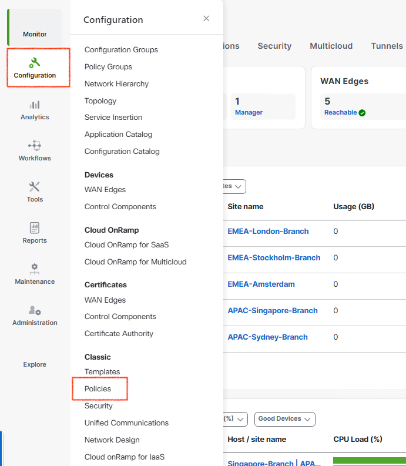{ .off-glb .small }
2. Under the Centralized Policy section, click Add Policy to create a new policy. This will initiate the process of defining and implementing the centralized data policy to enforce traffic inspection and routing as per the lab requirements.
   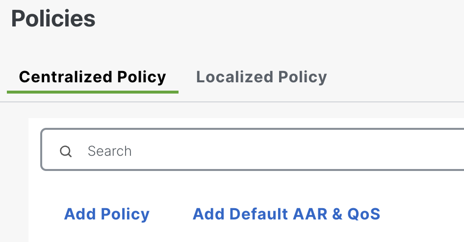{ .off-glb .small }
3. To create the required **Groups of Interest**, start by selecting **Data Prefix** from the left navigation pane within the **Centralized Policy** configuration window. Follow these steps:
   { .off-glb .small }
   1. Click **New Data Prefix List** to define the first prefix list:
      1. Data Prefix List Name: **Internet**
      2. Internet Protocol: IPv4 
      3. Add Data Prefix: **8.8.8.8/32, 4.2.2.2/32**
   2. Click **New Data Prefix List** again to define the second prefix list:
      1. Data Prefix List Name: **Stockholm-Branch-User-Subnet**
      2. Internet Protocol: IPv4 
      3. Add Data Prefix: **192.168.10.0/24**
   3. Click **New Data Prefix List** once more to define the third prefix list:
      1. Data Prefix List Name: **-Subnet**
      2. Internet Protocol: IPv4 
      3. Add Data Prefix: **192.168.20.0/24**
  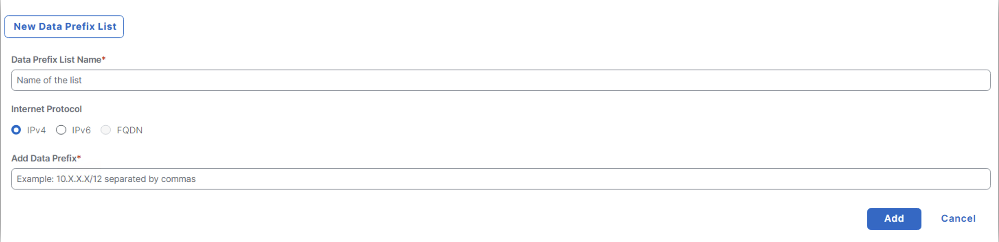{ .off-glb .small }
4. To configure the required **Site Lists** and **VPN List** for the centralized data policy, follow these steps:
   1. Navigate to **Site** in the left navigation pane:
      1. Click **New Site List** to create the first site list:
         1. Site List Name: **Stockholm-Branch**
         2. Add Site: **10** 
      2. Click **New Site List** again to create the second site list:
         1. Site List Name: **Sydney-Branch**
         2. Add Site: **20**
   { .off-glb .small }
   2. Navigate to **VPN** in the left navigation pane. 
      1. Click **New VPN List** to create the **VPN list**:
      2. VPN List Name: **VPN-1**
      3. Add VPN: <font color="orange">1</font>
   { .off-glb .small }
   3. Once the lists are configured, scroll down and click **<font color="green">Next</font>** to proceed with the **<font color="green">control policy</font> creation** process.
5. To proceed with configuring **control policy** rules for the centralized control policy, click **Next** to navigate to the **Configure Topology and VPN Membership** configuration section. 
   Under the heading Choose a tab and click **Topology** under the selected type, select the **Add Topology** tab.  
   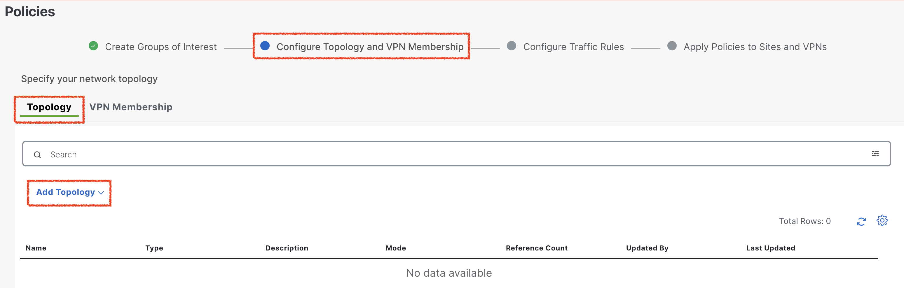{ .off-glb .small }
6. To create a tailored control policy that aligns with our specific requirements, select Custom Control (Route & TLOC). This option provides the flexibility to define precise route and TLOC configurations, enabling the policy to steer traffic effectively based on the desired criteria.
   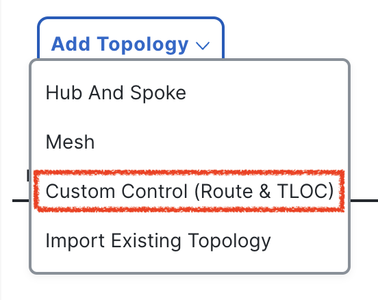{ .off-glb .small }
7. To define the topology policy, provide the name and description as **scenario-2-control-policy**.
   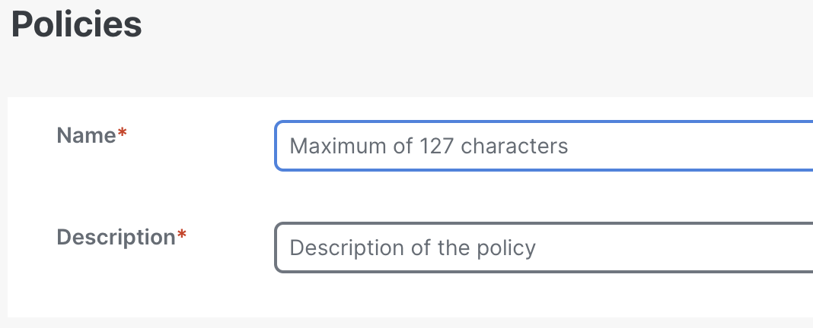{ .off-glb .small }
8. Now click **<font color="green">Default Action</font>** and click **Accept**, so all the remaining routes are accepted if they did not match in the policy entries.
   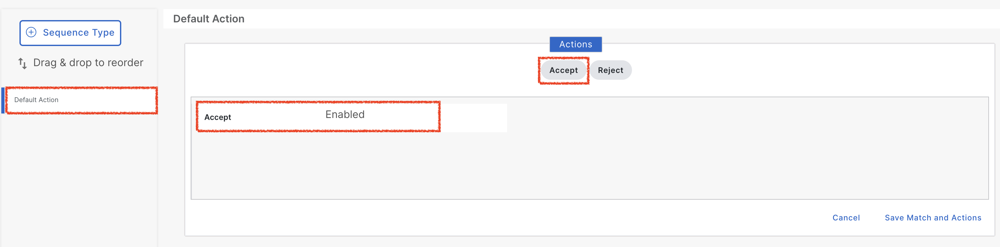{ .off-glb .small }
9. Next, click on **Sequence Type** to define the structure of the control policy. The sequence type determines the logical flow of the policy, specifying how matching conditions and corresponding actions are applied to the control plane. By selecting the appropriate sequence type, you can configure precise rules that dictate the routing behavior for specific traffic patterns or destinations.
   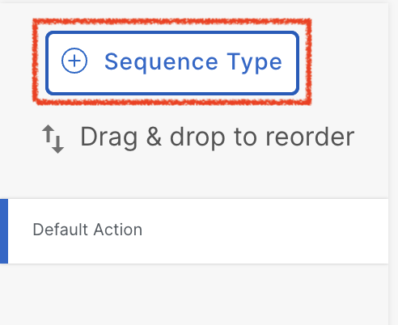{ .off-glb .small } 
10. In this step, we create a sequence within the control policy to handle routes specific to **Sydney-Branch** user traffic. This sequence matches the routes belonging to the **Sydney-Branch** **<font color="green">user subnet (<font color="green">192.168.20.0/24</font>)</font>** and sets the next hop to the **London-Branch TLOC (<font color="green">biz-internet:10.0.0.1</font>)**. 
    This TLOC is configured to direct traffic towards the **London-Branch Firewall (FW)**, ensuring that all matched traffic is routed through the firewall for inspection and policy enforcement. This configuration is a critical step in defining how traffic is dynamically steered within the SD-WAN environment to meet security and routing requirements.
    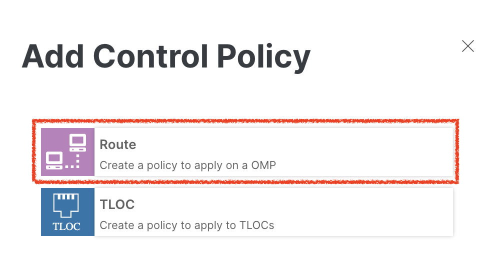{ .off-glb .small } 
11. Now, click **Sequence Rule** and select **Match** to define the criteria for the control policy. In this step, we configure the policy to match routes based on a specific site-id and a designated prefix-list. The site-id used in this control policy corresponds to **Sydney-Branch** (<font color="green">**site-id 20**</font>), ensuring the policy applies only to 
    traffic originating from this site. Additionally, the prefix-list selected for the control policy is **Sydney-Branch-User-Subnet**, which includes the subnet <font color="green">**192.168.20.0/24**</font>. This configuration ensures precise targeting of routes for the desired traffic steering behavior.
    { .off-glb .small } 
12. Next, click **Action** and select **Accept** to define the behavior of the control policy for matched routes. Once the action is set to **Accept**, proceed to configure the Service by selecting <font color="green">Firewall</font> from the dropdown menu. This step ensures that the traffic will be steered through the designated firewall service.
    Specify the **VPN** where the firewall is hosted — in this topology, the VPN is <font color="green">1</font>. Under the TLOC IP section, input the TLOC IP address **<font color="green">10.0.0.1</font>**, and select the color as **biz-internet** and Encapsulation as **IPSEC**. These configurations direct the traffic through the appropriate TLOC path, ensuring secure and optimized routing through the firewall.
    { .off-glb .small }
13. Once the match conditions and actions are fully configured, click **Save Match and Actions** to finalize the rule. This step ensures that the defined criteria and corresponding actions are stored within the control policy.
    By saving, you confirm the rule’s configuration, making it ready to be included in the policy sequence.
    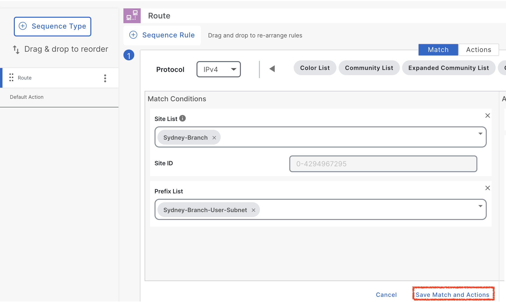{ .off-glb .small }
14. Now click **Next** and as we are NOT configuring any **Traffic Rules** so we click **Next** again. After that we land to **Apply Policies to Sites and VPNs** section.
    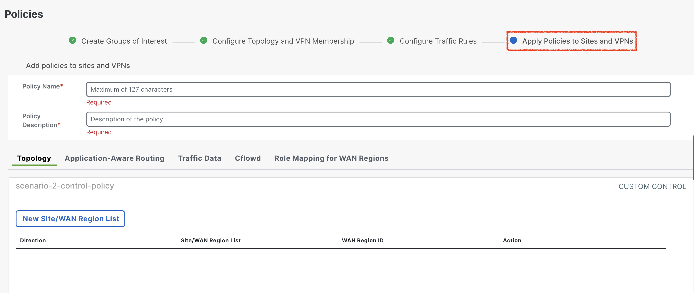{ .off-glb .small }
15. Under **Topology** section click **New Site/WAN Region List**.
    { .off-glb .small }
16. Make sure we select **Site List** and under **Outbound Site List**, we select **<font color="green">Stockholm-Branch</font>**. So intent of the control policy is to select
    when SD-WAN Controller (vSmart), advertised the routes of **Sydney-Branch** more specifically **Sydney-Branch-User**, we set the TLOC of **London-Branch** and advertised towards the
    **Stockholm-Branch**, as policy is applied in **<font color="green">outbound</font>** direction. Once **Stockholm-Branch** is selected from **Outbound Site List**, we select **Add**. So
    configuration of the direction is saved under control policy like below.
    { .off-glb .small }
17. To complete the control policy setup, configure the policy name and description. Enter **<font color="green">scenario-2</font>** as the name and description.
    { .off-glb .small }
18. Now click the three dots 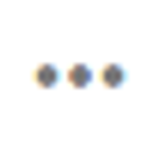{ .off-glb width="25"} on the **scenario-2** policy.
    { .off-glb .small }
19. Click **Preview** to review the policy and after reviewing click **OK**.
    { .off-glb .small }
20. Now go to **Policies > Centralized Policy** page, click 3 dots { .off-glb width="25"} on the **scenario-2** policy.
    1. Click **Activate**. 
    2. Click **Activate** on **Activate Policy** pop-up. 
    { .off-glb .small }
21. Click **Activate** and observe **Push vSmart Policy** <font color="green">**Validation success**</font> and <font color="orange">Message</font> **Done – Push vSmart Policy**. 
    { .off-glb .small }

## Verification

After the successful deployment of the centralized control policy <font color="green">**scenario-2**</font>, it is essential 
to verify its application on the **SD-WAN controller (vSmart)** and confirm that routes are being propagated according to the 
policy. Specifically, we need to ensure that the **Stockholm-Branch** WAN-Edge has received the **Sydney-Branch user routes** with 
the **London-Branch** TLOC as defined in the policy. This verification can be performed using the following show commands on 
the **SD-WAN Controller(vSmart)**. These commands allow us to confirm the correct route advertisements and validate that the 
policy is functioning as intended.

```{ .ios .no-copy  title="Centralized Control Policy on SD-WAN Controller"}
Controller-1# show running-config policy
policy
 lists
  site-list Stockholm-Branch
   site-id 10
  !
  site-list Sydney-Branch
   site-id 20
  !
  prefix-list Sydney-Branch-User-Subnet
   ip-prefix 192.168.20.0/24
  !
 !
 control-policy scenario-2-control-policy
  sequence 1
   match route
    prefix-list Sydney-Branch-User-Subnet
    site-list   Sydney-Branch
   !
   action accept
    set
     service FW vpn 1
     service tloc 10.0.0.1 color biz-internet encap ipsec
    !
   !
  !
  default-action accept
 !
!
```
After activating the centralized control policy, we can observe that the **Sydney-Branch** user subnet **<font color="green">192.168.20.0/24</font>** is 
now associated exclusively with the **London-Branch TLOC** (**<font color="green">biz-internet:10.0.0.1</font>**) as per the 
policy configuration. This behavior contrasts with the earlier state, prior to applying the control policy, where the same 
subnet **<font color="green">192.168.20.0/24</font>** was advertised with **both Sydney-Branch TLOCs** (<font color="orange">**biz-internet, mpls**</font>). 
This change demonstrates the effectiveness of the centralized control policy in steering traffic dynamically by modifying route advertisements to align with the desired topology.

```{ .ios .no-copy linenums="1", hl_lines="32"}
Stockholm-Branch#show sdwan omp routes 
Generating output, this might take time, please wait ...
Code:
C   -> chosen
I   -> installed
Red -> redistributed
Rej -> rejected
L   -> looped
R   -> resolved
S   -> stale
Ext -> extranet
Inv -> invalid
Stg -> staged
IA  -> On-demand inactive
U   -> TLOC unresolved
BR-R -> Border-Router reoriginated
TGW-R -> Transport-Gateway reoriginated
R-TGW-R -> Reoriginated Transport-Gateway reoriginated

                                                                                                                                                AFFINITY                                 
                                                      PATH                      ATTRIBUTE                                                       GROUP                                    
TENANT    VPN    PREFIX              FROM PEER        ID     LABEL    STATUS    TYPE       TLOC IP          COLOR            ENCAP  PREFERENCE  NUMBER      REGION ID   REGION PATH      
-----------------------------------------------------------------------------------------------------------------------------------------------------------------------------------------
0         1      10.10.10.0/24       0.0.0.0          66     1003     C,Red,R   installed  10.1.1.1         mpls             ipsec  -           None        None        -                
                                     0.0.0.0          68     1003     C,Red,R   installed  10.1.1.1         biz-internet     ipsec  -           None        None        -                
0         1      10.101.101.0/24     100.0.0.101      1      1003     C,I,R     installed  10.0.0.1         mpls             ipsec  -           None        None        -                
                                     100.0.0.101      2      1003     C,I,R     installed  10.0.0.1         biz-internet     ipsec  -           None        None        -                
0         1      10.102.102.102/32   100.0.0.101      1      1008     C,I,R     installed  10.0.0.2         biz-internet     ipsec  -           None        None        -                
                                     100.0.0.101      2      1008     C,I,R     installed  10.0.0.2         mpls             ipsec  -           None        None        -                
0         1      192.168.10.0/24     0.0.0.0          66     1003     C,Red,R   installed  10.1.1.1         mpls             ipsec  -           None        None        -                
                                     0.0.0.0          68     1003     C,Red,R   installed  10.1.1.1         biz-internet     ipsec  -           None        None        -                
0         1      192.168.20.0/24     100.0.0.101      2      1014     C,I,R     installed  10.0.0.1         biz-internet     ipsec  -           None        None        -                
```

The output of the command "**show sdwan omp routes** <font color="green">**192.168.20.0/24**</font>" confirms that the route **192.168.20.0/24**, 
which represents the **Sydney-Branch** user subnet, has been assigned the **label <font color="green">1014</font>**. This label corresponds to the 
**firewall (FW)** service label advertised by the **London-Branch** and is applied as per the centralized control policy configured on the SD-WAN controller (vSmart). 

```{ .ios .no-copy linenums="1", hl_lines="8 16" }
Stockholm-Branch#show sdwan omp routes 192.168.20.0/24 detail 
--------------------------------------------------------------------------
omp route entries for tenant-id 0 vpn 1 route 192.168.20.0/24
--------------------------------------------------------------------------
            RECEIVED FROM:                   
peer            100.0.0.101
path-id         2
label           1014
status          C,I,R
loss-reason     not set
lost-to-peer    not set
lost-to-path-id not set
    Attributes:
     originator       10.1.1.2
     type             installed
     tloc             10.0.0.1, biz-internet, ipsec
     ultimate-tloc    not set
     domain-id        not set
     overlay-id        1
     site-id          20
     preference       not set
     affinity-group  None
     derived-affinity-group  None
     affinity-preference-order  None
     device-group     not set
     region-id        None
     br-preference    not set
     mrf-route-originator      not set
     region-path      not set
     route-reoriginator      not set
     tag              not set
     origin-proto     connected
     origin-metric    0
     as-path          not set
     community        not set
     site-type        not set
     unknown-attr-len not set
     management-gateway   not set
     management-region   not set
```

To verify that the centralized data policy is functioning as intended, navigate back to the **Stockholm-User** in the **Stockholm-Branch** site. 

- Perform a traceroute to the **Sydney-User** located in the **Sydney-Branch** site using the **traceroute** command: 
    - _traceroute 192.168.20.2 -n_
- Observe the traceroute output to confirm that traffic is hitting the **London firewall (London-FW)** at IP address **<font color="#9AAFCB">10.101.101.2</font>**.

```{.ios .no-copy linenums="1" hl_lines="5 8"}
Stockholm-User:~$ traceroute 192.168.20.2 -n
traceroute to 192.168.20.2 (192.168.20.2), 30 hops max, 46 byte packets
 1  192.168.10.1  0.622 ms  0.757 ms  0.306 ms
 2  172.16.1.101  1.735 ms  0.660 ms  0.639 ms
 3  10.101.101.2  2.857 ms  1.571 ms  2.234 ms
 4  10.101.101.1  1.652 ms  1.654 ms  1.504 ms
 5  172.16.1.20  2.936 ms  1.835 ms  1.436 ms
 6  192.168.20.2  2.596 ms  2.295 ms  2.625 ms
Stockholm-User:~$ 
```
- Next, verify on the **London-FW** itself to ensure that the traffic is being **inspected** before continuing its journey toward the **Sydney-User**. 
- This step confirms that the traffic is correctly following the service chain configuration as defined in the centralized data policy.

```{.ios .no-copy title="Stockholm Firewall traffic inspection"}
London-Hub-FW# show conn all
12 in use, 100 most used

UDP inside  192.168.10.2:42735 inside  192.168.20.2:33444, idle 0:00:01, bytes 18, flags - 
UDP inside  192.168.10.2:42735 inside  192.168.20.2:33446, idle 0:00:01, bytes 18, flags - 
UDP inside  192.168.10.2:42735 inside  192.168.20.2:33450, idle 0:00:01, bytes 18, flags - 
UDP inside  192.168.10.2:42735 inside  192.168.20.2:33452, idle 0:00:01, bytes 18, flags - 
UDP inside  192.168.10.2:42735 inside  192.168.20.2:33448, idle 0:00:01, bytes 18, flags - 
UDP inside  192.168.10.2:42735 inside  192.168.20.2:33441, idle 0:00:01, bytes 0, flags - 
UDP inside  192.168.10.2:42735 inside  192.168.20.2:33449, idle 0:00:01, bytes 18, flags - 
UDP inside  192.168.10.2:42735 inside  192.168.20.2:33443, idle 0:00:01, bytes 0, flags - 
UDP inside  192.168.10.2:42735 inside  192.168.20.2:33445, idle 0:00:01, bytes 18, flags - 
UDP inside  192.168.10.2:42735 inside  192.168.20.2:33447, idle 0:00:01, bytes 18, flags - 
UDP inside  192.168.10.2:42735 inside  192.168.20.2:33442, idle 0:00:01, bytes 0, flags - 
UDP inside  192.168.10.2:42735 inside  192.168.20.2:33451, idle 0:00:01, bytes 18, flags - 
```
## Conclusion
In conclusion, the configuration group and centralized control policy implemented in this lab successfully ensured that traffic originating from the **Stockholm-User** 
at **Stockholm-Branch (site-10)** and destined for the **Sydney-User** at **Sydney-Branch (site-20)** was routed through the **firewall (London-FW)** at **London-Branch**. 
The firewall, reachable via the Stockholm-Branch WAN-Edge in **VRF-1**, effectively inspected the traffic before allowing it to proceed to its destination. 
This demonstrates the practical application of service chaining and centralized data policies in steering traffic through desired network functions within the Cisco SD-WAN fabric.

!!! info
    Before proceeding to the **next lab**, it is essential to **<font color="red">deactivate</font>** the centralized control policy configured in the current exercise. **Deactivating** the policy 
    ensures that no unintended traffic steering or service chaining configurations remain active, which could interfere with subsequent lab tasks. Once the centralized control policy is successfully deactivated 
    and confirmed, delete the service in **London-Branch-Service-Attachment** in **London-Branch** WAN-Edge service profile **EMEA-London-Branch-Service-VPN**. Now we can confidently move forward to 
    the next lab. This step is critical to maintain a clean and controlled environment for the upcoming configurations and scenarios.

