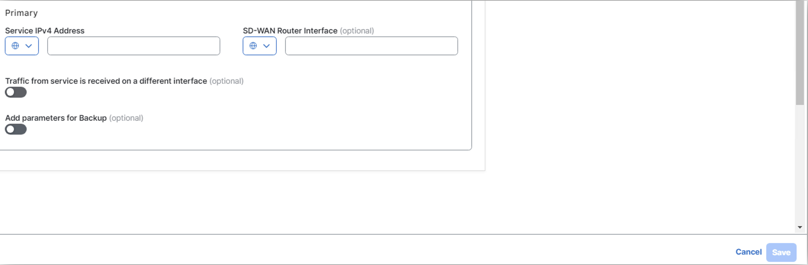

# Route traffic from Sydney to Stockholm via local firewall in Sydney in different VRF

## Introduction

In this lab exercise, you will analyze the traffic flow between a user in the **<font color="Green">APAC-Sydney-Branch (site-20)</font>** and a user in the **<font color="Green">EMEA-Stockholm-Branch (site-10)</font>**, with the traffic routed through a **firewall** **<font color="Green">(Sydney-Firewall)</font>** hosted at the 
**APAC-Sydney (site-20)** in a different **<font color="#9AAFCB">VRF-2</font>**. The **Sydney-Firewall**, accessible via **Sydney-Branch** WAN-Edge router in **<font color="#9AAFCB">VRF-2</font>**, plays a critical role in inspecting and securing the traffic as it traverses the network. This exercise will focus on understanding the configuration and verification of service chaining, 
centralized policies, and the interactions between network elements to ensure the intended traffic flow through the designated security device.

Here is a breakdown of the key components involved in the network path:

- **Source:** The traffic originates from a **Sydney-User** user in the **APAC-Sydney-Branch (site-20)**.
- **Destination:** The intended recipient is a **Stockholm-User** in the **EMEA-Stockholm-Branch (site-10)**.
- **Firewall:** All traffic passes through a **firewall (Sydney-FW)**, which is hosted locally at the **APAC-Sydney-Branch (site-20)** in a **<font color="green">VRF-2</font>**.
- **WAN Edge Router:** The **Sydney-Branch** WAN-Edge router, configured in ***<font color="#9AAFCB">VRF-1</font>***, facilitates the traffic's reachability to the firewall and subsequent routing towards the destination.

Ensure that each component is properly configured and verify the traffic flow is going through **London-FW**.

!!! note
    Through this lab, firewall is configured to inspect traffic automatically in **inspected mode**, ***<font color="red"> without requiring any additional configuration</font>***. This inspection ensures that only safe and authorized traffic flows through the network, enhancing security and protecting against potential threats.

## Intended Traffic Flow Diagram

The following diagram illustrates the **<font color="orange">flow of traffic within the network for this scenario</font>**. Traffic is initiated from the **Sydney-User** and is first redirected to the **Sydney-Firewall** in a **<font color="green">VRF-2</font>** for <font color="orange">**inspection**</font>. After the traffic undergoes inspection, it is then forwarded to the **Stockholm-User** in the **Stockholm Branch**. 

This scenario demonstrates how traffic is securely routed through the firewall for inspection before reaching its final destination, ensuring that security policies are applied effectively within the SD-WAN fabric.

<figure markdown>
  
</figure>

## Traffic flow without any policy

In the initial configuration, without applying any traffic policies, the routes learned from the **Stockholm-Branch** are distributed equally across both TLOCs, leveraging ECMP (Equal-Cost Multi-Path) for optimal path selection.

```{.ios, .no-copy}

Sydney-Branch#show sdwan omp routes 192.168.10.0/24 
Code:
C   -> chosen
I   -> installed
Red -> redistributed
Rej -> rejected
L   -> looped
R   -> resolved
S   -> stale
Ext -> extranet
Inv -> invalid
Stg -> staged
IA  -> On-demand inactive
U   -> TLOC unresolved
BR-R -> Border-Router reoriginated
TGW-R -> Transport-Gateway reoriginated
R-TGW-R -> Reoriginated Transport-Gateway reoriginated

                                                                                                                                                AFFINITY                                 
                                                      PATH                      ATTRIBUTE                                                       GROUP                                    
TENANT    VPN    PREFIX              FROM PEER        ID     LABEL    STATUS    TYPE       TLOC IP          COLOR            ENCAP  PREFERENCE  NUMBER      REGION ID   REGION PATH      
-----------------------------------------------------------------------------------------------------------------------------------------------------------------------------------------
0         1      192.168.10.0/24     100.0.0.101      1      1003     C,I,R     installed  10.1.1.1         mpls             ipsec  -           None        None        -                
                                     100.0.0.101      2      1003     C,I,R     installed  10.1.1.1         biz-internet     ipsec  -           None        None        -                

```

To verify this, we initiate a ping from the **Sydney-User** (**<font color="#9AAFCB">IP: 192.168.20.2</font>**) to the **Stockholm-User** (**<font color="#9AAFCB">IP: 192.168.10.2</font>**). A successful ping response confirms that reachability between the two branches is intact.

```{.ios, .no-copy}
Sydney-User:~$ ping 192.168.10.2
PING 192.168.10.2 (192.168.10.2): 56 data bytes
64 bytes from 192.168.10.2: seq=0 ttl=42 time=2.266 ms
64 bytes from 192.168.10.2: seq=1 ttl=42 time=1.586 ms
64 bytes from 192.168.10.2: seq=2 ttl=42 time=2.003 ms
64 bytes from 192.168.10.2: seq=3 ttl=42 time=5.758 ms
64 bytes from 192.168.10.2: seq=4 ttl=42 time=5.630 ms
^C
--- 192.168.10.2 ping statistics ---
5 packets transmitted, 5 packets received, 0% packet loss
round-trip min/avg/max = 1.586/3.448/5.758 ms
Sydney-User:~$ 
```
Additionally, traffic originating from the **Sydney-Branch** flows directly to the **Stockholm-Branch** via the available TLOCs, ensuring efficient and balanced connectivity in the absence of traffic policies.

```{.ios, .no-copy}
Sydney-User:~$ traceroute 192.168.10.2 -n
traceroute to 192.168.10.2 (192.168.10.2), 30 hops max, 46 byte packets
 1  192.168.20.1  0.893 ms  1.320 ms  0.312 ms
 2  172.16.1.10  1.151 ms  1.125 ms  172.16.2.10  1.027 ms
 3  192.168.10.2  1.822 ms  0.960 ms  1.538 ms
Sydney-User:~$ 
```

!!! note
    In the traceroute above, we observe that the traffic is currently routed over the **INET** TLOC. However, it is also possible for the traffic to use the **MPLS** TLOC, as SD-WAN employs ECMP (Equal-Cost Multi-Path) to balance traffic across all available TLOCs.

Following Table exhibit how traffic is flowing from **Stockholm-User** to **Sydney-User**.

| Interface         | IP Address   | Description                                                                                                                            |
|-------------------|--------------|----------------------------------------------------------------------------------------------------------------------------------------|
| GigabitEthernet 3 | 192.168.20.1 | <font color="#9AAFCB"> **Sydney-Branch** WAN-Edge interface in **<font color="black">VRF 1</font>** connected with **Sydney-User**. |
| GigabitEthernet 1 | 172.16.1.10  | <font color="#9AAFCB"> **Sydney-Branch** WAN-Edge interface **INET TLOC**.</font>                                                         |
| eth0              | 192.168.10.2 | <font color="#9AAFCB"> **Stockholm-User** IP address.</font>                                                                                 |

The **Sydney-Branch** WAN-Edge router establishes connectivity with the **Sydney-FW** firewall through its **<font color="#9AAFCB">GigabitEthernet 4</font>** interface, which is part of <font color="orange">**VRF-2**</font>. This interface facilitates the secure and efficient inspection of traffic passing through the firewall. 

The following table provides a detailed overview of the IP addressing configuration assigned to the **Sydney-Branch** WAN-Edge router, ensuring clarity and ease of reference for subsequent tasks in the lab.

| Interface         | IP Address   | Description                                                                      |
|-------------------|--------------|----------------------------------------------------------------------------------|
| GigabitEthernet 4 | 10.20.20.2 | <font color="#9AAFCB"> **Sydney-FW** GigabitEthernet 4 interface IP address.</font> |


## Configuring Service-Chain in Configuration Group
Next, we will configure a service chain within the service-profile parcel in the configuration group by following the below setps. 
This service chain defines the sequence of services that will be applied to traffic originating from the **Sydney-Branch** and destined 
for the **Stockholm-Branch**. By specifying the service chain in the configuration, we instruct the **Sydney WAN-Edge** on the type of services 
to be applied to the traffic, such as redirection through a **Sydney-FW** firewall in **<font color="bluw">VRF 2</font>**. 
This configuration ensures that the desired service policies are enforced as traffic flows between the branches.

1. From the vManage Landing Page, navigate to the left-hand panel, select Configuration, and click Configuration Groups.
   { .off-glb }
2. Locate and click on the **APAC-Sydney-Branch** Configuration Group as illustrated below.
   { .off-glb }
3. Click the edit { .off-glb, width=25 } icon for the **EMEA-London-Branch - Service Profile** as illustrated below.   
   { .off-glb }
4. Select **<font color="#9AAFCB">Add New Feature</font>** and add a <font color="orange">**Service Chain Attachment Gateway**</font> as illustrated below.
   { .off-glb }
5. In the <font color="orange">**Service Chain Attachment Gateway**</font> configuration parcel, click the dropdown arrow and select **Add New**.
   { .off-glb }
6. On the **Service Chain Attachment Gateway** configuration page, provide ***Name*** and ***Description*** for the attachment gateway. For example, use the name and description **<font color="orange">London-Branch-Service-Attachment</font>**.
   { .off-glb }
7. Click **Add Service Chain Definition** to define the service chain. 
   { .off-glb }
8. Enter the name **Sydney-Firewall-SC-Def** and Description **Sydney-Firewall-SC-Def** for the service chain definition.
9. Select a **Service Type** <font color="red">**Firewall**</font> by click dropdown and click **<font color="orange">Save</font>**
   { .off-glb }
10. Under Basic Information, enter **VPN** <font color="orange">**2**</font>.
11. Scroll down to **IPv4 Attachment**: <font color="orange">(1 Interface)</font>.
    { .off-glb }
12. Enter **Service IPv4 Address <font color="#9AAFCB">10.20.20.2</font>**. This is the IP address of **Sydney Firewall (***<font color="green">Sydney-FW</font>***)**.
13. Enter SD-WAN Router Interface as **GigabitEthernet4** and click <font color="orange">**Save**</font>.
    { .off-glb }
    The **GigabitEthernet4** interface on the **Sydney-Branch** WAN-Edge router serves as the connection point for the **Sydney-FW firewall**. 
    This interface facilitates the integration of the firewall into the service chain, allowing traffic to be redirected through the firewall for 
    inspection or policy enforcement as configured. The proper configuration of this interface is crucial for ensuring seamless communication between 
    the WAN-Edge router and the firewall, enabling the desired security and traffic management features within the SD-WAN environment.
14. Click **Back** at bottom left.
    { .off-glb }
15. As we add the **Service Attachment Gateway Definition**, now configuration group for **APAC-Sydney-Branch** is now marked as <font color="red">out of sync</font>. 
16. Click **APAC-Sydney-Branch** Configuration Group -> Click **<font color="green">Deploy**</font>.
    { .off-glb }
17. In **Deploy Configuration Group** page, select **APAC-Sydney-Branch** by clicking the square Radio Button and Click **Next**.  
    { .off-glb }
18. Click **Import**, and load **APAC-Sydney-Branch.csv** file which loads all the values for the variables.
    { .off-glb }
19. After uploading the **CSV files**, click on **Preview CLI** to review the configuration changes before deployment. This step ensures that the service-chain gateway definition 
    is correctly included in the configuration. By previewing the CLI, you can verify that all required parameters have been accurately applied and are ready for deployment. 
    This validation step is critical to confirm that the service chain configuration aligns with the intended design and will function as expected once deployed.
    { .off-glb }
20. Scroll down the **New Configuration** section to locate the **service-chain number** highlighted in <font color="#9AAFCB">**#9AAFCB**</font>. <font color="red">Make a note of this number</font>, as it will be required when configuring the data policy in later sections.
    The **service-chain number** is a <font color="red">critical identifier</font> used to link the service chain definition to the appropriate policy, ensuring that traffic is processed through the configured service chain as intended.
    { .off-glb }
21. After finalizing the configuration, click **Cancel** to exit the current screen and then click **Deploy** to initiate the deployment process. Once the deployment is triggered, navigate to the **View Deployment Status** section to monitor the progress. 
    { .off-glb } 
22. Wait until the deployment status indicates **<font color="green">Success</font>**, confirming that the configuration has been successfully applied to the relevant devices.
    { .off-glb }
23. To verify the configuration group status, click on the **EMEA-London-Branch** configuration group. Ensure that the **Associated column indicates <font color="orange">1</font> device**, confirming that the configuration group is 
    correctly linked to the **London-Branch** WAN-Edge router. Additionally, check that the Provisioning column displays **<font color="orange">0 out of sync</font>** indicating that the configuration has been successfully deployed 
    and is fully synchronized with the device. This step ensures that the configuration group is correctly applied and functioning as intended.
    { .off-glb }

## Verification of Service Chain configuration on Sydney-Branch

In the Cisco SD-WAN architecture, service nodes communicate their available services to the **SD-WAN Controller (vSmart)** using the **Overlay Management Protocol (OMP)** with the service route address family. Each WAN-Edge router is responsible for advertising its service routes to the SD-WAN Controller (vSmart), which then maintains these service routes within its **Routing Information Base (RIB)**. 

**<font color="green">Notably, the SD-WAN Controller (vSmart) controller does not propagate these service routes to other WAN-Edge routers within the SD-WAN fabric</font>**. Instead, the service label, which is advertised in the service route to the SD-WAN Controller (vSmart), plays a crucial role. If traffic destined for a particular vRoute needs to traverse a service, the SD-WAN Controller (vSmart) controller replaces the vRoute’s label with the service label.

```{ .ios, .no-copy, linenums="1", hl_lines="23 24"}
Sydney-Branch#show sdwan omp services 
C   -> chosen
I   -> installed
Red -> redistributed
Rej -> rejected
L   -> looped
R   -> resolved
S   -> stale
Ext -> extranet
Stg -> staged
IA  -> On-demand inactive
Inv -> invalid
BR-R -> Border-Router reoriginated
TGW-R -> Transport-Gateway reoriginated
R-TGW-R -> Reoriginated Transport-Gateway reoriginated

                                                                                 AFFINITY                            
ADDRESS                                                         PATH   REGION    GROUP                               
FAMILY   TENANT    VPN    SERVICE  ORIGINATOR  FROM PEER        ID     ID        NUMBER      LABEL    STATUS    VRF  
---------------------------------------------------------------------------------------------------------------------
ipv4     0         1      VPN      10.1.1.2    0.0.0.0          66     None      None        1003     C,Red,R   1    
                                               0.0.0.0          68     None      None        1003     C,Red,R   1    
         0         2      VPN      10.1.1.2    0.0.0.0          66     None      None        1007     C,Red,R   2    
                                               0.0.0.0          68     None      None        1007     C,Red,R   2    
         0         2      SC8      10.1.1.2    0.0.0.0          66     None      None        1008     C,Red,R   2    
                                               0.0.0.0          68     None      None        1008     C,Red,R   2    
ipv6     0         1      VPN      10.1.1.2    0.0.0.0          66     None      None        1003     C,Red,R   1    
                                               0.0.0.0          68     None      None        1003     C,Red,R   1    
         0         2      VPN      10.1.1.2    0.0.0.0          66     None      None        1007     C,Red,R   2    
                                               0.0.0.0          68     None      None        1007     C,Red,R   2    

```
To verify the service chain configuration on the **Sydney-Branch** WAN-Edge router, access the device CLI and execute the command:

- **show platform software sdwan service-chain database**. 

Review the output to confirm the following details: the **<font color="green">Service Chain ID (e.g., SC8)</font>**, the **<font color="green">VRF (e.g., vrf: 2)</font>**, and the State, which should display **UP** to indicate proper functionality. 

Additionally, verify that the Service is set to **<font color="green">FW (Firewall)</font>**, the TX and RX interface is **GigabitEthernet4**, and the associated IP address is **10.20.20.2**. This verification ensures that the service chain configuration is active and correctly aligned with the intended design.

```{.ios, .no-copy, linenums="1", hl_lines="3 4 5 6 9 17 20" }
Sydney-Branch#show platform software sdwan service-chain database 

Service Chain: SC8
   vrf: 2
   label: 1008
   state: up
   description:  Sydney-Firewall-SC-Def

   service: FW
      sequence: 1
      track-enable: true
      state: up
      ha_pair: 1
         type: ipv4
         posture: trusted
         active: [current]
            tx: GigabitEthernet4, 10.20.20.2
                endpoint-tracker: auto
                state: up
            rx: GigabitEthernet4, 10.20.20.2
                endpoint-tracker: auto
                state: up
```
## Configuring Centralized Control Policy for Route Leaking

