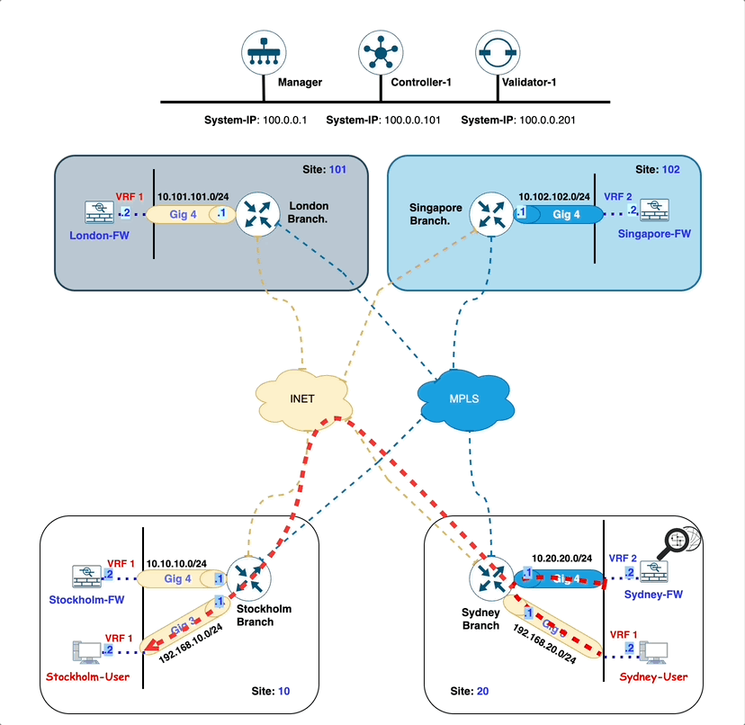

# Route traffic from Sydney to Stockholm via local firewall in Sydney in different VRF

## Introduction

In this lab exercise, you will analyze the traffic flow between a user in the **<font color="Green">APAC-Sydney-Branch (site-20)</font>** and a user in the **<font color="Green">EMEA-Stockholm-Branch (site-10)</font>**, with the traffic routed through a **firewall** **<font color="Green">(Sydney-Firewall)</font>** hosted at the 
**APAC-Sydney (site-20)** in a different **<font color="#9AAFCB">VRF-2</font>**. The **Sydney-Firewall**, accessible via **Sydney-Branch** WAN-Edge router in **<font color="#9AAFCB">VRF-2</font>**, plays a critical role in inspecting and securing the traffic as it traverses the network. This exercise will focus on understanding the configuration and verification of service chaining, 
centralized policies, and the interactions between network elements to ensure the intended traffic flow through the designated security device.

Here is a breakdown of the key components involved in the network path:

- **Source:** The traffic originates from a **Sydney-User** user in the **APAC-Sydney-Branch (site-20)**.
- **Destination:** The intended recipient is a **Stockholm-User** in the **EMEA-Stockholm-Branch (site-10)**.
- **Firewall:** All traffic passes through a **firewall (Sydney-FW)**, which is hosted locally at the **APAC-Sydney-Branch (site-20)** in a **<font color="green">VRF-2</font>**.
- **WAN Edge Router:** The **Sydney-Branch** WAN-Edge router, configured in ***<font color="#9AAFCB">VRF-1</font>***, facilitates the traffic's reachability to the firewall and subsequent routing towards the destination.

Ensure that each component is properly configured and verify the traffic flow is going through **London-FW**.

!!! note
    Through this lab, firewall is configured to inspect traffic automatically in **inspected mode**, ***<font color="red"> without requiring any additional configuration</font>***. This inspection ensures that only safe and authorized traffic flows through the network, enhancing security and protecting against potential threats.

## Intended Traffic Flow Diagram

The following diagram illustrates the **<font color="orange">flow of traffic within the network for this scenario</font>**. Traffic is initiated from the **Sydney-User** and is first redirected to the **Sydney-Firewall** in a **<font color="green">VRF-2</font>** for <font color="orange">**inspection**</font>. After the traffic undergoes inspection, it is then forwarded to the **Stockholm-User** in the **Stockholm Branch**. 

This scenario demonstrates how traffic is securely routed through the firewall for inspection before reaching its final destination, ensuring that security policies are applied effectively within the SD-WAN fabric.

<figure markdown>
  
</figure>

## Traffic flow without any policy

In the initial configuration, without applying any traffic policies, the routes learned from the **Stockholm-Branch** are distributed equally across both TLOCs, leveraging ECMP (Equal-Cost Multi-Path) for optimal path selection.

```{.ios, .no-copy}

Sydney-Branch#show sdwan omp routes 192.168.10.0/24 
Code:
C   -> chosen
I   -> installed
Red -> redistributed
Rej -> rejected
L   -> looped
R   -> resolved
S   -> stale
Ext -> extranet
Inv -> invalid
Stg -> staged
IA  -> On-demand inactive
U   -> TLOC unresolved
BR-R -> Border-Router reoriginated
TGW-R -> Transport-Gateway reoriginated
R-TGW-R -> Reoriginated Transport-Gateway reoriginated

                                                                                                                                                AFFINITY                                 
                                                      PATH                      ATTRIBUTE                                                       GROUP                                    
TENANT    VPN    PREFIX              FROM PEER        ID     LABEL    STATUS    TYPE       TLOC IP          COLOR            ENCAP  PREFERENCE  NUMBER      REGION ID   REGION PATH      
-----------------------------------------------------------------------------------------------------------------------------------------------------------------------------------------
0         1      192.168.10.0/24     100.0.0.101      1      1003     C,I,R     installed  10.1.1.1         mpls             ipsec  -           None        None        -                
                                     100.0.0.101      2      1003     C,I,R     installed  10.1.1.1         biz-internet     ipsec  -           None        None        -                

```

To verify this, we initiate a ping from the **Sydney-User** (**<font color="#9AAFCB">IP: 192.168.20.2</font>**) to the **Stockholm-User** (**<font color="#9AAFCB">IP: 192.168.10.2</font>**). A successful ping response confirms that reachability between the two branches is intact.

```{.ios, .no-copy}
Sydney-User:~$ ping 192.168.10.2
PING 192.168.10.2 (192.168.10.2): 56 data bytes
64 bytes from 192.168.10.2: seq=0 ttl=42 time=2.266 ms
64 bytes from 192.168.10.2: seq=1 ttl=42 time=1.586 ms
64 bytes from 192.168.10.2: seq=2 ttl=42 time=2.003 ms
64 bytes from 192.168.10.2: seq=3 ttl=42 time=5.758 ms
64 bytes from 192.168.10.2: seq=4 ttl=42 time=5.630 ms
^C
--- 192.168.10.2 ping statistics ---
5 packets transmitted, 5 packets received, 0% packet loss
round-trip min/avg/max = 1.586/3.448/5.758 ms
Sydney-User:~$ 
```
Additionally, traffic originating from the **Sydney-Branch** flows directly to the **Stockholm-Branch** via the available TLOCs, ensuring efficient and balanced connectivity in the absence of traffic policies.

```{.ios, .no-copy}
Sydney-User:~$ traceroute 192.168.10.2 -n
traceroute to 192.168.10.2 (192.168.10.2), 30 hops max, 46 byte packets
 1  192.168.20.1  0.893 ms  1.320 ms  0.312 ms
 2  172.16.1.10  1.151 ms  1.125 ms  172.16.2.10  1.027 ms
 3  192.168.10.2  1.822 ms  0.960 ms  1.538 ms
Sydney-User:~$ 
```

!!! note
    In the traceroute above, we observe that the traffic is currently routed over the **INET** TLOC. However, it is also possible for the traffic to use the **MPLS** TLOC, as SD-WAN employs ECMP (Equal-Cost Multi-Path) to balance traffic across all available TLOCs.

Following Table exhibit how traffic is flowing from **Stockholm-User** to **Sydney-User**.

| Interface         | IP Address   | Description                                                                                                                            |
|-------------------|--------------|----------------------------------------------------------------------------------------------------------------------------------------|
| GigabitEthernet 3 | 192.168.20.1 | <font color="#9AAFCB"> **Sydney-Branch** WAN-Edge interface in **<font color="black">VRF 1</font>** connected with **Sydney-User**. |
| GigabitEthernet 1 | 172.16.1.10  | <font color="#9AAFCB"> **Sydney-Branch** WAN-Edge interface **INET TLOC**.</font>                                                         |
| eth0              | 192.168.10.2 | <font color="#9AAFCB"> **Stockholm-User** IP address.</font>                                                                                 |

The **Sydney-Branch** WAN-Edge router establishes connectivity with the **Sydney-FW** firewall through its **<font color="#9AAFCB">GigabitEthernet 4</font>** interface, which is part of <font color="orange">**VRF-2**</font>. This interface facilitates the secure and efficient inspection of traffic passing through the firewall. 

The following table provides a detailed overview of the IP addressing configuration assigned to the **Sydney-Branch** WAN-Edge router, ensuring clarity and ease of reference for subsequent tasks in the lab.

| Interface         | IP Address   | Description                                                                      |
|-------------------|--------------|----------------------------------------------------------------------------------|
| GigabitEthernet 4 | 10.20.20.2 | <font color="#9AAFCB"> **Sydney-FW** GigabitEthernet 4 interface IP address.</font> |


## Configuring Service-Chain in Configuration Group
Next, we will configure a service chain within the service-profile parcel in the configuration group by following the below setps. 
This service chain defines the sequence of services that will be applied to traffic originating from the **Sydney-Branch** and destined 
for the **Stockholm-Branch**. By specifying the service chain in the configuration, we instruct the **Sydney WAN-Edge** on the type of services 
to be applied to the traffic, such as redirection through a **Sydney-FW** firewall in **<font color="bluw">VRF 2</font>**. 
This configuration ensures that the desired service policies are enforced as traffic flows between the branches.

