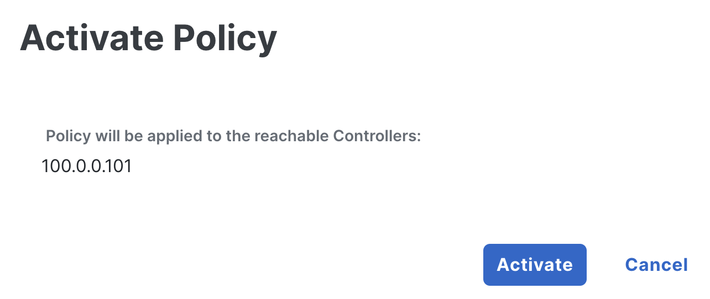
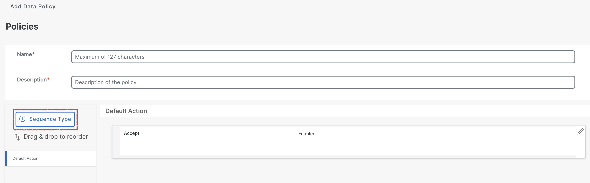
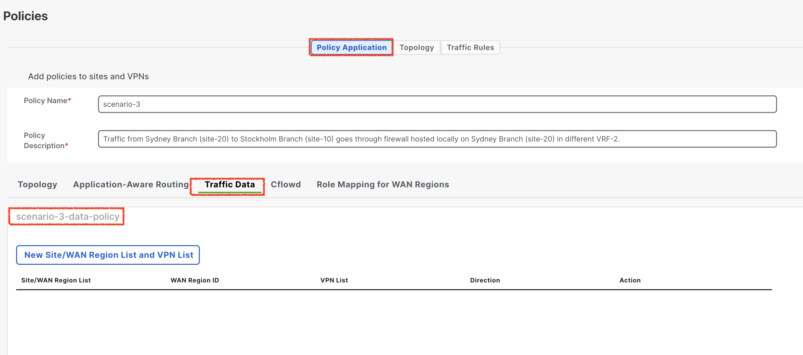

# Route traffic from Sydney to Stockholm via local firewall in Sydney in different VRF

## Introduction

In this lab exercise, you will analyze the traffic flow between a user in the **<font color="Green">APAC-Sydney-Branch (site-20)</font>** and a user in the **<font color="Green">EMEA-Stockholm-Branch (site-10)</font>**, with the traffic routed through a **firewall** **<font color="Green">(Sydney-Firewall)</font>** hosted at the 
**APAC-Sydney (site-20)** in a different **<font color="#9AAFCB">VRF-2</font>**. The **Sydney-Firewall**, accessible via **Sydney-Branch** WAN-Edge router in **<font color="#9AAFCB">VRF-2</font>**, plays a critical role in inspecting and securing the traffic as it traverses the network. This exercise will focus on understanding the configuration and verification of service chaining, 
centralized policies, and the interactions between network elements to ensure the intended traffic flow through the designated security device.

Here is a breakdown of the key components involved in the network path:

- **Source:** The traffic originates from a **Sydney-User** user in the **APAC-Sydney-Branch (site-20)**.
- **Destination:** The intended recipient is a **Stockholm-User** in the **EMEA-Stockholm-Branch (site-10)**.
- **Firewall:** All traffic passes through a **firewall (Sydney-FW)**, which is hosted locally at the **APAC-Sydney-Branch (site-20)** in a **<font color="green">VRF-2</font>**.
- **WAN Edge Router:** The **Sydney-Branch** WAN-Edge router, configured in ***<font color="#9AAFCB">VRF-1</font>***, facilitates the traffic's reachability to the firewall and subsequent routing towards the destination.

Ensure that each component is properly configured and verify the traffic flow is going through **London-FW**.

!!! note
    Through this lab, firewall is configured to inspect traffic automatically in **inspected mode**, ***<font color="red"> without requiring any additional configuration</font>***. This inspection ensures that only safe and authorized traffic flows through the network, enhancing security and protecting against potential threats.

## Intended Traffic Flow Diagram

The following diagram illustrates the **<font color="orange">flow of traffic within the network for this scenario</font>**. Traffic is initiated from the **Sydney-User** and is first redirected to the **Sydney-Firewall** in a **<font color="green">VRF-2</font>** for <font color="orange">**inspection**</font>. After the traffic undergoes inspection, it is then forwarded to the **Stockholm-User** in the **Stockholm Branch**. 

This scenario demonstrates how traffic is securely routed through the firewall for inspection before reaching its final destination, ensuring that security policies are applied effectively within the SD-WAN fabric.

<figure markdown>
  
</figure>

## Traffic flow without any policy

In the initial configuration, without applying any traffic policies, the routes learned from the **Stockholm-Branch** are distributed equally across both TLOCs, leveraging ECMP (Equal-Cost Multi-Path) for optimal path selection.

```{.ios, .no-copy}

Sydney-Branch#show sdwan omp routes 192.168.10.0/24 
Code:
C   -> chosen
I   -> installed
Red -> redistributed
Rej -> rejected
L   -> looped
R   -> resolved
S   -> stale
Ext -> extranet
Inv -> invalid
Stg -> staged
IA  -> On-demand inactive
U   -> TLOC unresolved
BR-R -> Border-Router reoriginated
TGW-R -> Transport-Gateway reoriginated
R-TGW-R -> Reoriginated Transport-Gateway reoriginated

                                                                                                                                                AFFINITY                                 
                                                      PATH                      ATTRIBUTE                                                       GROUP                                    
TENANT    VPN    PREFIX              FROM PEER        ID     LABEL    STATUS    TYPE       TLOC IP          COLOR            ENCAP  PREFERENCE  NUMBER      REGION ID   REGION PATH      
-----------------------------------------------------------------------------------------------------------------------------------------------------------------------------------------
0         1      192.168.10.0/24     100.0.0.101      1      1003     C,I,R     installed  10.1.1.1         mpls             ipsec  -           None        None        -                
                                     100.0.0.101      2      1003     C,I,R     installed  10.1.1.1         biz-internet     ipsec  -           None        None        -                

```

To verify this, we initiate a ping from the **Sydney-User** (**<font color="#9AAFCB">IP: 192.168.20.2</font>**) to the **Stockholm-User** (**<font color="#9AAFCB">IP: 192.168.10.2</font>**). A successful ping response confirms that reachability between the two branches is intact.

```{.ios, .no-copy}
Sydney-User:~$ ping 192.168.10.2
PING 192.168.10.2 (192.168.10.2): 56 data bytes
64 bytes from 192.168.10.2: seq=0 ttl=42 time=2.266 ms
64 bytes from 192.168.10.2: seq=1 ttl=42 time=1.586 ms
64 bytes from 192.168.10.2: seq=2 ttl=42 time=2.003 ms
64 bytes from 192.168.10.2: seq=3 ttl=42 time=5.758 ms
64 bytes from 192.168.10.2: seq=4 ttl=42 time=5.630 ms
^C
--- 192.168.10.2 ping statistics ---
5 packets transmitted, 5 packets received, 0% packet loss
round-trip min/avg/max = 1.586/3.448/5.758 ms
Sydney-User:~$ 
```
Additionally, traffic originating from the **Sydney-Branch** flows directly to the **Stockholm-Branch** via the available TLOCs, ensuring efficient and balanced connectivity in the absence of traffic policies.

```{.ios, .no-copy}
Sydney-User:~$ traceroute 192.168.10.2 -n
traceroute to 192.168.10.2 (192.168.10.2), 30 hops max, 46 byte packets
 1  192.168.20.1  0.893 ms  1.320 ms  0.312 ms
 2  172.16.1.10  1.151 ms  1.125 ms  172.16.2.10  1.027 ms
 3  192.168.10.2  1.822 ms  0.960 ms  1.538 ms
Sydney-User:~$ 
```

!!! note
    In the traceroute above, we observe that the traffic is currently routed over the **INET** TLOC. However, it is also possible for the traffic to use the **MPLS** TLOC, as SD-WAN employs ECMP (Equal-Cost Multi-Path) to balance traffic across all available TLOCs.

Following Table exhibit how traffic is flowing from **Sydney-User** to **Stockholm-User**.

| Interface         | IP Address   | Description                                                                                                                          |
|-------------------|--------------|--------------------------------------------------------------------------------------------------------------------------------------|
| GigabitEthernet 3 | 192.168.20.1 | <font color="#9AAFCB"> **Sydney-Branch** WAN-Edge interface in **<font color="orange">VRF 1</font>** connected with **Sydney-User**. |
| GigabitEthernet 1 | 172.16.1.10  | <font color="#9AAFCB"> **Sydney-Branch** WAN-Edge interface **INET TLOC**.</font>                                                    |
| eth0              | 192.168.10.2 | <font color="#9AAFCB"> **Stockholm-User** IP address.</font>                                                                         |

The **Sydney-Branch** WAN-Edge router establishes connectivity with the **Sydney-FW** firewall through its **<font color="#9AAFCB">GigabitEthernet 4</font>** interface, which is part of <font color="orange">**VRF-2**</font>. This interface facilitates the secure and efficient inspection of traffic passing through the firewall. 

The following table provides a detailed overview of the IP addressing configuration assigned to the **Sydney-Branch** WAN-Edge router, ensuring clarity and ease of reference for subsequent tasks in the lab.

| Interface         | IP Address   | Description                                                                      |
|-------------------|--------------|----------------------------------------------------------------------------------|
| GigabitEthernet 4 | 10.20.20.2 | <font color="#9AAFCB"> **Sydney-FW** GigabitEthernet 4 interface IP address.</font> |


## Configuring Service-Chain in Configuration Group
Next, we will configure a service chain within the service-profile parcel in the configuration group by following the below setps. 
This service chain defines the sequence of services that will be applied to traffic originating from the **Sydney-Branch** and destined 
for the **Stockholm-Branch**. By specifying the service chain in the configuration, we instruct the **Sydney WAN-Edge** on the type of services 
to be applied to the traffic, such as redirection through a **Sydney-FW** firewall in **<font color="bluw">VRF 2</font>**. 
This configuration ensures that the desired service policies are enforced as traffic flows between the branches.

1. From the vManage Landing Page, navigate to the left-hand panel, select Configuration, and click Configuration Groups.
   { .off-glb }
2. Locate and click on the **APAC-Sydney-Branch** Configuration Group as illustrated below.
   { .off-glb }
3. Click the edit { .off-glb, width=25 } icon for the **EMEA-London-Branch - Service Profile** as illustrated below.   
   { .off-glb }
4. Select **<font color="#9AAFCB">Add New Feature</font>** and add a <font color="orange">**Service Chain Attachment Gateway**</font> as illustrated below.
   { .off-glb }
5. In the <font color="orange">**Service Chain Attachment Gateway**</font> configuration parcel, click the dropdown arrow and select **Add New**.
   { .off-glb }
6. On the **Service Chain Attachment Gateway** configuration page, provide ***Name*** and ***Description*** for the attachment gateway. For example, use the name and description **<font color="orange">London-Branch-Service-Attachment</font>**.
   { .off-glb }
7. Click **Add Service Chain Definition** to define the service chain. 
   { .off-glb }
8. Enter the name **Sydney-Firewall-SC-Def** and Description **Sydney-Firewall-SC-Def** for the service chain definition.
9. Select a **Service Type** <font color="red">**Firewall**</font> by click dropdown and click **<font color="orange">Save</font>**
   { .off-glb }
10. Under Basic Information, enter **VPN** <font color="orange">**2**</font>.
11. Scroll down to **IPv4 Attachment**: <font color="orange">(1 Interface)</font>.
    { .off-glb }
12. Enter **Service IPv4 Address <font color="#9AAFCB">10.20.20.2</font>**. This is the IP address of **Sydney Firewall (***<font color="green">Sydney-FW</font>***)**.
13. Enter SD-WAN Router Interface as **GigabitEthernet4** and click <font color="orange">**Save**</font>.
    { .off-glb }
    The **GigabitEthernet4** interface on the **Sydney-Branch** WAN-Edge router serves as the connection point for the **Sydney-FW firewall**. 
    This interface facilitates the integration of the firewall into the service chain, allowing traffic to be redirected through the firewall for 
    inspection or policy enforcement as configured. The proper configuration of this interface is crucial for ensuring seamless communication between 
    the WAN-Edge router and the firewall, enabling the desired security and traffic management features within the SD-WAN environment.
14. Click **Back** at bottom left.
    { .off-glb }
15. As we add the **Service Attachment Gateway Definition**, now configuration group for **APAC-Sydney-Branch** is now marked as <font color="red">out of sync</font>. 
16. Click **APAC-Sydney-Branch** Configuration Group -> Click **<font color="green">Deploy**</font>.
    { .off-glb }
17. In **Deploy Configuration Group** page, select **APAC-Sydney-Branch** by clicking the square Radio Button and Click **Next**.  
    { .off-glb }
18. Click **Import**, and load **APAC-Sydney-Branch.csv** file which loads all the values for the variables.
    { .off-glb }
19. After uploading the **CSV files**, click on **Preview CLI** to review the configuration changes before deployment. This step ensures that the service-chain gateway definition 
    is correctly included in the configuration. By previewing the CLI, you can verify that all required parameters have been accurately applied and are ready for deployment. 
    This validation step is critical to confirm that the service chain configuration aligns with the intended design and will function as expected once deployed.
    { .off-glb }
20. Scroll down the **New Configuration** section to locate the **service-chain number** highlighted in <font color="#9AAFCB">**blue**</font>. <font color="red">Make a note of this number</font>, as it will be required when configuring the data policy in later sections.
    The **service-chain number** is a <font color="red">critical identifier</font> used to link the service chain definition to the appropriate policy, ensuring that traffic is processed through the configured service chain as intended.
    { .off-glb }
21. After finalizing the configuration, click **Cancel** to exit the current screen and then click **Deploy** to initiate the deployment process. Once the deployment is triggered, navigate to the **View Deployment Status** section to monitor the progress. 
    { .off-glb } 
22. Wait until the deployment status indicates **<font color="green">Success</font>**, confirming that the configuration has been successfully applied to the relevant devices.
    { .off-glb }
23. To verify the configuration group status, click on the **EMEA-London-Branch** configuration group. Ensure that the **Associated column indicates <font color="orange">1</font> device**, confirming that the configuration group is 
    correctly linked to the **London-Branch** WAN-Edge router. Additionally, check that the Provisioning column displays **<font color="orange">0 out of sync</font>** indicating that the configuration has been successfully deployed 
    and is fully synchronized with the device. This step ensures that the configuration group is correctly applied and functioning as intended.
    { .off-glb }

## Verification of Service Chain configuration on Sydney-Branch

In the Cisco SD-WAN architecture, service nodes communicate their available services to the **SD-WAN Controller (vSmart)** using the **Overlay Management Protocol (OMP)** with the service route address family. Each WAN-Edge router is responsible for advertising its service routes to the SD-WAN Controller (vSmart), which then maintains these service routes within its **Routing Information Base (RIB)**. 

**<font color="green">Notably, the SD-WAN Controller (vSmart) controller does not propagate these service routes to other WAN-Edge routers within the SD-WAN fabric</font>**. Instead, the service label, which is advertised in the service route to the SD-WAN Controller (vSmart), plays a crucial role. If traffic destined for a particular vRoute needs to traverse a service, the SD-WAN Controller (vSmart) controller replaces the vRoute’s label with the service label.

```{ .ios, .no-copy, linenums="1", hl_lines="23 24"}
Sydney-Branch#show sdwan omp services 
C   -> chosen
I   -> installed
Red -> redistributed
Rej -> rejected
L   -> looped
R   -> resolved
S   -> stale
Ext -> extranet
Stg -> staged
IA  -> On-demand inactive
Inv -> invalid
BR-R -> Border-Router reoriginated
TGW-R -> Transport-Gateway reoriginated
R-TGW-R -> Reoriginated Transport-Gateway reoriginated

                                                                                 AFFINITY                            
ADDRESS                                                         PATH   REGION    GROUP                               
FAMILY   TENANT    VPN    SERVICE  ORIGINATOR  FROM PEER        ID     ID        NUMBER      LABEL    STATUS    VRF  
---------------------------------------------------------------------------------------------------------------------
ipv4     0         1      VPN      10.1.1.2    0.0.0.0          66     None      None        1003     C,Red,R   1    
                                               0.0.0.0          68     None      None        1003     C,Red,R   1    
         0         2      VPN      10.1.1.2    0.0.0.0          66     None      None        1007     C,Red,R   2    
                                               0.0.0.0          68     None      None        1007     C,Red,R   2    
         0         2      SC8      10.1.1.2    0.0.0.0          66     None      None        1008     C,Red,R   2    
                                               0.0.0.0          68     None      None        1008     C,Red,R   2    
ipv6     0         1      VPN      10.1.1.2    0.0.0.0          66     None      None        1003     C,Red,R   1    
                                               0.0.0.0          68     None      None        1003     C,Red,R   1    
         0         2      VPN      10.1.1.2    0.0.0.0          66     None      None        1007     C,Red,R   2    
                                               0.0.0.0          68     None      None        1007     C,Red,R   2    

```
To verify the service chain configuration on the **Sydney-Branch** WAN-Edge router, access the device CLI and execute the command:

- **show platform software sdwan service-chain database**. 

Review the output to confirm the following details: the **<font color="green">Service Chain ID (e.g., SC8)</font>**, the **<font color="green">VRF (e.g., vrf: 2)</font>**, and the State, which should display **UP** to indicate proper functionality. 

Additionally, verify that the Service is set to **<font color="green">FW (Firewall)</font>**, the TX and RX interface is **GigabitEthernet4**, and the associated IP address is **10.20.20.2**. This verification ensures that the service chain configuration is active and correctly aligned with the intended design.

```{.ios, .no-copy, linenums="1", hl_lines="3 4 5 6 9 17 20" }
Sydney-Branch#show platform software sdwan service-chain database 

Service Chain: SC8
   vrf: 2
   label: 1008
   state: up
   description:  Sydney-Firewall-SC-Def

   service: FW
      sequence: 1
      track-enable: true
      state: up
      ha_pair: 1
         type: ipv4
         posture: trusted
         active: [current]
            tx: GigabitEthernet4, 10.20.20.2
                endpoint-tracker: auto
                state: up
            rx: GigabitEthernet4, 10.20.20.2
                endpoint-tracker: auto
                state: up
```
## Routing State Prior to Control Policy Implementation
In an SD-WAN environment, the **SD-WAN controller** maintains routes for each configured **VPN/VRF** and advertises these routes to all 
WAN-Edge routers associated with the **respective VPN/VRF**. This ensures consistent route propagation and connectivity across the network. 
To verify how the **SD-WAN controller** advertises these routes to the WAN-Edge routers, we can use the following command:

- **show omp routes <font color ="orange">vpn 1</font> advertised**
- **show omp routes <font color ="orange">vpn 2</font> advertised**

```{ .ios .no-copy}
Controller-1# show omp routes vpn 1 advertised
Code:
C   -> chosen
I   -> installed
Red -> redistributed
Rej -> rejected
L   -> looped
R   -> resolved
S   -> stale
Ext -> extranet
Inv -> invalid
Stg -> staged
IA  -> On-demand inactive
U   -> TLOC unresolved

VPN    PREFIX              TO PEER          
--------------------------------------------
1      10.10.10.0/24       10.0.0.1         
                           10.0.0.2         
                           10.1.1.2         
1      10.101.101.0/24     10.0.0.2         
                           10.1.1.1         
                           10.1.1.2         
1      10.102.102.102/32   10.0.0.1         
                           10.1.1.1         
                           10.1.1.2         
1      192.168.10.0/24     10.0.0.1         
                           10.0.0.2         
                           10.1.1.2         
1      192.168.20.0/24     10.0.0.1         
                           10.0.0.2         
                           10.1.1.1         
```
As observed in the output below, the routes from **VRF-1** are <font color="green">**not visible within VRF-2**</font>. 
The displayed prefixes belong exclusively to **VRF-2**, indicating that route-leaking between **VRF-1** and **VRF-2** has not yet been configured or applied. 
This behavior is expected in the **absence of a control policy facilitating inter-VRF route exchange**.

```{.ios .no-copy}
Controller-1# show omp routes vpn 2 advertised
Code:
C   -> chosen
I   -> installed
Red -> redistributed
Rej -> rejected
L   -> looped
R   -> resolved
S   -> stale
Ext -> extranet
Inv -> invalid
Stg -> staged
IA  -> On-demand inactive
U   -> TLOC unresolved

VPN    PREFIX              TO PEER          
--------------------------------------------
2      10.20.20.0/24       10.0.0.2         
2      10.102.102.0/24     10.1.1.2         
```
This output highlights the necessity of implementing the **scenario-3** control policy to enable **route-leaking** and achieve full connectivity **between the VRFs**.

## Configuring Centralized Control Policy for Route Leaking

Next, we will configure a centralized **control policy** to ensure that traffic initiated from the **Sydney-User** destined 
for the **Stockholm-User** is first inspected by the **Sydney-FW** before reaching its destination. Since the 
**Sydney-Firewall** (**<font color="green">Sydney-FW</font>**) is positioned within **<font color="orange">VRF-2</font>**, it is necessary to configure a centralized control policy 
to enable **route-leaking**. This configuration ensures that traffic from the **Sydney-User** can reach the **Sydney-Firewall** 
and maintain connectivity with the **Stockholm-Branch** user in **<font color="orange">VRF-1</font>**. The control policy facilitates seamless 
communication between the two VRFs, ensuring full bidirectional reachability. By implementing this policy, 
we establish a cohesive routing environment that allows resources in **VRF-1** and **VRF-2** to interact efficiently, 
aligning with the network's operational requirements.

1. To begin configuring the centralized data policy, navigate to the left-hand pane in the SD-WAN Manager (vManage) interface. From there, select Configuration, followed by Classic, and then click on Policies. 
   { .off-glb }
2. Under the Centralized Policy section, click Add Policy to create a new policy. This will initiate the process of defining and implementing the centralized data policy to enforce traffic inspection and routing as per the lab requirements.
   { .off-glb }
3. To create the required **Groups of Interest**, start by selecting **Data Prefix** from the left navigation pane within the **Centralized Policy** configuration window. Follow these steps:
   { .off-glb }
   1. Click Site in left navigation pane and check if following sites are already created. 
      1. Click “**New Site List**” 
         1. Site List Name - **Stockholm-Branch** 
         2. Add Site – <font color="green">10</font>
      2. Click “**New Site List**”
         1. Site List Name - **Sydney-Branch** 
         2. Add Site – <font color="green">20</font>
      3. Click “**New Site List**” 
         1. Site List Name – **Both-Branches** 
         2. Add Site – <font color="green">10,20</font> 
{ .off-glb }
   2. Click VPN.  
      1. Click “**New VPN List**” 
         1. VPN List Name – **VPN-1** 
            1. Add VPN – <font color="green">1</font> 
         2. VPN List Name – **VPN-2** 
            1. Add VPN – <font color="green">2</font> 
         3. VPN List Name – **VPN-1-2** 
            1. Add VPN – <font color="green">1,2</font>
{ .off-glb }
4. Scroll down and click Next.
5. Under Topology, click **<font color="orange">Add Topology</font>** dropdown (for creating route-leaking policy) and select **<font color="green">Custom Control ( Route and TLOC)</font>**.
{ .off-glb }
6. Proceed by entering the required details as outlined below and follow the steps to configure the control policy.
   1. Enter **scenario-3-route-leak** as the policy name.
   2. Description: Provide a brief description, using **scenario-3-route-leak** for clarity and consistency.
   3. Navigate to **<font color="green">Sequence Type</font>**. Under **Add Control Policy**, choose **Route** to define the **route-leaking** configuration.
   These steps ensure that the policy is accurately defined and aligned with the lab's objectives, facilitating effective route-leaking between VPNs as part of the scenario setup.
{ .off-glb }
7. Click **<font color="green">Sequence Rule</font>**.
{ .off-glb }
8. In the **Match** section, configure the parameters to define the scope of the **control policy**. Begin by selecting Site and VPN as the matching criteria. Next, specify the following details:
    1. **Site List**: Select <font color="orange">**Both-Branches**</font> to include both branches in the policy. 
    2. **VPN List**: Choose <font color="orange">**VPN-1-2**</font> to encompass the VPNs involved in the route-leaking configuration.
   This configuration ensures that the policy applies to the specified sites and VPNs, enabling precise control over route-leaking between the designated network segments.
{ .off-glb }
9. Next, navigate to the Action section and configure the route-leaking process to enable communication between **VPN-1** and **VPN-2**. 
   Specifically, ensure that routes from **VPN-1** are leaked into **VPN-2** and vice versa. This step is critical to establishing bidirectional
   connectivity, allowing resources in both VPNs to communicate seamlessly. Proper configuration at this stage ensures the integrity of the routing 
   setup and facilitates the intended traffic flow between the VPNs as per the lab topology design.
    1. Click **Action** > **Accept** > **<font color=orange">Export To</font>**. 
    2. Export To: **<font color="orange">VPN-1-2</font>**
{ .off-glb }
10. Click **<font color="orange">Save Match and Actions</font>**.
{ .off-glb }
11. Click **Default Action**, click(./assets/S-1-figure-dots.png){ .off-glb width="25"}icon and click **Accept**. Click **<font color="orange">Save Match and Action</font>**. 
{ .off-glb }
12. Now click **Next** and ignore **Configure Traffic Rules** and move to **Apply Policies to Sites and VPNs** section.
{ .off-glb }
13. In order to apply the control policy for route-leaking, select **New Site/WAN Region List** and apply the **<font color="green">scenario-3-route-leak</font>** 
    policy in inbound direction on both **Stockholm-Branch** and **Sydney-Branch**. Now after that click **<font color="green">Save Policy</font>**.
{ .off-glb }
14. Now click { .off-glb width="25" } and select **Preview** to see the content of the control policy.
{ .off-glb }
15. In order to deploy the policy click **Activate**.
{ .off-glb }
16. Once policy is being pushed successfully, we can have **<font color="green">Success</font>** message that policy is pushed successfully to **SD-WAN controller**.
{ .off-glb }

## Verification of Centralized Control Policy

With the **scenario-3** **<font color="orange">control policy</font>** successfully pushed to facilitate route-leaking between **VPN-1** and **VPN-2**, the next step is to 
verify its implementation. This involves ensuring that the policy has been applied correctly and that the intended routes are being leaked between the two VPNs. 
Additionally, confirm that full reachability is established between **VPN-1** and **VPN-2**, enabling seamless communication as per the lab objectives. 
Verification is a critical step to validate the policy's effectiveness and to ensure that the network behaves as designed.

To ensure that the policy has been applied correctly on the **SD-WAN controller**, the next step involves verifying its implementation through the controller's running configuration. 
By reviewing the running configuration of the control policy, we can confirm that the **scenario-3** policy is correctly defined and operational. This verification process is essential to
validate the deployment and ensure that the policy is functioning as intended to achieve the desired route-leaking between **VPN-1** and **VPN-2**.

```{ .ios .no-copy linenums="1"}
Controller-1# show running-config policy 
policy
 lists
  vpn-list VPN-1-2
   vpn 1
   vpn 2
  !
  site-list Both-Branches
   site-id 10
   site-id 20
  !
  site-list Stockholm-Branch
   site-id 10
  !
  site-list Sydney-Branch
   site-id 20
  !
  prefix-list _AnyIpv4PrefixList
   ip-prefix 0.0.0.0/0 le 32
  !
 !
 control-policy scenario-3-route-leak
  sequence 1
   match route
    prefix-list _AnyIpv4PrefixList
    site-list   Both-Branches
    vpn-list    VPN-1-2
   !
   action accept
    export-to
     vpn-list VPN-1-2
    !
   !
  !
  default-action accept
 !
!
Controller-1# show running-config apply-policy 
apply-policy
 site-list Stockholm-Branch
  control-policy scenario-3-route-leak in
 !
 site-list Sydney-Branch
  control-policy scenario-3-route-leak in
 !
!
```
The output below demonstrates that the **prefix <font color="green">10.20.20.0/24</font>**, which belongs to **VRF-2**, 
has been successfully **leaked into VRF-1**. This confirms that the control policy for route-leaking is now active and 
functioning as intended. The leaked prefix is visible alongside other prefixes **native to VRF-1**, and it is being advertised to the **relevant peers**.

```{.ios .no-copy linenums="1", hl_lines="21 22 23 24"}
Controller-1# show omp routes vpn 1 advertised
Code:
C   -> chosen
I   -> installed
Red -> redistributed
Rej -> rejected
L   -> looped
R   -> resolved
S   -> stale
Ext -> extranet
Inv -> invalid
Stg -> staged
IA  -> On-demand inactive
U   -> TLOC unresolved

VPN    PREFIX              TO PEER          
--------------------------------------------
1      10.10.10.0/24       10.0.0.1         
                           10.0.0.2         
                           10.1.1.2         
1      10.20.20.0/24       10.0.0.1         
                           10.0.0.2         
                           10.1.1.1         
                           10.1.1.2         
1      10.101.101.0/24     10.0.0.2         
                           10.1.1.1         
                           10.1.1.2         
1      10.102.102.102/32   10.0.0.1         
                           10.1.1.1         
                           10.1.1.2         
1      192.168.10.0/24     10.0.0.1         
                           10.0.0.2         
                           10.1.1.2         
1      192.168.20.0/24     10.0.0.1         
                           10.0.0.2         
                           10.1.1.1         
```
This validation confirms the effectiveness of the configured control policy in achieving route-leaking, thereby enabling connectivity between the two VRFs as per the lab design.


Prefix **10.20.20.0/24** is now visible in the **VRF-1** routing table on the **Stockholm-Branch**. 

```{.ios .no-copy linenums="1", hl_lines="1 23"}
Stockholm-Branch#show ip route vrf 1

Routing Table: 1
Codes: L - local, C - connected, S - static, R - RIP, M - mobile, B - BGP
       D - EIGRP, EX - EIGRP external, O - OSPF, IA - OSPF inter area 
       N1 - OSPF NSSA external type 1, N2 - OSPF NSSA external type 2
       E1 - OSPF external type 1, E2 - OSPF external type 2, m - OMP
       n - NAT, Ni - NAT inside, No - NAT outside, Nd - NAT DIA
       i - IS-IS, su - IS-IS summary, L1 - IS-IS level-1, L2 - IS-IS level-2
       ia - IS-IS inter area, * - candidate default, U - per-user static route
       H - NHRP, G - NHRP registered, g - NHRP registration summary
       o - ODR, P - periodic downloaded static route, l - LISP
       a - application route
       + - replicated route, % - next hop override, p - overrides from PfR
       & - replicated local route overrides by connected

Gateway of last resort is 0.0.0.0 to network 0.0.0.0

n*Nd  0.0.0.0/0 [6/0], 17:17:58, Null0
      10.0.0.0/8 is variably subnetted, 5 subnets, 2 masks
C        10.10.10.0/24 is directly connected, GigabitEthernet4
L        10.10.10.1/32 is directly connected, GigabitEthernet4
m        10.20.20.0/24 [251/0] via 10.1.1.2, 00:06:48, Sdwan-system-intf
m        10.101.101.0/24 [251/0] via 10.0.0.1, 17:17:54, Sdwan-system-intf
m        10.102.102.102/32 [251/0] via 10.0.0.2, 17:17:53, Sdwan-system-intf
      192.168.10.0/24 is variably subnetted, 2 subnets, 2 masks
C        192.168.10.0/24 is directly connected, GigabitEthernet3
L        192.168.10.1/32 is directly connected, GigabitEthernet3
m     192.168.20.0/24 [251/0] via 10.1.1.2, 17:17:47, Sdwan-system-intf
```
Let's try to ping from **Stockholm-Branch** WAN-Edge router from **VRF-1** towards **Sydney-FW** ip address **10.20.20.2**.

```{.ios .no-copy linenums="1", hl_lines="1"}
Stockholm-Branch#ping vrf 1 10.20.20.2
Type escape sequence to abort.
Sending 5, 100-byte ICMP Echos to 10.20.20.2, timeout is 2 seconds:
!!!!!
Success rate is 100 percent (5/5), round-trip min/avg/max = 1/2/5 ms
Stockholm-Branch#
```

Next, verify the routing table on the **Sydney-Branch** WAN-Edge device in **VRF-2** to confirm if the routes from **VRF-1** have been successfully leaked into **VRF-2**. 
This step ensures that the route-leaking configuration is functioning as expected and that traffic originating from VRF-1 is properly advertised and accessible within VRF-2. 
By checking the routing table, we can validate the successful propagation of the routes and confirm that the connectivity between the two VRFs is fully operational.

```{.ios .no-copy linenums="1", hl_lines="1 21 25 26"}
Sydney-Branch#show ip route vrf 2

Routing Table: 2
Codes: L - local, C - connected, S - static, R - RIP, M - mobile, B - BGP
       D - EIGRP, EX - EIGRP external, O - OSPF, IA - OSPF inter area 
       N1 - OSPF NSSA external type 1, N2 - OSPF NSSA external type 2
       E1 - OSPF external type 1, E2 - OSPF external type 2, m - OMP
       n - NAT, Ni - NAT inside, No - NAT outside, Nd - NAT DIA
       i - IS-IS, su - IS-IS summary, L1 - IS-IS level-1, L2 - IS-IS level-2
       ia - IS-IS inter area, * - candidate default, U - per-user static route
       H - NHRP, G - NHRP registered, g - NHRP registration summary
       o - ODR, P - periodic downloaded static route, l - LISP
       a - application route
       + - replicated route, % - next hop override, p - overrides from PfR
       & - replicated local route overrides by connected

Gateway of last resort is 0.0.0.0 to network 0.0.0.0

n*Nd  0.0.0.0/0 [6/0], 17:24:19, Null0
      10.0.0.0/8 is variably subnetted, 4 subnets, 2 masks
m        10.10.10.0/24 [251/0] via 10.1.1.1, 00:13:14, Sdwan-system-intf
C        10.20.20.0/24 is directly connected, GigabitEthernet4
L        10.20.20.1/32 is directly connected, GigabitEthernet4
m        10.102.102.0/24 [251/0] via 10.0.0.2, 17:24:12, Sdwan-system-intf
m     192.168.10.0/24 [251/0] via 10.1.1.1, 00:13:14, Sdwan-system-intf
m     192.168.20.0/24 [251/0] via 10.1.1.2 (1), 00:13:14, Sdwan-system-intf
Sydney-Branch#
```

Verify that we have full reachability from Sydney-Branch towards **Stockholm-Branch user** and **Stockholm-FW**.

```{.ios .no-copy linenums="1", hl_lines="1 7"}
Sydney-Branch#ping vrf 2 192.168.10.2
Type escape sequence to abort.
Sending 5, 100-byte ICMP Echos to 192.168.10.2, timeout is 2 seconds:
!!!!!
Success rate is 100 percent (5/5), round-trip min/avg/max = 2/2/3 ms

Sydney-Branch#ping vrf 2 10.10.10.2
Type escape sequence to abort.
Sending 5, 100-byte ICMP Echos to 10.10.10.2, timeout is 2 seconds:
!!!!!
Success rate is 100 percent (5/5), round-trip min/avg/max = 2/2/3 ms
Sydney-Branch#
```
## Configuring Centralized Data Policy for Traffic Steering

Next, we will configure a centralized data policy to ensure that traffic initiated from the **Sydney-User** destined for 
the **Stockholm-User** is first inspected by the **Sydney-FW** in **VRF-2** before reaching its destination. This policy
enforces the required traffic inspection by leveraging the service chain defined earlier. During the configuration, we 
will use the **service-chain number** that was previously configured and noted in **<font color="green">step 20</font>** under "**Configuring Service-Chain in Configuration Group**" section. 
This centralized policy ensures that traffic adheres to the intended security and inspection workflow within the SD-WAN fabric.

1. To begin configuring the centralized data policy, navigate to the left-hand pane in the SD-WAN Manager (vManage) interface. From there, select Configuration, followed by **Classic**, and then click on **Policies**. 
   { .off-glb }
2. In addition to the previously configured centralized control policy **scenario-3**, where we add **<font color="green">scenario-3-route-leak</font>** for route-leaking, we now introduce a centralized data policy to 
   ensure that traffic is inspected by the **<font color="green">Sydney-FW</font>** in **<font color="green">VRF-2</font>**. This step enhances the traffic management strategy by directing traffic through the firewall 
   for inspection, providing additional security and compliance. To implement this, navigate to the centralized policy section, click on { .off-glb width="25"} next to the <font color="green">**scenario-3**</font> policy, and select **<font color="green">Edit</font>** to add the data policy. 
   This ensures seamless integration of traffic inspection within the existing policy framework.
   { .off-glb }
3. In order to add data policy, click **Traffic Rules**.
   { .off-glb }
4. Now click **Add Policy** and then click **Create New**.
   { .off-glb }
5. Follow the below steps to start configuring data policy.
   * Enter Name – **scenario-3-data-policy**
   * Description - **scenario-3-data-policy**
6. Now click { .off-glb width="25"} icon in “**<font color="green">Default Action</font>**”
   * Under “**<font color="orange">Actions</font>**” Select **<font color="green">Accept</font>**. 
   * Click “**Save and Match**”.
     { .off-glb }
7. Click **Sequence Type**.
   { .off-glb }
8. From “**Add Data Policy**” pop-up, Select “**Custom**”.
   { .off-glb }
9. Click “**Sequence Rule**”.
   { .off-glb }
10. **Match** > **Scroll** right to select and click **Source Data Prefix**.
    { .off-glb }
11. Under “**Match Conditions**”. 
    * Click in box with “**Source Data Prefix List**” and **select** > **<font color="green">Sydney-Branch-User</font>**.
13. Under “**Match Conditions**”. 
    * Scroll down and click in box with “**Destination Data Prefix List**” and **select** > **<font color="green">Stockholm-Branch-User</font>**.
    { .off-glb }
14. Scroll up and select “**<font color="green">Actions</font>**”.
    * Click **Accept** Radio button. 
    { .off-glb }
    * Scroll to the right to select “**<font color="green">Service Chain</font>**”.
    { .off-glb }
15. Click **<font color="orange">Service Chain Type</font>** and scroll the options down a bit and select “**Service Chain Type**” – for example **<font color="green">SC8</font>**. 
    - Under VPN, specify VPN **<font color="green">2</font>**.
    - Under **TLOC List** select **<font color="green">Local</font>**. 
    - Uncheck **<font color="green">Restrict</font>**. 
    { .off-glb }
16. Click “**Save Match and Actions**”. 
    { .off-glb }
17. Once data policy is saved, we can click **Policy Application** and under **Policy Application**, we select **<font color="green">Traffic Data</font> to apply the data policy **scenario-3-data-policy**.
    { .off-glb }
18. Now Click **New Site/WAN Region List and VPN List**
    * Keep **<font color="orange">From Service</font>** radio button checked.
    * Keep **<font color="orange">Site List</font>** radio button checked.
    * Select Site List by clicking in the box – **<font color="green">Sydney-Branch</font>**
    * Click outside the selection box to expose **Select VPN List**.
    * Select VPN List by clicking in the box – **<font color="green">VPN-1</font>**. 
    { .off-glb }
19. Click **<font color="orange">Save Policy</font>** at the bottom.
20. Now data policy is added into centralized policy **scenario-3**. We can click three dots { .off-glb width="25"} and click **Preview** to review policy. 
    * Click **Okay** once reviewed.
    { .off-glb }
21. In order to activate the policy, click { .off-glb width="25"} on the “Scenario-3” policy.
    * Click **Activate**. 
    * Click **Activate** on **Activate Policy** pop-up.
    { .off-glb }
22. Once policy is being pushed successfully, we can have **Push vSmart Policy** **Validation success** and **Message** “**<font color="green">Done – Push vSmart Policy**</font>”. 
    { .off-glb }

## Verification

After the centralized data policy has been successfully deployed, the next step is to confirm that the policy has been 
propagated by the SD-WAN controller (vSmart) to the WAN-Edges. In this case, we need to ensure that the **Sydney-Branch** WAN-Edge 
has received the policy via OMP and is correctly steering traffic through the **Sydney-FW** in **<font color="orange">VRF-2</font>** as intended.

To verify this, we can utilize the following show command on the **Sydney-Branch** WAN-Edge. This will help confirm whether the 
centralized data policy has been effectively pushed from the SD-WAN controller (vSmart) to the **Sydney-Branch** router through OMP.
