# Lab 5 - Using Data for Direct Internet Breakout for Sydney-Branch Traffic via Underlay with local Firewall Inspection

## Introduction
In this lab exercise, you will explore the traffic flow from a user located in the **APAC-Sydney-Branch (site-20)** breakout directly to **<font color="green">Internet</font>** via underlay. Here is a breakdown of the key components involved in the network path: 

Here is a breakdown of the key components involved in the network path:

- **Source:** The traffic originates from a **Sydney-User** in the **APAC-Sydney-Branch (site-20)**.
- **Destination:** Internet for example **<font color="orange">Google DNS server 8.8.8.8</font>**.
- **Firewall:** All traffic passes through a **firewall (Sydney-FW)**, which is hosted locally at the **APAC-Sydney-Branch (site-20)** in **<font color="green">VRF-2</font>**.
- **WAN Edge Router:** The **Sydney-Branch** WAN-Edge router, router carries user traffic in ***<font color="#9AAFCB">VRF-1</font>***  and facilitates the firewall reachability in ***<font color="#9AAFCB">VRF-2</font>***. 

Ensure that each component is properly configured and verify the traffic flow is going through **Sydney-FW**.

!!! note
    Through this lab, firewall is configured to inspect traffic automatically in **inspect mode**, ***<font color="red"> without requiring any additional configuration</font>***. This inspection ensures that only safe and authorized traffic flows through the network, enhancing security and protecting against potential threats.

## Intended Traffic Flow Diagram

The following diagram illustrates the **<font color="orange">flow of traffic within the network for this scenario</font>**. Traffic is initiated from the **Sydney-User** in **<font color="green">VRF 1</font>** and is first redirected to the **Sydney-Firewall** in a **<font color="green">VRF-2</font>** for <font color="orange">**inspection**</font>. After the traffic undergoes inspection, it is then forwarded to the **Internet( for example Google <font color="green">DNS server 8.8.8.8</font>)**. 

This scenario demonstrates how traffic is securely routed through the firewall for inspection before reaching its final destination, ensuring that security policies are applied effectively within the SD-WAN fabric.

<figure markdown>
  
</figure>

## Traffic flow without any NAT

!!! info 
    This is **<font color=orange>mandatory</font>** piece of configuration required for DIA to work. In this lab guide this **configuration is already done**.

In the initial configuration, prior to applying any traffic policies or making modifications to the configuration group, it is observed that connectivity to the Internet, specifically to the **<font color="orange">Google DNS server 8.8.8.8</font>**, is not established from **VRF-1** on the **Sydney-Branch** WAN-Edge router. This lack of connectivity indicates that the current setup does not support direct Internet access from **VRF-1**, highlighting the need for further configuration, such as route adjustments, NAT settings, or centralized policies, to enable Internet reachability. This baseline observation provides a starting point for implementing the necessary changes in subsequent steps.

```{ .ios .no-copy }
Sydney-Branch#show ip route vrf 1

Routing Table: 1
Codes: L - local, C - connected, S - static, R - RIP, M - mobile, B - BGP
       D - EIGRP, EX - EIGRP external, O - OSPF, IA - OSPF inter area 
       N1 - OSPF NSSA external type 1, N2 - OSPF NSSA external type 2
       E1 - OSPF external type 1, E2 - OSPF external type 2, m - OMP
       n - NAT, Ni - NAT inside, No - NAT outside, Nd - NAT DIA
       i - IS-IS, su - IS-IS summary, L1 - IS-IS level-1, L2 - IS-IS level-2
       ia - IS-IS inter area, * - candidate default, U - per-user static route
       H - NHRP, G - NHRP registered, g - NHRP registration summary
       o - ODR, P - periodic downloaded static route, l - LISP
       a - application route
       + - replicated route, % - next hop override, p - overrides from PfR
       & - replicated local route overrides by connected

Gateway of last resort is not set

      10.0.0.0/8 is variably subnetted, 3 subnets, 2 masks
m        10.10.10.0/24 [251/0] via 10.1.1.1, 1d10h, Sdwan-system-intf
m        10.101.101.0/24 [251/0] via 10.0.0.1, 2d01h, Sdwan-system-intf
m        10.102.102.102/32 [251/0] via 10.0.0.2, 2d01h, Sdwan-system-intf
m     192.168.10.0/24 [251/0] via 10.1.1.1, 1d10h, Sdwan-system-intf
      192.168.20.0/24 is variably subnetted, 2 subnets, 2 masks
C        192.168.20.0/24 is directly connected, GigabitEthernet3
L        192.168.20.1/32 is directly connected, GigabitEthernet3
Sydney-Branch#
```
The **Sydney-Branch** WAN-Edge router is able to reach the **Internet** through the **<font color="green">underlay network</font>**, confirming that basic Internet connectivity is functional at the transport level. 

```{.ios .no-copy}
Sydney-Branch#ping 8.8.8.8
Type escape sequence to abort.
Sending 5, 100-byte ICMP Echos to 8.8.8.8, timeout is 2 seconds:
!!!!!
Success rate is 100 percent (5/5), round-trip min/avg/max = 8/9/11 ms

Sydney-Branch#ping 8.8.4.4
Type escape sequence to abort.
Sending 5, 100-byte ICMP Echos to 8.8.4.4, timeout is 2 seconds:
!!!!!
Success rate is 100 percent (5/5), round-trip min/avg/max = 7/8/10 ms
Sydney-Branch#
```
However, Internet access from **<font color="orange">VRF-1</font>** is not established, as demonstrated in the output below. This indicates that while the underlay network is properly configured for external reachability, additional configurations, such as **NAT**, are required to enable Internet connectivity for **<font color="green">VRF-1</font>**.

```{.ios .no-copy}
Sydney-Branch#ping vrf 1 8.8.8.8
Type escape sequence to abort.
Sending 5, 100-byte ICMP Echos to 8.8.8.8, timeout is 2 seconds:
.....
Success rate is 0 percent (0/5)

Sydney-Branch#ping vrf 1 8.8.4.4
Type escape sequence to abort.
Sending 5, 100-byte ICMP Echos to 8.8.4.4, timeout is 2 seconds:
.....
Success rate is 0 percent (0/5)
Sydney-Branch#
```
## Enabling NAT in Configuration Group for Sydney-Branch 

In Cisco Catalyst SD-WAN, enabling **NAT** (Network Address Translation) on the interface is crucial for reaching the underlay network for **Direct Internet Access (DIA)**. NAT translates internal private IP addresses into public IP addresses, allowing devices in **private VRFs** to communicate with external networks, such as the **Internet**. 

Without NAT, traffic from the private VRF cannot traverse the underlay network to access external resources. To enable NAT on the **<font color="green">Sydney-Branch</font>** WAN-Edge router, follow these steps:

1. From the vManage Landing Page, navigate to the left-hand panel, select Configuration, and click Configuration Groups.
   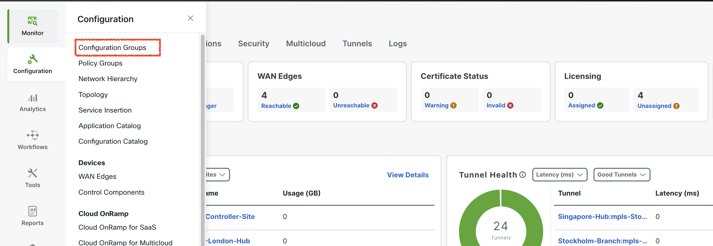{ .off-glb }
2. Locate and click on the **APAC-Sydney-Branch** Configuration Group as illustrated below.
   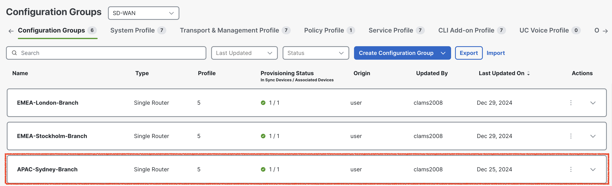{ .off-glb }
3. Click the edit { .off-glb, width=25 } icon for the **APAC-Sydney-Branch - Transport & Management Profile** as illustrated below.
   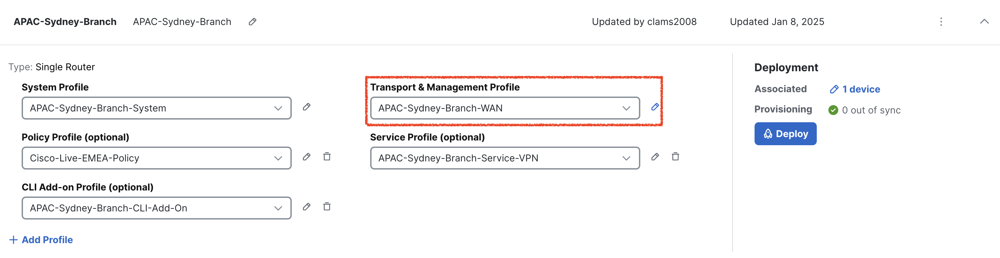{ .off-glb }   
4. Click the edit { .off-glb, width=25 } icon for **APAC-Sydney-Branch-INET** to enable **<font color="green">NAT</font>** for **INET** transport.
   { .off-glb } 
5. Now click **<font color="green">NAT</font>** to enable NAT on INET transport(TLOC).
   { .off-glb } 
6. Enable **NAT** on INET TLOC by clicking NAT. Once it is enabled click **<font color="green">Save</font>**
   { .off-glb }
7. Click **Back**
   { .off-glb } 
8. As we enable the **NAT**, now configuration group for **APAC-Sydney-Branch** is now marked as <font color="red">out of sync</font>. 
9. Click **APAC-Sydney-Branch** Configuration Group -> Click **<font color="green">Deploy**</font>.
    { .off-glb } 
10. In **Deploy Configuration Group** page, select **APAC-Sydney-Branch** by clicking the square Radio Button and Click **Next**.  
    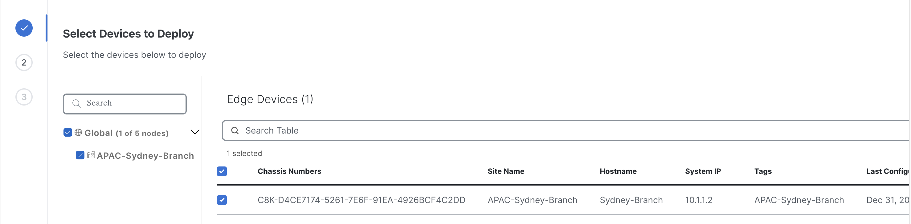{ .off-glb } 
11. Click **Import**, and load **APAC-Sydney-Branch.csv** file which loads all the values for the variables.
    { .off-glb } 

    !!! info
        All CSV files are located in the **<font color="green">CSV files</font>** folder on the **Desktop** of **_jump-host_**.

12. After uploading the **CSV files**, click on **Preview CLI** to review the configuration changes before deployment. This step ensures that the **NAT** is enabled on **INET TLOC**. 
    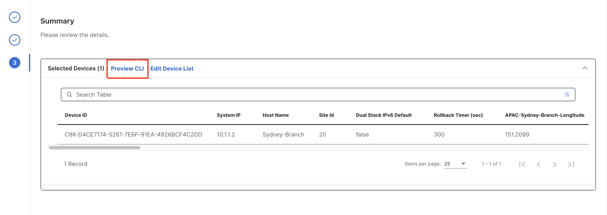{ .off-glb } 
13. Scroll down the **New Configuration** section to locate the ***ip nat*** configuration section.
    { .off-glb }
14. After finalizing the configuration, click **Cancel** to exit the current screen and then click **Deploy** to initiate the deployment process. Once the deployment is triggered, navigate to the **View Deployment Status** section to monitor the progress. 
    { .off-glb } 
15. Wait until the deployment status indicates **<font color="green">Success</font>**, confirming that the configuration has been successfully applied to the relevant devices.
    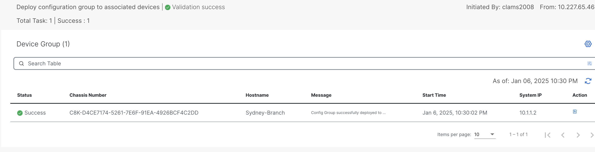{ .off-glb } 
16. To verify the configuration group status, click on the **APAC-Sydney-Branch** configuration group. Ensure that the **Associated row indicates <font color="orange">1</font> device**, confirming that the configuration group is 
    correctly linked to the **Sydney-Branch** WAN-Edge router. Additionally, check that the Provisioning row displays **<font color="orange">0 out of sync</font>** indicating that the configuration has been successfully deployed 
    and is fully synchronized with the device. This step ensures that the configuration group is correctly applied and functioning as intended.
    { .off-glb }

## Verification of NAT configuration on Sydney-Branch

After enabling NAT on the interface, a static route is installed in **VRF-1** on the **Sydney-Branch** WAN-Edge router,

```{ .ios .no-copy }
Sydney-Branch#show running-config | i ip nat route vrf 1
ip nat route vrf 1 0.0.0.0 0.0.0.0 global
Sydney-Branch#
```
As shown in the routing table output below. The route indicates a default gateway (0.0.0.0/0) pointing to **Null0**, signifying that traffic from **VRF-1** destined for external networks will now be processed for **<font color="green">Direct Internet Access (DIA) via the underlay</font>** network. This static route ensures that any traffic not explicitly matched by more specific routes is directed to the NAT-enabled interface for Internet access. The configuration confirms that the NAT setup is successfully integrated with the SD-WAN routing infrastructure, allowing seamless communication between the internal VRF and external networks.

```{.ios .no-copy linenums="1", hl_lines="19"}
Sydney-Branch#show ip route vrf 1

Routing Table: 1
Codes: L - local, C - connected, S - static, R - RIP, M - mobile, B - BGP
       D - EIGRP, EX - EIGRP external, O - OSPF, IA - OSPF inter area 
       N1 - OSPF NSSA external type 1, N2 - OSPF NSSA external type 2
       E1 - OSPF external type 1, E2 - OSPF external type 2, m - OMP
       n - NAT, Ni - NAT inside, No - NAT outside, Nd - NAT DIA
       i - IS-IS, su - IS-IS summary, L1 - IS-IS level-1, L2 - IS-IS level-2
       ia - IS-IS inter area, * - candidate default, U - per-user static route
       H - NHRP, G - NHRP registered, g - NHRP registration summary
       o - ODR, P - periodic downloaded static route, l - LISP
       a - application route
       + - replicated route, % - next hop override, p - overrides from PfR
       & - replicated local route overrides by connected

Gateway of last resort is 0.0.0.0 to network 0.0.0.0

n*Nd  0.0.0.0/0 [6/0], 00:08:23, Null0
      10.0.0.0/8 is variably subnetted, 3 subnets, 2 masks
m        10.10.10.0/24 [251/0] via 10.1.1.1, 1d11h, Sdwan-system-intf
m        10.101.101.0/24 [251/0] via 10.0.0.1, 2d01h, Sdwan-system-intf
m        10.102.102.102/32 [251/0] via 10.0.0.2, 2d01h, Sdwan-system-intf
m     192.168.10.0/24 [251/0] via 10.1.1.1, 1d11h, Sdwan-system-intf
      192.168.20.0/24 is variably subnetted, 2 subnets, 2 masks
C        192.168.20.0/24 is directly connected, GigabitEthernet3
L        192.168.20.1/32 is directly connected, GigabitEthernet3
Sydney-Branch#
```
Now, Internet access from Sydney-Branch from **<font color="orange">VRF-1</font>** is established, as demonstrated in the output below. 

```{.ios .no-copy}
Sydney-Branch#ping vrf 1 8.8.8.8
Type escape sequence to abort.
Sending 5, 100-byte ICMP Echos to 8.8.8.8, timeout is 2 seconds:
!!!!!
Success rate is 100 percent (5/5), round-trip min/avg/max = 7/11/24 ms

Sydney-Branch#ping vrf 1 8.8.4.4  
Type escape sequence to abort.
Sending 5, 100-byte ICMP Echos to 8.8.4.4, timeout is 2 seconds:
!!!!!
Success rate is 100 percent (5/5), round-trip min/avg/max = 7/8/9 ms
Sydney-Branch#
```
Lets verify from **Sydney-User** if we have internet access or not. 

```{.ios .no-copy}
Sydney-User:~$ ping 8.8.8.8
PING 8.8.8.8 (8.8.8.8): 56 data bytes
64 bytes from 8.8.8.8: seq=0 ttl=42 time=10.965 ms
64 bytes from 8.8.8.8: seq=1 ttl=42 time=10.881 ms
64 bytes from 8.8.8.8: seq=2 ttl=42 time=9.520 ms
^C
--- 8.8.8.8 ping statistics ---
3 packets transmitted, 3 packets received, 0% packet loss
round-trip min/avg/max = 9.520/10.455/10.965 ms
```
Lets perform a ***traceroute*** from **<font color="green">Sydney-User</font>** towards Google DNS server **8.8.8.8**.

```{.ios .no-copy}
Sydney-User:~$ traceroute 8.8.8.8 -n
traceroute to 8.8.8.8 (8.8.8.8), 30 hops max, 46 byte packets
 1  192.168.20.1  0.639 ms  0.781 ms  0.916 ms
 2  172.16.1.254  1.210 ms  1.193 ms  0.761 ms
 3  192.168.255.1  1.560 ms  1.257 ms  2.069 ms
 4  198.18.128.1  2.222 ms  2.283 ms  1.956 ms
 5  10.255.0.3  1.560 ms  2.146 ms  2.303 ms
 6  10.1.27.9  2.436 ms  2.489 ms  2.459 ms
 7  4.4.4.2  2.724 ms  2.188 ms  2.010 ms
 8  64.103.43.33  2.590 ms  3.745 ms  3.221 ms
 9  10.230.4.140  12.564 ms  7.000 ms  7.031 ms
10  10.230.4.130  8.108 ms  6.868 ms  6.957 ms
11  64.103.40.93  7.442 ms  7.649 ms  64.103.40.97  9.068 ms
12  128.107.8.18  10.159 ms  128.107.8.46  7.378 ms  7.507 ms
13  195.66.224.125  8.222 ms  7.516 ms  9.600 ms
14  192.178.97.41  9.513 ms  192.178.97.181  8.075 ms  192.178.97.41  8.374 ms
15  142.251.54.49  7.849 ms  142.251.54.35  8.759 ms  192.178.46.83  8.876 ms
16  8.8.8.8  8.830 ms  7.968 ms  7.485 ms
Sydney-User:~$ 
```
Following Table exhibit how traffic is flowing from **Sydney-User** towards **Google DNS 8.8.8.8**.

| Interface         | IP Address   | Description                                                                                                                          |
|-------------------|--------------|--------------------------------------------------------------------------------------------------------------------------------------|
| GigabitEthernet 3 | 192.168.20.1 | <font color="#9AAFCB"> **Sydney-Branch** WAN-Edge interface in **<font color="orange">VRF 1</font>** connected with **Sydney-User**. |
| GigabitEthernet 1 | 172.16.1.254 | <font color="#9AAFCB"> **INET** WAN-Edge interface **INET TLOC**.</font>                                                             |

## Configuring Service-Chain in Configuration Group

Next, we will configure a service chain within the service-profile parcel in the configuration group by following the below steps. 
This service chain defines the sequence of services that will be applied to traffic originating from the **Sydney-Branch** and destined 
for the **<font color="green">Internet-traffic</font>**. By specifying the service chain in the configuration, we instruct the **Sydney WAN-Edge** on the type of services 
to be applied to the traffic, such as redirection through a **Sydney-FW** firewall in **<font color="bluw">VRF 2</font>**. 

1. From the vManage Landing Page, navigate to the left-hand panel, select Configuration, and click Configuration Groups.
   { .off-glb }
2. Locate and click on the **APAC-Sydney-Branch** Configuration Group as illustrated below.
   { .off-glb }
3. Click the edit { .off-glb, width=25 } icon for the **APAC-Sydney-Branch - Service Profile** as illustrated below.   
   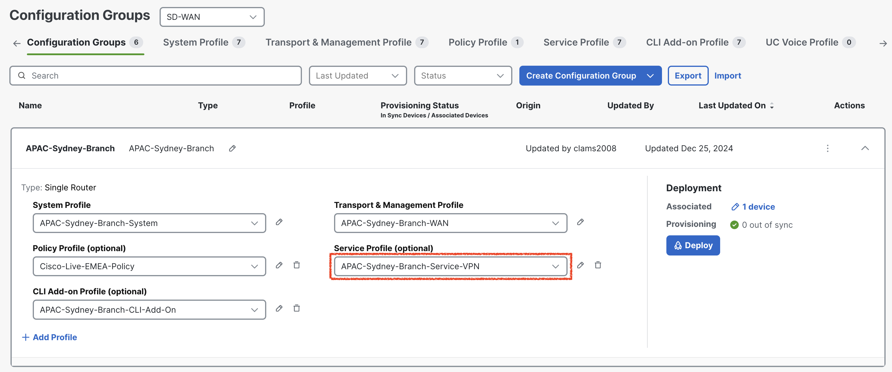{ .off-glb }
4. Select **<font color="#9AAFCB">Add New Feature</font>** and add a <font color="orange">**Service Chain Attachment Gateway**</font> as illustrated below.
   { .off-glb }
5. In the <font color="orange">**Service Chain Attachment Gateway**</font> configuration parcel, click the dropdown arrow and select **Add New**.
   { .off-glb }
6. On the **Service Chain Attachment Gateway** configuration page, provide ***Name*** and ***Description*** for the attachment gateway. For example, use the name and description **<font color="orange">Sydney-Branch-Service-Attachment</font>**.
   { .off-glb }
7. Click **Add Service Chain Definition** to define the service chain. 
   { .off-glb }
8. Enter the name **Sydney-Firewall-SC** and Description **Sydney-Firewall-SC** for the service chain definition.
9. Select a **Service Type** <font color="red">**Firewall**</font> by click dropdown and click **<font color="orange">Save</font>**
   { .off-glb }
10. Under Basic Information, enter **VPN** <font color="orange">**2**</font>.
11. Scroll down to **IPv4 Attachment**: <font color="orange">(1 Interface)</font>.
    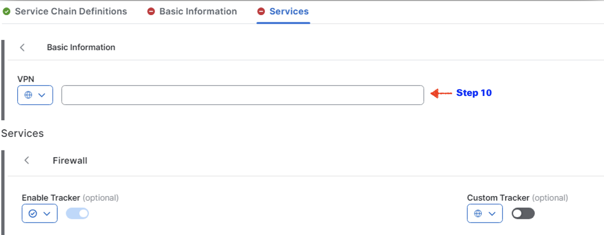{ .off-glb }
12. Enter **Service IPv4 Address <font color="#9AAFCB">10.20.20.2</font>**. This is the IP address of **Sydney Firewall (***<font color="green">Sydney-FW</font>***)**.
13. Enter SD-WAN Router Interface as **GigabitEthernet4** and click <font color="orange">**Save**</font>.
    { .off-glb }
    The **GigabitEthernet4** interface on the **Sydney-Branch** WAN-Edge router serves as the connection point for the **Sydney-FW firewall**. 
    This interface facilitates the integration of the firewall into the service chain, allowing traffic to be redirected through the firewall for 
    inspection or policy enforcement as configured. The proper configuration of this interface is crucial for ensuring seamless communication between 
    the WAN-Edge router and the firewall, enabling the desired security and traffic management features within the SD-WAN environment.
14. Click **Back** at bottom left.
    { .off-glb }
15. As we add the **Service Attachment Gateway Definition**, now configuration group for **APAC-Sydney-Branch** is now marked as <font color="red">out of sync</font>. 
16. Click **APAC-Sydney-Branch** Configuration Group -> Click **<font color="green">Deploy**</font>.
    { .off-glb }
17. In **Deploy Configuration Group** page, select **APAC-Sydney-Branch** by clicking the square Radio Button and Click **Next**.  
    { .off-glb }
18. Click **Import**, and load **APAC-Sydney-Branch.csv** file which loads all the values for the variables.
    { .off-glb }
19. After uploading the **CSV files**, click **next** then click on **Preview CLI** then select the device from the **left hand** navigation pane to review the configuration changes before deployment. This step ensures that the service-chain gateway definition is correctly included in the configuration. By previewing the CLI, you can verify that all required parameters have been accurately applied and are ready for deployment. This validation step is critical to confirm that the service chain configuration aligns with the intended design and will function as expected once deployed.
    { .off-glb }
20. Scroll down the **New Configuration** section to locate the **service-chain number** highlighted in <font color="#9AAFCB">**blue**</font>. <font color="red">Make a note of this number</font>, as it will be required when configuring the data policy in later sections.
    The **service-chain number** is a <font color="red">critical identifier</font> used to link the service chain definition to the appropriate policy, ensuring that traffic is processed through the configured service chain as intended.
    { .off-glb }
21. After finalizing the configuration, click **Cancel** to exit the current screen and then click **Deploy** to initiate the deployment process. Once the deployment is triggered, navigate to the **View Deployment Status** section to monitor the progress. 
    { .off-glb } 
22. Wait until the deployment status indicates **<font color="green">Success</font>**, confirming that the configuration has been successfully applied to the relevant devices.
    { .off-glb }
23. To verify the configuration group status, click on the **APAC-Sydney-Branch** configuration group. Ensure that the **Associated column indicates <font color="orange">1</font> device**, confirming that the configuration group is 
    correctly linked to the **Sydney-Branch** WAN-Edge router. Additionally, check that the Provisioning column displays **<font color="orange">0 out of sync</font>** indicating that the configuration has been successfully deployed 
    and is fully synchronized with the device. This step ensures that the configuration group is correctly applied and functioning as intended.
    { .off-glb }

## Verification of Service Chain configuration on Sydney-Branch

In the Cisco SD-WAN architecture, service nodes communicate their available services to the **SD-WAN Controller (vSmart)** using the **Overlay Management Protocol (OMP)** with the service route address family. Each WAN-Edge router is responsible for advertising its service routes to the SD-WAN Controller (vSmart), which then maintains these service routes within its **Routing Information Base (RIB)**. 

**<font color="green">Notably, the SD-WAN Controller (vSmart) controller does not propagate these service routes to other WAN-Edge routers within the SD-WAN fabric</font>**. Instead, the service label, which is advertised by WAN-Edge router in the service route to the SD-WAN Controller (vSmart), plays a crucial role. If traffic destined for a particular vRoute needs to traverse a service, the SD-WAN Controller (vSmart) controller replaces the vRoute’s label with the service label.

```{ .ios, .no-copy, linenums="1", hl_lines="23 24"}
Sydney-Branch#show sdwan omp services 
C   -> chosen
I   -> installed
Red -> redistributed
Rej -> rejected
L   -> looped
R   -> resolved
S   -> stale
Ext -> extranet
Stg -> staged
IA  -> On-demand inactive
Inv -> invalid
BR-R -> Border-Router reoriginated
TGW-R -> Transport-Gateway reoriginated
R-TGW-R -> Reoriginated Transport-Gateway reoriginated

                                                                                 AFFINITY                            
ADDRESS                                                         PATH   REGION    GROUP                               
FAMILY   TENANT    VPN    SERVICE  ORIGINATOR  FROM PEER        ID     ID        NUMBER      LABEL    STATUS    VRF  
---------------------------------------------------------------------------------------------------------------------
ipv4     0         1      VPN      10.1.1.2    0.0.0.0          66     None      None        1003     C,Red,R   1    
                                               0.0.0.0          68     None      None        1003     C,Red,R   1    
         0         2      VPN      10.1.1.2    0.0.0.0          66     None      None        1007     C,Red,R   2    
                                               0.0.0.0          68     None      None        1007     C,Red,R   2    
         0         2      SC8      10.1.1.2    0.0.0.0          66     None      None        1008     C,Red,R   2    
                                               0.0.0.0          68     None      None        1008     C,Red,R   2    
ipv6     0         1      VPN      10.1.1.2    0.0.0.0          66     None      None        1003     C,Red,R   1    
                                               0.0.0.0          68     None      None        1003     C,Red,R   1    
         0         2      VPN      10.1.1.2    0.0.0.0          66     None      None        1007     C,Red,R   2    
                                               0.0.0.0          68     None      None        1007     C,Red,R   2    

```
To verify the service chain configuration on the **Sydney-Branch** WAN-Edge router, access the device CLI and execute the command:

- **show platform software sdwan service-chain database**. 

Review the output to confirm the following details: the **<font color="green">Service Chain ID (e.g., SC8)</font>**, the **<font color="green">VRF (e.g., vrf: 2)</font>**, and the State, which should display **UP** to indicate proper functionality. 

Additionally, verify that the Service is set to **<font color="green">FW (Firewall)</font>**, the TX and RX interface is **GigabitEthernet4**, and the associated IP address is **10.20.20.2**. This verification ensures that the service chain configuration is active and correctly aligned with the intended design.

```{.ios, .no-copy, linenums="1", hl_lines="3 4 5 6 9 17 20" }
Sydney-Branch#show platform software sdwan service-chain database 

Service Chain: SC8
   vrf: 2
   label: 1008
   state: up
   description:  Sydney-Firewall-SC

   service: FW
      sequence: 1
      track-enable: true
      state: up
      ha_pair: 1
         type: ipv4
         posture: trusted
         active: [current]
            tx: GigabitEthernet4, 10.20.20.2
                endpoint-tracker: auto
                state: up
            rx: GigabitEthernet4, 10.20.20.2
                endpoint-tracker: auto
                state: up
```

## Routing State Prior to Control Policy Implementation

In an SD-WAN environment, the **SD-WAN controller** maintains routes for each configured **VPN/VRF** and advertises these routes to all 
WAN-Edge routers associated with the **respective VPN/VRF**. This ensures consistent route propagation and connectivity across the network. 
To verify how the **SD-WAN controller** advertises these routes to the WAN-Edge routers, we can use the following command:

- **show omp routes <font color ="orange">vpn 1</font> advertised**
- **show omp routes <font color ="orange">vpn 2</font> advertised**

```{ .ios .no-copy}
Controller-1# show omp routes vpn 1 advertised
Code:
C   -> chosen
I   -> installed
Red -> redistributed
Rej -> rejected
L   -> looped
R   -> resolved
S   -> stale
Ext -> extranet
Inv -> invalid
Stg -> staged
IA  -> On-demand inactive
U   -> TLOC unresolved

VPN    PREFIX              TO PEER          
--------------------------------------------
1      10.10.10.0/24       10.0.0.1         
                           10.0.0.2         
                           10.1.1.2         
1      10.101.101.0/24     10.0.0.2         
                           10.1.1.1         
                           10.1.1.2         
1      10.102.102.102/32   10.0.0.1         
                           10.1.1.1         
                           10.1.1.2         
1      192.168.10.0/24     10.0.0.1         
                           10.0.0.2         
                           10.1.1.2         
1      192.168.20.0/24     10.0.0.1         
                           10.0.0.2         
                           10.1.1.1         
```
As observed in the output below, the routes from **VRF-1** are <font color="green">**not visible within VRF-2**</font>. 
The displayed prefixes belong exclusively to **VRF-2**, indicating that route-leaking between **VRF-1** and **VRF-2** has not yet been configured or applied. 
This behavior is expected in the **absence of a control policy facilitating inter-VRF route exchange**.

```{.ios .no-copy}
Controller-1# show omp routes vpn 2 advertised
Code:
C   -> chosen
I   -> installed
Red -> redistributed
Rej -> rejected
L   -> looped
R   -> resolved
S   -> stale
Ext -> extranet
Inv -> invalid
Stg -> staged
IA  -> On-demand inactive
U   -> TLOC unresolved

VPN    PREFIX              TO PEER          
--------------------------------------------
2      10.20.20.0/24       10.0.0.2         
2      10.102.102.0/24     10.1.1.2         
```
This output highlights the necessity of implementing the **scenario-3** control policy to enable **route-leaking** and achieve full connectivity **between the VRFs**.

Verify the routes in **VRF-1** and **VRF-2** on **Sydney-Branch** WAN-Edge router to confirm routes are not leaked in VRFs.

```{.ios .no-copy linenums="1" }
Sydney-Branch#show ip route vrf 1

Routing Table: 1
Codes: L - local, C - connected, S - static, R - RIP, M - mobile, B - BGP
       D - EIGRP, EX - EIGRP external, O - OSPF, IA - OSPF inter area 
       N1 - OSPF NSSA external type 1, N2 - OSPF NSSA external type 2
       E1 - OSPF external type 1, E2 - OSPF external type 2, m - OMP
       n - NAT, Ni - NAT inside, No - NAT outside, Nd - NAT DIA
       i - IS-IS, su - IS-IS summary, L1 - IS-IS level-1, L2 - IS-IS level-2
       ia - IS-IS inter area, * - candidate default, U - per-user static route
       H - NHRP, G - NHRP registered, g - NHRP registration summary
       o - ODR, P - periodic downloaded static route, l - LISP
       a - application route
       + - replicated route, % - next hop override, p - overrides from PfR
       & - replicated local route overrides by connected

Gateway of last resort is 0.0.0.0 to network 0.0.0.0

n*Nd  0.0.0.0/0 [6/0], 23:14:47, Null0
      10.0.0.0/8 is variably subnetted, 3 subnets, 2 masks
m        10.10.10.0/24 [251/0] via 10.1.1.1, 08:52:44, Sdwan-system-intf
m        10.101.101.0/24 [251/0] via 10.0.0.1, 23:14:40, Sdwan-system-intf
m        10.102.102.102/32 [251/0] via 10.0.0.2, 23:14:40, Sdwan-system-intf
m     192.168.10.0/24 [251/0] via 10.1.1.1, 08:52:44, Sdwan-system-intf
      192.168.20.0/24 is variably subnetted, 2 subnets, 2 masks
C        192.168.20.0/24 is directly connected, GigabitEthernet3
L        192.168.20.1/32 is directly connected, GigabitEthernet3
Sydney-Branch#
```
The following output from the **VRF-2** routing table on **Sydney-Branch** confirms that no routes have been leaked from **VRF-2** into **VRF-1**. 

```{.ios .no-copy linenums="1"}
Sydney-Branch#show ip route vrf 2

Routing Table: 2
Codes: L - local, C - connected, S - static, R - RIP, M - mobile, B - BGP
       D - EIGRP, EX - EIGRP external, O - OSPF, IA - OSPF inter area 
       N1 - OSPF NSSA external type 1, N2 - OSPF NSSA external type 2
       E1 - OSPF external type 1, E2 - OSPF external type 2, m - OMP
       n - NAT, Ni - NAT inside, No - NAT outside, Nd - NAT DIA
       i - IS-IS, su - IS-IS summary, L1 - IS-IS level-1, L2 - IS-IS level-2
       ia - IS-IS inter area, * - candidate default, U - per-user static route
       H - NHRP, G - NHRP registered, g - NHRP registration summary
       o - ODR, P - periodic downloaded static route, l - LISP
       a - application route
       + - replicated route, % - next hop override, p - overrides from PfR
       & - replicated local route overrides by connected

Gateway of last resort is 0.0.0.0 to network 0.0.0.0

n*Nd  0.0.0.0/0 [6/0], 23:14:45, Null0
      10.0.0.0/8 is variably subnetted, 3 subnets, 2 masks
C        10.20.20.0/24 is directly connected, GigabitEthernet4
L        10.20.20.1/32 is directly connected, GigabitEthernet4
m        10.102.102.0/24 [251/0] via 10.0.0.2, 23:14:38, Sdwan-system-intf
```

## Configuring Centralized Control Policy for Route Leaking

Next, we will configure a centralized **control policy** to ensure that traffic initiated from the **Sydney-User** destined 
for the **Internet-Traffic** is first inspected by the **Sydney-FW** before reaching its destination. Since the 
**Sydney-Firewall** (**<font color="green">Sydney-FW</font>**) is positioned within **<font color="orange">VRF-2</font>**, it is necessary to configure a centralized control policy 
to enable **route-leaking**. This configuration ensures that traffic from the **Sydney-User** can reach the **Sydney-Firewall** 
and maintain connectivity with the **Internet via DIA**. 

The control policy facilitates seamless communication between the two VRFs, ensuring full bidirectional reachability. By implementing this policy, 
we establish a cohesive routing environment that allows resources in **VRF-1** and **VRF-2** to interact efficiently, 
aligning with the network's operational requirements.

1. To begin configuring the centralized data policy, navigate to the left-hand pane in the SD-WAN Manager (vManage) interface. From there, select Configuration, followed by Classic, and then click on Policies. 
   { .off-glb }
2. Under the Centralized Policy section, click Add Policy to create a new policy. This will initiate the process of defining and implementing the centralized data policy to enforce traffic inspection and routing as per the lab requirements.
   { .off-glb }
3. To create the required **Groups of Interest**, start by selecting **Data Prefix** from the left navigation pane within the **Centralized Policy** configuration window. Follow these steps:
   { .off-glb }
   1. Click **New Data Prefix List** to define the first prefix list:
      1. Data Prefix List Name: **Internet**
      2. Internet Protocol: IPv4 
      3. Add Data Prefix: **8.8.8.8/32**
   1. Click Site in left navigation pane and check if following sites are already created.
      1. Click “**New Site List**” 
         1. Site List Name – **Stockholm-Sydney** 
         2. Add Site – <font color="green">10,20</font> 
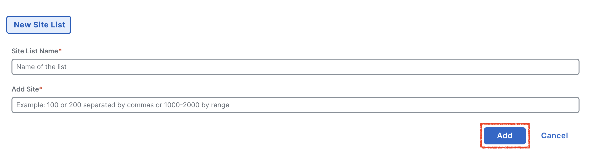{ .off-glb }
   2. Click VPN.  
      1. Click “**New VPN List**” 
         1. VPN List Name – **VPN-1** 
            1. Add VPN – <font color="green">1</font> 
         2. VPN List Name – **VPN-2** 
            1. Add VPN – <font color="green">2</font> 
         3. VPN List Name – **VPN-1-2** 
            1. Add VPN – <font color="green">1,2</font>
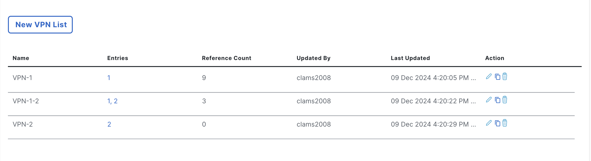{ .off-glb }
4. Scroll down and click Next.
5. Under Topology, click **<font color="orange">Add Topology</font>** dropdown (for creating route-leaking policy) and select **<font color="green">Custom Control ( Route and TLOC)</font>**.
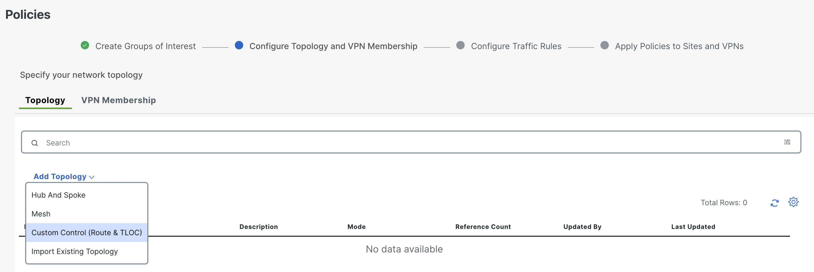{ .off-glb }
6. Proceed by entering the required details as outlined below and follow the steps to configure the control policy. 
   * Enter **<font color="green">scenario-5-route-leak</font>** as the policy name. 
   * Description: Provide a brief description, using **<font color="green">scenario-5-route-leak</font>** for clarity and consistency. 
   * Navigate to **<font color="green">Sequence Type</font>**. Under **Add Control Policy**, choose **Route** to define the **route-leaking** configuration.
     These steps ensure that the policy is accurately defined and aligned with the lab's objectives, facilitating effective route-leaking between VPNs as part of the scenario setup.
     { .off-glb }
7. Click **<font color="green">Sequence Rule</font>**.
{ .off-glb }
8. In the **Match** section, configure the parameters to define the scope of the **control policy**. Begin by selecting Site and VPN as the matching criteria. Next, specify the following details:
   * **Site List**: Select <font color="orange">**Stockholm-Sydney**</font> to include both branches in the policy.
   * **VPN List**: Choose <font color="orange">**VPN-1-2**</font> to encompass the VPNs involved in the route-leaking configuration.
   This configuration ensures that the policy applies to the specified sites and VPNs, enabling precise control over route-leaking between the designated network segments.
   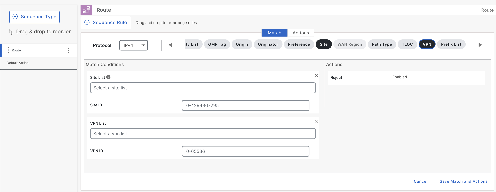{ .off-glb }
9. Next, navigate to the Action section and configure the route-leaking process to enable communication between **VPN-1** and **VPN-2**. 
   Specifically, ensure that routes from **VPN-1** are leaked into **VPN-2** and vice versa. This step is critical to establishing bidirectional
   connectivity, allowing resources in both VPNs to communicate seamlessly. Proper configuration at this stage ensures the integrity of the routing 
   setup and facilitates the intended traffic flow between the VPNs as per the lab topology design.
    1. Click **Action** > **Accept** > **<font color=green">Export To</font>**. 
    2. Export To: **<font color="orange">VPN-1-2</font>**
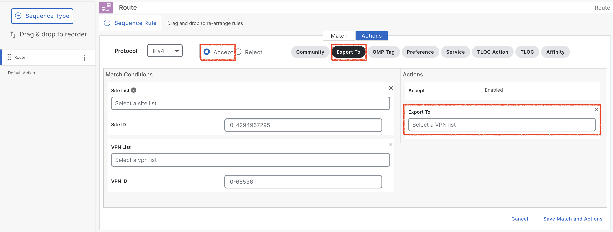{ .off-glb }
10. Click **<font color="orange">Save Match and Actions</font>**.
{ .off-glb }
11. Click **Default Action**, click { .off-glb width="25"}icon and click **Accept**. Click **<font color="orange">Save Match and Action</font>**. 
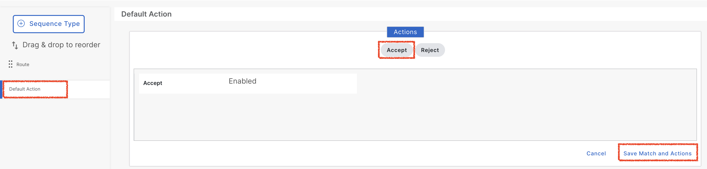{ .off-glb }
12. Now click **Next** and ignore **Configure Traffic Rules** and move to **Apply Policies to Sites and VPNs** section.
{ .off-glb }
13. In order to apply the control policy for route-leaking, select **New Site/WAN Region List** and apply the **<font color="green">scenario-5-route-leak</font>** 
    policy in inbound direction on **Sydney-Branch**. Now after that click **<font color="green">Save Policy</font>**.
{ .off-glb }
14. Now click { .off-glb width="25" } and select **Preview** to see the content of the control policy.
{ .off-glb }
15. In order to deploy the policy click **Activate**.
{ .off-glb }
16. Once policy is being pushed successfully, we can have **<font color="green">Success</font>** message that policy is pushed successfully to **SD-WAN controller**.
{ .off-glb }

## Verification of Centralized Control Policy

With the **scenario-5** **<font color="orange">control policy</font>** successfully pushed to facilitate route-leaking between **VPN-1** and **VPN-2**, the next step is to 
verify its implementation. This involves ensuring that the policy has been applied correctly and that the intended routes are being leaked between the two VPNs. 
Additionally, confirm that full reachability is established between **VPN-1** and **VPN-2**, enabling seamless communication as per the lab objectives. 
Verification is a critical step to validate the policy's effectiveness and to ensure that the network behaves as designed.

To ensure that the policy has been applied correctly on the **SD-WAN controller**, the next step involves verifying its implementation through the controller's running configuration. 
By reviewing the running configuration of the control policy, we can confirm that the **scenario-5** policy is correctly defined and operational. This verification process is essential to
validate the deployment and ensure that the policy is functioning as intended to achieve the desired route-leaking between **VPN-1** and **VPN-2**.

```{ .ios .no-copy linenums="1" hl_lines="1 36"}
Controller-1# show running-config policy
policy
 lists
  vpn-list VPN-1-2
   vpn 1
   vpn 2
  !
  site-list Stockholm-Sydney
   site-id 10
   site-id 20
  !
  site-list Sydney-Branch
   site-id 20
  !
  prefix-list _AnyIpv4PrefixList
   ip-prefix 0.0.0.0/0 le 32
  !
 !
 control-policy scenario-5-route-leak
  sequence 1
   match route
    prefix-list _AnyIpv4PrefixList
    site-list   Stockholm-Sydney
    vpn-list    VPN-1-2
   !
   action accept
    export-to
     vpn-list VPN-1-2
    !
   !
  !
  default-action accept
 !
!

Controller-1# show running-config apply-policy 
apply-policy
 site-list Sydney-Branch
  control-policy scenario-5-route-leak in
 !
!
```

The output below demonstrates that the **prefix <font color="green">10.20.20.0/24</font>**, which belongs to **VRF-2**, 
has been successfully **leaked into VRF-1**. This confirms that the control policy for route-leaking is now active and 
functioning as intended. The leaked prefix is visible alongside other prefixes **native to VRF-1**, and it is being advertised to the **relevant peers**.

```{.ios .no-copy linenums="1" hl_lines="21 22 23 24"}
Controller-1# show omp routes vpn 1 advertised
Code:
C   -> chosen
I   -> installed
Red -> redistributed
Rej -> rejected
L   -> looped
R   -> resolved
S   -> stale
Ext -> extranet
Inv -> invalid
Stg -> staged
IA  -> On-demand inactive
U   -> TLOC unresolved

VPN    PREFIX              TO PEER          
--------------------------------------------
1      10.10.10.0/24       10.0.0.1         
                           10.0.0.2         
                           10.1.1.2         
1      10.20.20.0/24       10.0.0.1         
                           10.0.0.2         
                           10.1.1.1         
                           10.1.1.2         
1      10.101.101.0/24     10.0.0.2         
                           10.1.1.1         
                           10.1.1.2         
1      10.102.102.102/32   10.0.0.1         
                           10.1.1.1         
                           10.1.1.2         
1      192.168.10.0/24     10.0.0.1         
                           10.0.0.2         
                           10.1.1.2         
1      192.168.20.0/24     10.0.0.1         
                           10.0.0.2         
                           10.1.1.1         
```

This validation confirms the effectiveness of the configured control policy in achieving route-leaking, thereby enabling connectivity between the two VRFs as per the lab design.


Prefix **10.20.20.0/24** is now visible in the **VRF-1** routing table on the **<font color="green">Sydney-Branch</font>**. 

```{.ios .no-copy linenums="1" hl_lines="1 22"}
Sydney-Branch#show ip route vrf 1

Routing Table: 1
Codes: L - local, C - connected, S - static, R - RIP, M - mobile, B - BGP
       D - EIGRP, EX - EIGRP external, O - OSPF, IA - OSPF inter area 
       N1 - OSPF NSSA external type 1, N2 - OSPF NSSA external type 2
       E1 - OSPF external type 1, E2 - OSPF external type 2, m - OMP
       n - NAT, Ni - NAT inside, No - NAT outside, Nd - NAT DIA
       i - IS-IS, su - IS-IS summary, L1 - IS-IS level-1, L2 - IS-IS level-2
       ia - IS-IS inter area, * - candidate default, U - per-user static route
       H - NHRP, G - NHRP registered, g - NHRP registration summary
       o - ODR, P - periodic downloaded static route, l - LISP
       a - application route
       + - replicated route, % - next hop override, p - overrides from PfR
       & - replicated local route overrides by connected

Gateway of last resort is 0.0.0.0 to network 0.0.0.0

n*Nd  0.0.0.0/0 [6/0], 01:38:29, Null0
      10.0.0.0/8 is variably subnetted, 4 subnets, 2 masks
m        10.10.10.0/24 [251/0] via 10.1.1.1, 1d13h, Sdwan-system-intf
m        10.20.20.0/24 [251/0] via 10.1.1.2 (2), 00:06:11, Sdwan-system-intf
m        10.101.101.0/24 [251/0] via 10.0.0.1, 2d03h, Sdwan-system-intf
m        10.102.102.102/32 [251/0] via 10.0.0.2, 2d03h, Sdwan-system-intf
m     192.168.10.0/24 [251/0] via 10.1.1.1, 1d13h, Sdwan-system-intf
      192.168.20.0/24 is variably subnetted, 2 subnets, 2 masks
C        192.168.20.0/24 is directly connected, GigabitEthernet3
L        192.168.20.1/32 is directly connected, GigabitEthernet3
Sydney-Branch#
```
Let's try to ping from **Sydney-Branch** WAN-Edge router from **VRF-1** towards **Sydney-FW** ip address **10.20.20.2** in **VRF-2**.

```{.ios .no-copy linenums="1", hl_lines="1"}
Sydney-Branch#ping vrf 1 10.20.20.2
Type escape sequence to abort.
Sending 5, 100-byte ICMP Echos to 10.20.20.2, timeout is 2 seconds:
!!!!!
Success rate is 100 percent (5/5), round-trip min/avg/max = 1/1/1 ms
Sydney-Branch#
```

## Configuring Centralized Data Policy for Traffic Steering

Next, we will configure a **centralized data policy** to ensure that traffic initiated from the **Sydney-User** destined for 
the **Internet traffic** is first inspected by the **Sydney-FW** in **VRF-2** before reaching its destination. This policy
enforces the required traffic inspection by leveraging the service chain defined earlier. During the configuration, we 
will use the **service-chain number** that was previously configured and noted in **<font color="green">step 20</font>** under "**Configuring Service-Chain in Configuration Group**" section. 
This centralized policy ensures that traffic adheres to the intended security and inspection workflow within the SD-WAN fabric.

1. To begin configuring the centralized data policy, navigate to the left-hand pane in the SD-WAN Manager (vManage) interface. From there, select Configuration, followed by **Classic**, and then click on **Policies**. 
   { .off-glb }
2. In addition to the previously configured centralized control policy **scenario-5**, where we add **<font color="green">scenario-5-route-leak</font>** for route-leaking, we now introduce a centralized data policy to 
   ensure that traffic is inspected by the **<font color="green">Sydney-FW</font>** in **<font color="green">VRF-2</font>**. This step enhances the traffic management strategy by directing traffic through the firewall 
   for inspection, providing additional security and compliance. To implement this, navigate to the centralized policy section, click on { .off-glb width="25"} next to the <font color="green">**scenario-5**</font> policy, and select **<font color="green">Edit</font>** to add the data policy. 
   This ensures seamless integration of traffic inspection within the existing policy framework.
   { .off-glb }
3. In order to add data policy, click **Traffic Rules**.
   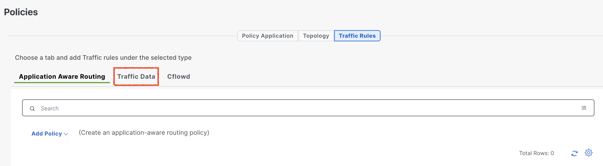{ .off-glb }
4. Now click **Add Policy** and then click **Create New**.
   { .off-glb }
5.  Follow the below steps to start configuring data policy.
    1. Enter Name – **scenario-5-data-policy**
    2. Description – **scenario-5-data-policy**
6.  Now click { .off-glb width="25"} icon in “**<font color="green">Default Action</font>**”
    1. Under “**<font color="orange">Actions</font>**” Select **<font color="green">Accept</font>**. 
    2. Click “**Save and Match**”.
    { .off-glb }
7. Click **Sequence Type**.
   { .off-glb }
8. From “**Add Data Policy**” pop-up, Select **<font color="green">Custom</font>**.
   { .off-glb }
9. Click “**Sequence Rule**”.
   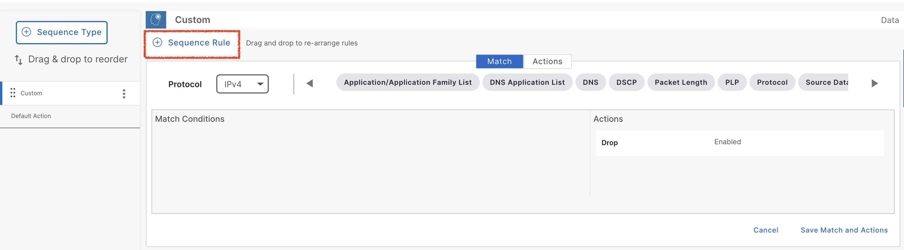{ .off-glb }
10. **Match** > **Scroll** right to select and click **Source Data Prefix**.
    { .off-glb }
11. Under “**Match Conditions**”. 
    1. Click in box with “**Source Data Prefix List**” and **select** > **<font color="green">Sydney-Branch-User</font>**.
13. Under “**Match Conditions**”. 
    1. Scroll down and click in box with “**Destination Data Prefix List**” and **select** > **<font color="green">Internet</font>**.
    { .off-glb }
14. Scroll up and select “**<font color="green">Actions</font>**”.
    1. Click **Accept** Radio button. 
    { .off-glb }
    2. Scroll to the right to select “**<font color="green">Service Chain</font>**”.
    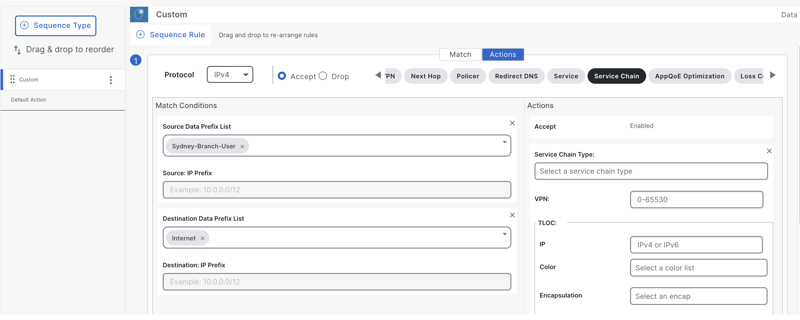{ .off-glb }
15. Click **<font color="orange">Service Chain Type</font>** and scroll the options down a bit and select “**Service Chain Type**” – for example **<font color="green">SC8</font>**. 
    1. Under VPN, specify VPN **<font color="green">2</font>**.
    2. Under **TLOC List** select **<font color="green">Local</font>**. 
    3. Uncheck **<font color="green">Restrict</font>**. 
    { .off-glb }

    !!! info
        When **restrict** is configured in the set service-chain action, packets are dropped if a service chain goes down or if the **TLOCs** that are specified in a policy are **NOT** available. The restrict behavior is suitable for security services such as a <font color="green">firewall</font>.
    
    !!! warning
        Use the <font color="red">**Service Chain Type**</font> from **point 20** of "**Configuring Service-Chain in Configuration Group**".

16. Click “**Save Match and Actions**”. 
    { .off-glb }
17. Once data policy is saved, we can click **Policy Application** and under **Policy Application**, we select **<font color="green">Traffic Data</font>** to apply the data policy **scenario-5-data-policy**.
    { .off-glb }
18. Now Click **New Site/WAN Region List and VPN List**
    * Keep **<font color="orange">From Service</font>** radio button checked.
    * Keep **<font color="orange">Site List</font>** radio button checked.
    * Select Site List by clicking in the box – **<font color="green">Sydney-Branch</font>**
    * Click outside the selection box to expose **Select VPN List**.
    * Select VPN List by clicking in the box – **<font color="green">VPN-1</font>**. 
    { .off-glb }
19. Click **<font color="orange">Save Policy</font>** at the bottom.
20. Now data policy is added into centralized policy **scenario-5**. We can click three dots { .off-glb width="25"} and click **Preview** to review policy. 
    * Click **Okay** once reviewed.
    { .off-glb }
21. In order to activate the policy, click { .off-glb width="25"} on the **<font color="green">Scenario-5</font>** policy.
    * Click **Activate**. 
    * Click **Activate** on **Activate Policy** pop-up.
    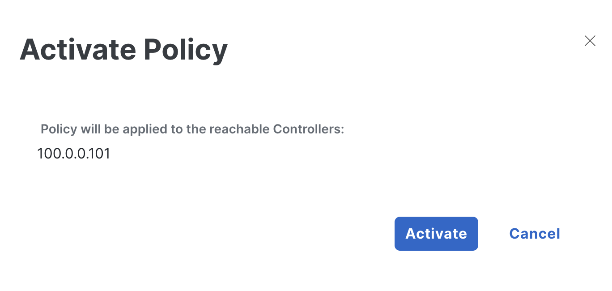{ .off-glb }
22. Once policy is being pushed successfully, we can have **Push vSmart Policy** **Validation success** and **Message** “**<font color="green">Done – Push vSmart Policy**</font>”. 
    { .off-glb }

## Verification

After the centralized data policy has been successfully deployed, the next step is to confirm that the policy has been 
propagated by the SD-WAN controller (vSmart) to the WAN-Edges. In this case, we need to ensure that the **Sydney-Branch** WAN-Edge 
has received the policy via OMP and is correctly steering traffic through the **Sydney-FW** in **<font color="orange">VRF-2</font>** as intended.

To verify this, we can utilize the following show command on the **Sydney-Branch** WAN-Edge. This will help confirm whether the 
centralized data policy has been effectively pushed from the SD-WAN controller (vSmart) to the **Sydney-Branch** router through OMP.

```{ .ios .no-copy linenums="1", hl_lines="1" }
Sydney-Branch#show sdwan policy from-vsmart 
from-vsmart data-policy _VPN-1_scenario-5-data-policy
 direction from-service
 vpn-list VPN-1
  sequence 1
   match
    source-data-prefix-list      Sydney-Branch-User
    destination-data-prefix-list Internet
   action accept
    set
     service-chain SC8
     service-chain vpn 2
     service-chain fall-back
     service-chain local
  default-action accept
from-vsmart lists vpn-list VPN-1
 vpn 1
from-vsmart lists data-prefix-list Internet
 ip-prefix 8.8.8.8/32
from-vsmart lists data-prefix-list Sydney-Branch-User
 ip-prefix 192.168.20.0/24
```

!!! info
    In our centralized policy configuration, we have implemented both a control policy and a data policy. Within the Cisco SD-WAN policy framework, 
    it is important to note that centralized control policies are processed directly on the **SD-WAN controller** and are not pushed to the WAN-Edge devices. 
    Conversely, **centralized data policies** are distributed to the WAN-Edge devices for local enforcement. As a result, when inspecting the configuration 
    on the **Sydney-Branch** WAN-Edge, only the data policy will be visible. This distinction ensures that control decisions are managed centrally while data traffic 
    is handled locally at the edge for optimized performance and enforcement.


!!! warning
    It could be possible that Service-chain number might be different.

To verify that the centralized data policy is functioning as intended, navigate back to the **Sydney-User** in the **Sydney-Branch** site. 

- Perform a traceroute to the **<font color="green">Google DNS server 8.8.8.8</font>** from **Sydney-User**: 
    - _traceroute 8.8.8.8 -n_
- Observe the traceroute output to confirm that traffic is hitting the **Sydney firewall (Sydney-FW)** at IP address **<font color="#9AAFCB">10.20.20.2</font>**, which is in **<font color="green">VRF-2</font>**.

```{.ios .no-copy linenums="1", hl_lines="4"}
Sydney-User:~$ traceroute 8.8.8.8 -n
traceroute to 8.8.8.8 (8.8.8.8), 30 hops max, 46 byte packets
 1  192.168.20.1  1.288 ms  1.244 ms  0.804 ms
 2  10.20.20.2  2.648 ms  1.625 ms  1.546 ms
 3  192.168.20.1  1.453 ms  1.440 ms  1.275 ms
 4  172.16.1.254  2.845 ms  1.852 ms  1.943 ms
 5  192.168.255.1  2.619 ms  2.420 ms  3.571 ms
 6  198.18.128.1  3.751 ms  2.306 ms  3.243 ms
 7  10.255.0.3  2.592 ms  2.715 ms  3.019 ms
 8  10.1.27.9  2.996 ms  2.705 ms  3.097 ms
 9  4.4.4.2  6.951 ms  4.303 ms  3.846 ms
10  64.103.43.33  3.192 ms  3.515 ms  3.002 ms
11  10.230.4.140  15.867 ms  14.236 ms  8.647 ms
12  10.230.4.130  8.900 ms  9.731 ms  8.482 ms
13  64.103.40.93  9.529 ms  9.820 ms  64.103.40.97  10.968 ms
14  128.107.8.46  9.461 ms  128.107.8.18  12.020 ms  128.107.8.46  9.326 ms
15  195.66.224.125  14.366 ms  11.994 ms  13.270 ms
16  192.178.97.107  12.348 ms  192.178.97.249  12.282 ms  192.178.97.41  13.088 ms
17  142.251.54.49  11.068 ms  209.85.252.181  11.958 ms  172.253.66.101  12.680 ms
18  8.8.8.8  15.640 ms  13.103 ms  11.219 ms
Sydney-User:~$ 
```
- Next, verify on the **Sydney-FW** itself to ensure that the traffic is being **inspected** before continuing its journey toward the **Google DNS server**. 
- This step confirms that the traffic is correctly following the service chain configuration as defined in the centralized policy **<font color="green">even though users are in different VRF</font>**.

```{.ios .no-copy linenums="1"}
Sydney-FW#show conn all
51 in use, 51 most used

UDP inside  192.168.20.2:53653 inside  8.8.8.8:33485, idle 0:00:02, bytes 18, flags - 
UDP inside  192.168.20.2:53653 inside  8.8.8.8:33448, idle 0:00:03, bytes 18, flags - 
UDP inside  192.168.20.2:53653 inside  8.8.8.8:33453, idle 0:00:03, bytes 18, flags - 
UDP inside  192.168.20.2:53653 inside  8.8.8.8:33469, idle 0:00:03, bytes 18, flags - 
UDP inside  192.168.20.2:53653 inside  8.8.8.8:33455, idle 0:00:03, bytes 18, flags - 
UDP inside  192.168.20.2:53653 inside  8.8.8.8:33451, idle 0:00:03, bytes 18, flags - 
UDP inside  192.168.20.2:53653 inside  8.8.8.8:33462, idle 0:00:03, bytes 18, flags - 
UDP inside  192.168.20.2:53653 inside  8.8.8.8:33464, idle 0:00:03, bytes 18, flags - 
UDP inside  192.168.20.2:53653 inside  8.8.8.8:33459, idle 0:00:03, bytes 18, flags - 
UDP inside  192.168.20.2:53653 inside  8.8.8.8:33450, idle 0:00:03, bytes 18, flags - 
UDP inside  192.168.20.2:53653 inside  8.8.8.8:33446, idle 0:00:03, bytes 18, flags - 
UDP inside  192.168.20.2:53653 inside  8.8.8.8:33458, idle 0:00:03, bytes 18, flags - 
UDP inside  192.168.20.2:53653 inside  8.8.8.8:33474, idle 0:00:03, bytes 18, flags - 
UDP inside  192.168.20.2:53653 inside  8.8.8.8:33454, idle 0:00:03, bytes 18, flags - 
UDP inside  192.168.20.2:53653 inside  8.8.8.8:33477, idle 0:00:03, bytes 18, flags - 
UDP inside  192.168.20.2:53653 inside  8.8.8.8:33467, idle 0:00:03, bytes 18, flags - 
UDP inside  192.168.20.2:53653 inside  8.8.8.8:33465, idle 0:00:03, bytes 18, flags - 
UDP inside  192.168.20.2:53653 inside  8.8.8.8:33481, idle 0:00:03, bytes 18, flags - 
UDP inside  192.168.20.2:53653 inside  8.8.8.8:33470, idle 0:00:03, bytes 18, flags - 
UDP inside  192.168.20.2:53653 inside  8.8.8.8:33488, idle 0:00:03, bytes 18, flags - 
UDP inside  192.168.20.2:53653 inside  8.8.8.8:33460, idle 0:00:03, bytes 18, flags - 
UDP inside  192.168.20.2:53653 inside  8.8.8.8:33463, idle 0:00:03, bytes 18, flags - 
UDP inside  192.168.20.2:53653 inside  8.8.8.8:33441, idle 0:00:03, bytes 18, flags - 
UDP inside  192.168.20.2:53653 inside  8.8.8.8:33443, idle 0:00:03, bytes 18, flags - 
UDP inside  192.168.20.2:53653 inside  8.8.8.8:33440, idle 0:00:03, bytes 0, flags - 
UDP inside  192.168.20.2:53653 inside  8.8.8.8:33461, idle 0:00:03, bytes 18, flags - 
UDP inside  192.168.20.2:53653 inside  8.8.8.8:33468, idle 0:00:03, bytes 18, flags - 
UDP inside  192.168.20.2:53653 inside  8.8.8.8:33442, idle 0:00:03, bytes 18, flags - 
UDP inside  192.168.20.2:53653 inside  8.8.8.8:33479, idle 0:00:03, bytes 18, flags - 
UDP inside  192.168.20.2:53653 inside  8.8.8.8:33480, idle 0:00:03, bytes 18, flags - 
UDP inside  192.168.20.2:53653 inside  8.8.8.8:33475, idle 0:00:03, bytes 18, flags - 
UDP inside  192.168.20.2:53653 inside  8.8.8.8:33452, idle 0:00:03, bytes 18, flags - 
UDP inside  192.168.20.2:53653 inside  8.8.8.8:33444, idle 0:00:03, bytes 18, flags - 
UDP inside  192.168.20.2:53653 inside  8.8.8.8:33487, idle 0:00:03, bytes 18, flags - 
UDP inside  192.168.20.2:53653 inside  8.8.8.8:33471, idle 0:00:03, bytes 18, flags - 
UDP inside  192.168.20.2:53653 inside  8.8.8.8:33472, idle 0:00:03, bytes 18, flags - 
UDP inside  192.168.20.2:53653 inside  8.8.8.8:33445, idle 0:00:03, bytes 18, flags - 
UDP inside  192.168.20.2:53653 inside  8.8.8.8:33478, idle 0:00:03, bytes 18, flags - 
UDP inside  192.168.20.2:53653 inside  8.8.8.8:33482, idle 0:00:03, bytes 18, flags - 
UDP inside  192.168.20.2:53653 inside  8.8.8.8:33456, idle 0:00:03, bytes 18, flags - 
UDP inside  192.168.20.2:53653 inside  8.8.8.8:33466, idle 0:00:03, bytes 18, flags - 
UDP inside  192.168.20.2:53653 inside  8.8.8.8:33457, idle 0:00:03, bytes 18, flags - 
UDP inside  192.168.20.2:53653 inside  8.8.8.8:33473, idle 0:00:03, bytes 18, flags - 
UDP inside  192.168.20.2:53653 inside  8.8.8.8:33476, idle 0:00:03, bytes 18, flags - 
UDP inside  192.168.20.2:53653 inside  8.8.8.8:33439, idle 0:00:03, bytes 0, flags - 
UDP inside  192.168.20.2:53653 inside  8.8.8.8:33438, idle 0:00:03, bytes 0, flags - 
UDP inside  192.168.20.2:53653 inside  8.8.8.8:33486, idle 0:00:03, bytes 18, flags - 
UDP inside  192.168.20.2:53653 inside  8.8.8.8:33483, idle 0:00:03, bytes 18, flags - 
UDP inside  192.168.20.2:53653 inside  8.8.8.8:33447, idle 0:00:03, bytes 18, flags - 
UDP inside  192.168.20.2:53653 inside  8.8.8.8:33484, idle 0:00:03, bytes 18, flags - 
UDP inside  192.168.20.2:53653 inside  8.8.8.8:33449, idle 0:00:03, bytes 18, flags - 
Sydney-FW# 
```

We can use the following show commands to see packets are matching and service chaining is working on **Sydney** WAN-Edge router. 

- **show platform software sdwan service-chain stats detail**
- **show platform hardware qfp active feature sdwan datapath service-chain stats**

```{.ios .no-copy linenums="1", hl_lines="1 3 4 5 6 9"}
Sydney-Branch#sh platform software sdwan service-chain stats detail  

Service Chain: SC8
   vrf: 2
   label: 1008
   state: up
   description:  Sydney-Firewall-SC

   service: FW
      tx: 75 rx: 66
      ha_pair 1: ipv4
         active
            tx: 75 rx: 66 
            tx tracker: sent: 8 dropped: 0 rtt: 2
            rx tracker: sent: 0 dropped: 0 rtt: 0
         backup
            tx: 0 rx: 0 
            tx tracker: sent: 0 dropped: 0 rtt: 0
            rx tracker: sent: 0 dropped: 0 rtt: 0
```

```{.ios .no-copy linenums="1", hl_lines="1 2 7 8"}
Sydney-Branch#show platform hardware qfp active feature sdwan datapath service-chain stats          
Service-Chain ID: 8
  Global stats: 75
  Global stats v6: 0
  Per Service stats 
    Service: Firewall
      Tx pkt: 75
      Rx pkt: 66
      Tx pkt v6: 0
      Rx pkt v6: 0
```

## Conclusion
In conclusion, the configuration group and centralized policy implemented in this lab successfully achieved the intended traffic 
flow and inspection requirements. Traffic originating from the **Sydney-User at Sydney-Branch (site-20)** and destined for the **Internet** was effectively routed through the **firewall (Sydney-FW)** located at **Sydney-Branch** in a **separate VRF (VRF-2)**. The centralized control policy **enabled route-leaking between VRF-1 and VRF-2**, allowing the **Sydney-Branch** WAN-Edge to establish connectivity with the firewall. 
The centralized data policy ensured that all traffic was directed through the **Sydney-firewall** for inspection before proceeding to its destination. This demonstrates the effective use of service chaining and centralized policy mechanisms in Cisco SD-WAN to implement advanced traffic steering and security measures.

!!! info
    Before proceeding to the **next lab**, it is essential to **<font color="red">deactivate</font>** the centralized policy configured in the current exercise. **Deactivating** the policy 
    ensures that no unintended traffic steering or service chaining configurations remain active, which could interfere with subsequent lab tasks. Once the centralized policy is successfully deactivated 
    and confirmed, delete the service chain parcel **Sydney-Branch-Service-Attachment** in **Sydney-Branch** WAN-Edge service profile **APAC-Sydney-Branch-Service-VPN**. Now we can confidently move forward to 
    the next lab. This step is critical to maintain a clean and controlled environment for the upcoming configurations and scenarios.
    From the left hand navigation pane select **<font color="red">Configuration -> Policies -> {{Respected-Scenario-Centralized-Policy}} -> ... -> Deactivate</font>**.
