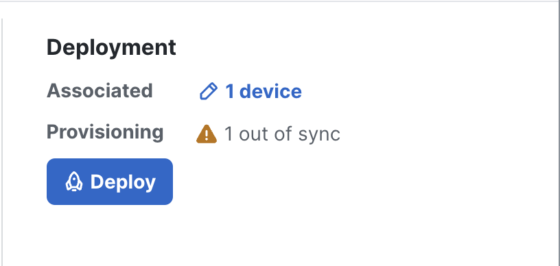
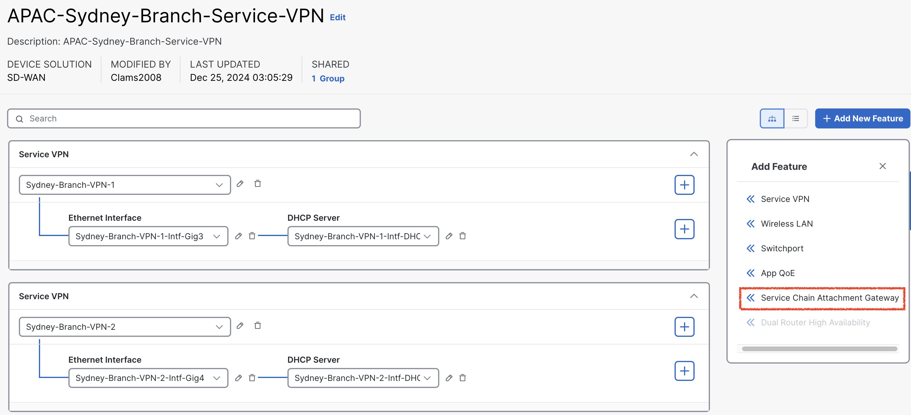
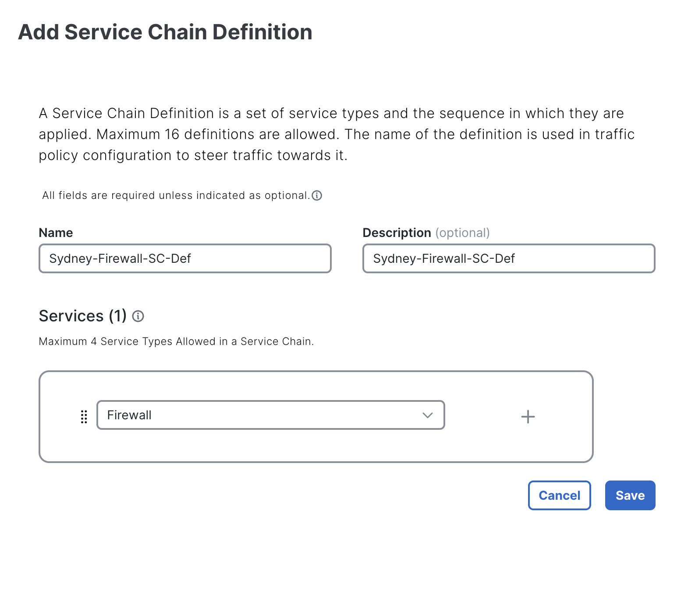

# Lab 5 - Direct Internet Breakout for Sydney-Branch Traffic via Underlay with Firewall Inspection

## Introduction
In this lab exercise, you will explore the traffic flow from a user located in the **APAC-Sydney-Branch (site-20)** breakout directly to **<font color="green">Internet</font>** via underlay. Here is a breakdown of the key components involved in the network path: 

Here is a breakdown of the key components involved in the network path:

- **Source:** The traffic originates from a **Sydney-User** in the **APAC-Sydney-Branch (site-20)**.
- **Destination:** Internet for example **<font color="orange">Google DNS server 8.8.8.8</font>**.
- **Firewall:** All traffic passes through a **firewall (Sydney-FW)**, which is hosted locally at the **APAC-Sydney-Branch (site-20)** in **<font color="green">VRF-2</font>**.
- **WAN Edge Router:** The **Sydney-Branch** WAN-Edge router, router carries user traffic in ***<font color="#9AAFCB">VRF-1</font>***  and facilitates the firewall reachability in ***<font color="#9AAFCB">VRF-2</font>***. 

Ensure that each component is properly configured and verify the traffic flow is going through **Sydney-FW**.

!!! note
    Through this lab, firewall is configured to inspect traffic automatically in **inspected mode**, ***<font color="red"> without requiring any additional configuration</font>***. This inspection ensures that only safe and authorized traffic flows through the network, enhancing security and protecting against potential threats.

## Intended Traffic Flow Diagram

The following diagram illustrates the **<font color="orange">flow of traffic within the network for this scenario</font>**. Traffic is initiated from the **Sydney-User** and is first redirected to the **Sydney-Firewall** in a **<font color="green">VRF-2</font>** for <font color="orange">**inspection**</font>. After the traffic undergoes inspection, it is then forwarded to the **Internet( for example Google <font color="green">DNS server 8.8.8.8</font>)**. 

This scenario demonstrates how traffic is securely routed through the firewall for inspection before reaching its final destination, ensuring that security policies are applied effectively within the SD-WAN fabric.

<figure markdown>
  
</figure>

## Traffic flow without any NAT

In the initial configuration, prior to applying any traffic policies or making modifications to the configuration group, it is observed that connectivity to the Internet, specifically to the **<font color="orange">Google DNS server 8.8.8.8</font>**, is not established from **VRF-1** on the **Sydney-Branch** WAN-Edge router. This lack of connectivity indicates that the current setup does not support direct Internet access from **VRF-1**, highlighting the need for further configuration, such as route adjustments, NAT settings, or centralized policies, to enable Internet reachability. This baseline observation provides a starting point for implementing the necessary changes in subsequent steps.

```{ .ios .no-copy }
Sydney-Branch#show ip route vrf 1

Routing Table: 1
Codes: L - local, C - connected, S - static, R - RIP, M - mobile, B - BGP
       D - EIGRP, EX - EIGRP external, O - OSPF, IA - OSPF inter area 
       N1 - OSPF NSSA external type 1, N2 - OSPF NSSA external type 2
       E1 - OSPF external type 1, E2 - OSPF external type 2, m - OMP
       n - NAT, Ni - NAT inside, No - NAT outside, Nd - NAT DIA
       i - IS-IS, su - IS-IS summary, L1 - IS-IS level-1, L2 - IS-IS level-2
       ia - IS-IS inter area, * - candidate default, U - per-user static route
       H - NHRP, G - NHRP registered, g - NHRP registration summary
       o - ODR, P - periodic downloaded static route, l - LISP
       a - application route
       + - replicated route, % - next hop override, p - overrides from PfR
       & - replicated local route overrides by connected

Gateway of last resort is not set

      10.0.0.0/8 is variably subnetted, 3 subnets, 2 masks
m        10.10.10.0/24 [251/0] via 10.1.1.1, 1d10h, Sdwan-system-intf
m        10.101.101.0/24 [251/0] via 10.0.0.1, 2d01h, Sdwan-system-intf
m        10.102.102.102/32 [251/0] via 10.0.0.2, 2d01h, Sdwan-system-intf
m     192.168.10.0/24 [251/0] via 10.1.1.1, 1d10h, Sdwan-system-intf
      192.168.20.0/24 is variably subnetted, 2 subnets, 2 masks
C        192.168.20.0/24 is directly connected, GigabitEthernet3
L        192.168.20.1/32 is directly connected, GigabitEthernet3
Sydney-Branch#
```
The **Sydney-Branch** WAN-Edge router is able to reach the **Internet** through the **<font color="green">underlay network</font>**, confirming that basic Internet connectivity is functional at the transport level. 

```{.ios .no-copy}
Sydney-Branch#ping 8.8.8.8
Type escape sequence to abort.
Sending 5, 100-byte ICMP Echos to 8.8.8.8, timeout is 2 seconds:
!!!!!
Success rate is 100 percent (5/5), round-trip min/avg/max = 8/9/11 ms

Sydney-Branch#ping 8.8.4.4
Type escape sequence to abort.
Sending 5, 100-byte ICMP Echos to 8.8.4.4, timeout is 2 seconds:
!!!!!
Success rate is 100 percent (5/5), round-trip min/avg/max = 7/8/10 ms
Sydney-Branch#
```
However, Internet access from **<font color="orange">VRF-1</font>** is not established, as demonstrated in the output below. This indicates that while the underlay network is properly configured for external reachability, additional configurations, such as **NAT**, are required to enable Internet connectivity for **<font color="green">VRF-1</font>**.

```{.ios .no-copy}
Sydney-Branch#ping vrf 1 8.8.8.8
Type escape sequence to abort.
Sending 5, 100-byte ICMP Echos to 8.8.8.8, timeout is 2 seconds:
.....
Success rate is 0 percent (0/5)

Sydney-Branch#ping vrf 1 8.8.4.4
Type escape sequence to abort.
Sending 5, 100-byte ICMP Echos to 8.8.4.4, timeout is 2 seconds:
.....
Success rate is 0 percent (0/5)
Sydney-Branch#
```
## Enabling NAT in Configuration Group for Sydney-Branch 

In Cisco Catalyst SD-WAN, enabling **NAT** (Network Address Translation) on the interface is crucial for reaching the underlay network for **Direct Internet Access (DIA)**. NAT translates internal private IP addresses into public IP addresses, allowing devices in **private VRFs** to communicate with external networks, such as the **Internet**. Without NAT, traffic from the private VRF cannot traverse the underlay network to access external resources. To enable NAT on the **<font color="green">Sydney-Branch</font>** WAN-Edge router, follow these steps:

1. From the vManage Landing Page, navigate to the left-hand panel, select Configuration, and click Configuration Groups.
   { .off-glb }
2. Locate and click on the **APAC-Sydney-Branch** Configuration Group as illustrated below.
   { .off-glb }
3. Click the edit { .off-glb, width=25 } icon for the **APAC-Sydney-Branch - Transport & Management Profile** as illustrated below.
   { .off-glb }   
4. Click the edit { .off-glb, width=25 } icon for **APAC-Sydney-Branch-INET** to enable **<font color="green">NAT</font>** for **INET** transport.
   { .off-glb } 
5. Now click **<font color="green">NAT</font>** to enable NAT on INET transport(TLOC).
   { .off-glb } 
6. Enable **NAT** on INET TLOC by clicking NAT. Once it is enabled click **<font color="green">Save</font>**
   { .off-glb }
7. Click **Back**
   { .off-glb } 
8. As we enable the **NAT**, now configuration group for **APAC-Sydney-Branch** is now marked as <font color="red">out of sync</font>. 
9. Click **APAC-Sydney-Branch** Configuration Group -> Click **<font color="green">Deploy**</font>.
    { .off-glb } 
10. In **Deploy Configuration Group** page, select **APAC-Sydney-Branch** by clicking the square Radio Button and Click **Next**.  
    { .off-glb } 
11. Click **Import**, and load **APAC-Sydney-Branch.csv** file which loads all the values for the variables.
    { .off-glb } 
12. After uploading the **CSV files**, click on **Preview CLI** to review the configuration changes before deployment. This step ensures that the **NAT** is enabled on **INET TLOC**. 
    { .off-glb } 
13. Scroll down the **New Configuration** section to locate the ***ip nat*** configuration section.
    { .off-glb }
14. After finalizing the configuration, click **Cancel** to exit the current screen and then click **Deploy** to initiate the deployment process. Once the deployment is triggered, navigate to the **View Deployment Status** section to monitor the progress. 
    { .off-glb } 
15. Wait until the deployment status indicates **<font color="green">Success</font>**, confirming that the configuration has been successfully applied to the relevant devices.
    { .off-glb } 
16. To verify the configuration group status, click on the **APAC-Sydney-Branch** configuration group. Ensure that the **Associated column indicates <font color="orange">1</font> device**, confirming that the configuration group is 
    correctly linked to the **Sydney-Branch** WAN-Edge router. Additionally, check that the Provisioning column displays **<font color="orange">0 out of sync</font>** indicating that the configuration has been successfully deployed 
    and is fully synchronized with the device. This step ensures that the configuration group is correctly applied and functioning as intended.
    { .off-glb }

## Verification of NAT configuration on Sydney-Branch

After enabling NAT on the interface, a static route is installed in **VRF-1** on the **Sydney-Branch** WAN-Edge router,

```{ .ios .no-copy }
Sydney-Branch#show running-config | i ip nat route vrf 1
ip nat route vrf 1 0.0.0.0 0.0.0.0 global
Sydney-Branch#
```
As shown in the routing table output below. The route indicates a default gateway (0.0.0.0/0) pointing to **Null0**, signifying that traffic from **VRF-1** destined for external networks will now be processed for **<font color="green">Direct Internet Access (DIA) via the underlay</font>** network. This static route ensures that any traffic not explicitly matched by more specific routes is directed to the NAT-enabled interface for Internet access. The configuration confirms that the NAT setup is successfully integrated with the SD-WAN routing infrastructure, allowing seamless communication between the internal VRF and external networks.

```{.ios .no-copy linenums="1", hl_lines="19"}
Sydney-Branch#show ip route vrf 1

Routing Table: 1
Codes: L - local, C - connected, S - static, R - RIP, M - mobile, B - BGP
       D - EIGRP, EX - EIGRP external, O - OSPF, IA - OSPF inter area 
       N1 - OSPF NSSA external type 1, N2 - OSPF NSSA external type 2
       E1 - OSPF external type 1, E2 - OSPF external type 2, m - OMP
       n - NAT, Ni - NAT inside, No - NAT outside, Nd - NAT DIA
       i - IS-IS, su - IS-IS summary, L1 - IS-IS level-1, L2 - IS-IS level-2
       ia - IS-IS inter area, * - candidate default, U - per-user static route
       H - NHRP, G - NHRP registered, g - NHRP registration summary
       o - ODR, P - periodic downloaded static route, l - LISP
       a - application route
       + - replicated route, % - next hop override, p - overrides from PfR
       & - replicated local route overrides by connected

Gateway of last resort is 0.0.0.0 to network 0.0.0.0

n*Nd  0.0.0.0/0 [6/0], 00:08:23, Null0
      10.0.0.0/8 is variably subnetted, 3 subnets, 2 masks
m        10.10.10.0/24 [251/0] via 10.1.1.1, 1d11h, Sdwan-system-intf
m        10.101.101.0/24 [251/0] via 10.0.0.1, 2d01h, Sdwan-system-intf
m        10.102.102.102/32 [251/0] via 10.0.0.2, 2d01h, Sdwan-system-intf
m     192.168.10.0/24 [251/0] via 10.1.1.1, 1d11h, Sdwan-system-intf
      192.168.20.0/24 is variably subnetted, 2 subnets, 2 masks
C        192.168.20.0/24 is directly connected, GigabitEthernet3
L        192.168.20.1/32 is directly connected, GigabitEthernet3
Sydney-Branch#
```
Now, Internet access from Sydney-Branch from **<font color="orange">VRF-1</font>** is established, as demonstrated in the output below. 

```{.ios .no-copy}
Sydney-Branch#ping vrf 1 8.8.8.8
Type escape sequence to abort.
Sending 5, 100-byte ICMP Echos to 8.8.8.8, timeout is 2 seconds:
!!!!!
Success rate is 100 percent (5/5), round-trip min/avg/max = 7/11/24 ms

Sydney-Branch#ping vrf 1 8.8.4.4  
Type escape sequence to abort.
Sending 5, 100-byte ICMP Echos to 8.8.4.4, timeout is 2 seconds:
!!!!!
Success rate is 100 percent (5/5), round-trip min/avg/max = 7/8/9 ms
Sydney-Branch#
```
Lets verify from **Sydney-User** if we have internet access or not. 

```{.ios .no-copy}
Sydney-User:~$ ping 8.8.8.8
PING 8.8.8.8 (8.8.8.8): 56 data bytes
64 bytes from 8.8.8.8: seq=0 ttl=42 time=10.965 ms
64 bytes from 8.8.8.8: seq=1 ttl=42 time=10.881 ms
64 bytes from 8.8.8.8: seq=2 ttl=42 time=9.520 ms
^C
--- 8.8.8.8 ping statistics ---
3 packets transmitted, 3 packets received, 0% packet loss
round-trip min/avg/max = 9.520/10.455/10.965 ms
```
Lets perform a ***traceroute*** from **<font color="green">Sydney-User</font>** towards Google DNS server **8.8.8.8**.

```{.ios .no-copy}
Sydney-User:~$ traceroute 8.8.8.8 -n
traceroute to 8.8.8.8 (8.8.8.8), 30 hops max, 46 byte packets
 1  192.168.20.1  0.639 ms  0.781 ms  0.916 ms
 2  172.16.1.254  1.210 ms  1.193 ms  0.761 ms
 3  192.168.255.1  1.560 ms  1.257 ms  2.069 ms
 4  198.18.128.1  2.222 ms  2.283 ms  1.956 ms
 5  10.255.0.3  1.560 ms  2.146 ms  2.303 ms
 6  10.1.27.9  2.436 ms  2.489 ms  2.459 ms
 7  4.4.4.2  2.724 ms  2.188 ms  2.010 ms
 8  64.103.43.33  2.590 ms  3.745 ms  3.221 ms
 9  10.230.4.140  12.564 ms  7.000 ms  7.031 ms
10  10.230.4.130  8.108 ms  6.868 ms  6.957 ms
11  64.103.40.93  7.442 ms  7.649 ms  64.103.40.97  9.068 ms
12  128.107.8.18  10.159 ms  128.107.8.46  7.378 ms  7.507 ms
13  195.66.224.125  8.222 ms  7.516 ms  9.600 ms
14  192.178.97.41  9.513 ms  192.178.97.181  8.075 ms  192.178.97.41  8.374 ms
15  142.251.54.49  7.849 ms  142.251.54.35  8.759 ms  192.178.46.83  8.876 ms
16  8.8.8.8  8.830 ms  7.968 ms  7.485 ms
Sydney-User:~$ 
```
Following Table exhibit how traffic is flowing from **Sydney-User** towards **Google DNS 8.8.8.8**.

| Interface         | IP Address   | Description                                                                                                                          |
|-------------------|--------------|--------------------------------------------------------------------------------------------------------------------------------------|
| GigabitEthernet 3 | 192.168.20.1 | <font color="#9AAFCB"> **Sydney-Branch** WAN-Edge interface in **<font color="orange">VRF 1</font>** connected with **Sydney-User**. |
| GigabitEthernet 1 | 172.16.1.254 | <font color="#9AAFCB"> **INET** WAN-Edge interface **INET TLOC**.</font>                                                             |

## Configuring Service-Chain in Configuration Group

Next, we will configure a service chain within the service-profile parcel in the configuration group by following the below steps. 
This service chain defines the sequence of services that will be applied to traffic originating from the **Sydney-Branch** and destined 
for the **<font color="green">Internet-traffic</font>**. By specifying the service chain in the configuration, we instruct the **Sydney WAN-Edge** on the type of services 
to be applied to the traffic, such as redirection through a **Sydney-FW** firewall in **<font color="bluw">VRF 2</font>**. 

1. From the vManage Landing Page, navigate to the left-hand panel, select Configuration, and click Configuration Groups.
   { .off-glb }
2. Locate and click on the **APAC-Sydney-Branch** Configuration Group as illustrated below.
   { .off-glb }
3. Click the edit { .off-glb, width=25 } icon for the **APAC-Sydney-Branch - Service Profile** as illustrated below.   
   { .off-glb }
4. Select **<font color="#9AAFCB">Add New Feature</font>** and add a <font color="orange">**Service Chain Attachment Gateway**</font> as illustrated below.
   { .off-glb }
5. In the <font color="orange">**Service Chain Attachment Gateway**</font> configuration parcel, click the dropdown arrow and select **Add New**.
   { .off-glb }
6. On the **Service Chain Attachment Gateway** configuration page, provide ***Name*** and ***Description*** for the attachment gateway. For example, use the name and description **<font color="orange">London-Branch-Service-Attachment</font>**.
   { .off-glb }
7. Click **Add Service Chain Definition** to define the service chain. 
   { .off-glb }
8. Enter the name **Sydney-Firewall-SC-Def** and Description **Sydney-Firewall-SC-Def** for the service chain definition.
9. Select a **Service Type** <font color="red">**Firewall**</font> by click dropdown and click **<font color="orange">Save</font>**
   { .off-glb }
10. Under Basic Information, enter **VPN** <font color="orange">**2**</font>.
11. Scroll down to **IPv4 Attachment**: <font color="orange">(1 Interface)</font>.
    { .off-glb }
12. Enter **Service IPv4 Address <font color="#9AAFCB">10.20.20.2</font>**. This is the IP address of **Sydney Firewall (***<font color="green">Sydney-FW</font>***)**.
13. Enter SD-WAN Router Interface as **GigabitEthernet4** and click <font color="orange">**Save**</font>.
    { .off-glb }
    The **GigabitEthernet4** interface on the **Sydney-Branch** WAN-Edge router serves as the connection point for the **Sydney-FW firewall**. 
    This interface facilitates the integration of the firewall into the service chain, allowing traffic to be redirected through the firewall for 
    inspection or policy enforcement as configured. The proper configuration of this interface is crucial for ensuring seamless communication between 
    the WAN-Edge router and the firewall, enabling the desired security and traffic management features within the SD-WAN environment.
14. Click **Back** at bottom left.
    { .off-glb }
15. As we add the **Service Attachment Gateway Definition**, now configuration group for **APAC-Sydney-Branch** is now marked as <font color="red">out of sync</font>. 
16. Click **APAC-Sydney-Branch** Configuration Group -> Click **<font color="green">Deploy**</font>.
    { .off-glb }
17. In **Deploy Configuration Group** page, select **APAC-Sydney-Branch** by clicking the square Radio Button and Click **Next**.  
    { .off-glb }
18. Click **Import**, and load **APAC-Sydney-Branch.csv** file which loads all the values for the variables.
    { .off-glb }
19. After uploading the **CSV files**, click on **Preview CLI** to review the configuration changes before deployment. This step ensures that the service-chain gateway definition 
    is correctly included in the configuration. By previewing the CLI, you can verify that all required parameters have been accurately applied and are ready for deployment. 
    This validation step is critical to confirm that the service chain configuration aligns with the intended design and will function as expected once deployed.
    { .off-glb }
20. Scroll down the **New Configuration** section to locate the **service-chain number** highlighted in <font color="#9AAFCB">**blue**</font>. <font color="red">Make a note of this number</font>, as it will be required when configuring the data policy in later sections.
    The **service-chain number** is a <font color="red">critical identifier</font> used to link the service chain definition to the appropriate policy, ensuring that traffic is processed through the configured service chain as intended.
    { .off-glb }
21. After finalizing the configuration, click **Cancel** to exit the current screen and then click **Deploy** to initiate the deployment process. Once the deployment is triggered, navigate to the **View Deployment Status** section to monitor the progress. 
    { .off-glb } 
22. Wait until the deployment status indicates **<font color="green">Success</font>**, confirming that the configuration has been successfully applied to the relevant devices.
    { .off-glb }
23. To verify the configuration group status, click on the **APAC-Sydney-Branch** configuration group. Ensure that the **Associated column indicates <font color="orange">1</font> device**, confirming that the configuration group is 
    correctly linked to the **Sydney-Branch** WAN-Edge router. Additionally, check that the Provisioning column displays **<font color="orange">0 out of sync</font>** indicating that the configuration has been successfully deployed 
    and is fully synchronized with the device. This step ensures that the configuration group is correctly applied and functioning as intended.
    { .off-glb }
