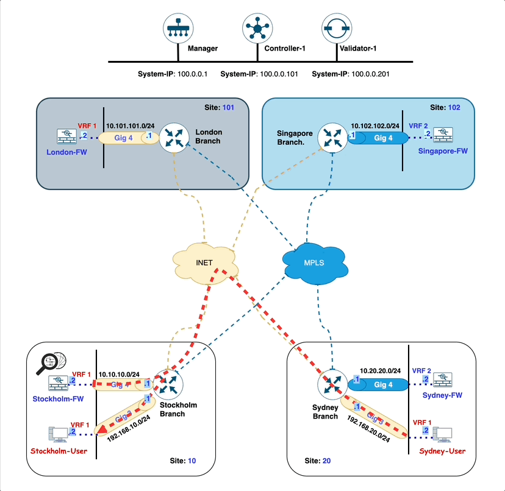
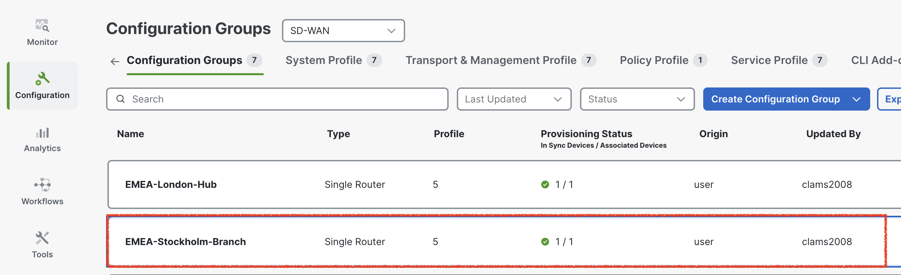
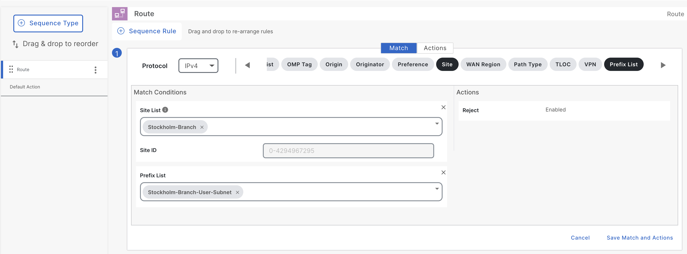

# Lab 7 - Using Data Policy for Routing Traffic from A to B via C firewall in Same VRF in AWS A
## Introduction

In this lab exercise, you will explore the traffic flow from a user located in the **EMEA-Sydney-Branch (site-20)** to a user situated at the **APAC-Stockholm-Branch (site-10)**.

Here is a breakdown of the key components involved in the network path:

- **Source:** The traffic originates from a **Sydney-User** user in the **EMEA-Sydney-Branch (site-20)**.
- **Destination:** The intended recipient is a **Stockholm-User** in the **APAC-Stockholm-Branch (site-10)**.
- **Firewall:** All traffic passes through a **firewall (Stockholm-FW)**, which is hosted locally at the **EMEA-Stockholm-Branch (site-10)**.
- **WAN Edge Router:** The **Stockholm-Branch** WAN-Edge router, configured in ***<font color="#9AAFCB">VRF-1</font>***, facilitates the traffic's reachability to the firewall and subsequent routing towards the destination.

Ensure that each component is properly configured and verify the traffic flow is going through **Stockholm-FW**.

!!! note
    Through this lab, firewall is configured to inspect traffic automatically in **inspected mode**, ***<font color="red"> without requiring any additional configuration</font>***. This inspection ensures that only safe and authorized traffic flows through the network, enhancing security and protecting against potential threats.

## Intended Traffic Flow Diagram

The following diagram illustrates the **<font color="orange">flow of traffic within the network for this scenario</font>**. Traffic is initiated from the **Sydney-User** and is first redirected to the **Stockholm-Firewall** for <font color="orange">**inspection**</font>. 
After the traffic undergoes inspection, it is then forwarded to the **Stockholm-User** in the **Stockholm Branch**. This scenario demonstrates how traffic is securely routed through the firewall for inspection before reaching its final destination, ensuring that security 
policies are applied effectively within the SD-WAN fabric.

<figure markdown>
  
</figure>

## Traffic flow without any policy

In the initial configuration, without applying any traffic policies, the routes learned from the **Stockholm-Branch** are distributed equally across both **Stockholm-Branch** WAN-Edge TLOCs (**biz-internet:10.1.1.1**, **mpls:10.1.1.1**), leveraging ECMP (Equal-Cost Multi-Path) for optimal path selection.

```{.ios, .no-copy, linenums="1", hl_lines="30 31"}
Sydney-Branch#show sdwan omp routes         
Generating output, this might take time, please wait ...
Code:
C   -> chosen
I   -> installed
Red -> redistributed
Rej -> rejected
L   -> looped
R   -> resolved
S   -> stale
Ext -> extranet
Inv -> invalid
Stg -> staged
IA  -> On-demand inactive
U   -> TLOC unresolved
BR-R -> Border-Router reoriginated
TGW-R -> Transport-Gateway reoriginated
R-TGW-R -> Reoriginated Transport-Gateway reoriginated

                                                                                                                                                AFFINITY                                 
                                                      PATH                      ATTRIBUTE                                                       GROUP                                    
TENANT    VPN    PREFIX              FROM PEER        ID     LABEL    STATUS    TYPE       TLOC IP          COLOR            ENCAP  PREFERENCE  NUMBER      REGION ID   REGION PATH      
-----------------------------------------------------------------------------------------------------------------------------------------------------------------------------------------
0         1      10.10.10.0/24       100.0.0.101      1      1003     C,I,R     installed  10.1.1.1         biz-internet     ipsec  -           None        None        -                
                                     100.0.0.101      2      1003     C,I,R     installed  10.1.1.1         mpls             ipsec  -           None        None        -                
0         1      10.101.101.0/24     100.0.0.101      1      1003     C,I,R     installed  10.0.0.1         mpls             ipsec  -           None        None        -                
                                     100.0.0.101      2      1003     C,I,R     installed  10.0.0.1         biz-internet     ipsec  -           None        None        -                
0         1      10.102.102.102/32   100.0.0.101      1      1008     C,I,R     installed  10.0.0.2         biz-internet     ipsec  -           None        None        -                
                                     100.0.0.101      2      1008     C,I,R     installed  10.0.0.2         mpls             ipsec  -           None        None        -                
0         1      192.168.10.0/24     100.0.0.101      1      1003     C,I,R     installed  10.1.1.1         biz-internet     ipsec  -           None        None        -                
                                     100.0.0.101      2      1003     C,I,R     installed  10.1.1.1         mpls             ipsec  -           None        None        -                
0         1      192.168.20.0/24     0.0.0.0          66     1003     C,Red,R   installed  10.1.1.2         mpls             ipsec  -           None        None        -                
                                     0.0.0.0          68     1003     C,Red,R   installed  10.1.1.2         biz-internet     ipsec  -           None        None        -                
0         2      10.20.20.0/24       0.0.0.0          66     1007     C,Red,R   installed  10.1.1.2         mpls             ipsec  -           None        None        -                
                                     0.0.0.0          68     1007     C,Red,R   installed  10.1.1.2         biz-internet     ipsec  -           None        None        -                
0         2      10.102.102.0/24     100.0.0.101      1      1004     C,I,R     installed  10.0.0.2         biz-internet     ipsec  -           None        None        -                
                                     100.0.0.101      2      1004     C,I,R     installed  10.0.0.2         mpls             ipsec  -           None        None        -                
```

To verify this, we initiate a ping from the **Sydney-User** (**<font color="#9AAFCB">IP: 192.168.20.2</font>**) to the **Stockholm-User** (**<font color="#9AAFCB">IP: 192.168.10.2</font>**). 
A successful ping response confirms that reachability between the two branches is intact.

```{.ios, .no-copy}
Sydney-User:~$ ping 192.168.10.2
PING 192.168.10.2 (192.168.10.2): 56 data bytes
64 bytes from 192.168.10.2: seq=0 ttl=42 time=1.678 ms
64 bytes from 192.168.10.2: seq=1 ttl=42 time=1.389 ms
64 bytes from 192.168.10.2: seq=2 ttl=42 time=1.596 ms
64 bytes from 192.168.10.2: seq=3 ttl=42 time=2.214 ms
64 bytes from 192.168.10.2: seq=4 ttl=42 time=4.609 ms
64 bytes from 192.168.10.2: seq=5 ttl=42 time=1.374 ms
^C
--- 192.168.10.2 ping statistics ---
6 packets transmitted, 6 packets received, 0% packet loss
round-trip min/avg/max = 1.374/2.143/4.609 ms
Sydney-User:~$ 
```
Additionally, traffic originating from the **Sydney-Branch** flows directly to the **Stockholm-Branch** via the available TLOCs, 
ensuring efficient and balanced connectivity in the absence of traffic policies.

```{.ios, .no-copy}
Sydney-User:~$ traceroute 192.168.10.2 -n
traceroute to 192.168.10.2 (192.168.10.2), 30 hops max, 46 byte packets
 1  192.168.20.1  0.766 ms  0.903 ms  0.748 ms
 2  172.16.1.10  1.352 ms  0.792 ms  1.462 ms
 3  192.168.10.2  1.575 ms  2.458 ms  1.601 ms
```

!!! note
    In the traceroute above, we observe that the traffic is currently routed over the **INET** TLOC. However, it is also possible for the traffic to use the **MPLS** TLOC, as SD-WAN employs ECMP (Equal-Cost Multi-Path) to balance traffic across all available TLOCs.

Following Table exhibit how traffic is flowing from **Sydney-User** to **Stockholm-User**.

| Interface         | IP Address   | Description                                                                                                                           |
|-------------------|--------------|---------------------------------------------------------------------------------------------------------------------------------------|
| GigabitEthernet 3 | 192.168.20.1 | <font color="#9AAFCB"> **Sydney-Branch** WAN-Edge interface in **<font color="#A8C6A5">VRF 1</font>** connected with **Sydney-User**. |
| GigabitEthernet 1 | 172.16.1.10  | <font color="#9AAFCB"> **Sydney-Branch** WAN-Edge interface **INET TLOC**.</font>                                                     |
| eth0              | 192.168.10.2 | <font color="#9AAFCB"> **Stockholm-User** IP address.</font>                                                                                |

## Configuring Service-Chain in Configuration Group

Next, we will configure a service chain within the service-profile parcel in the configuration group by following the
below steps. This service chain defines the sequence of services that will be applied to traffic originating
from the **Sydney-Branch** and destined for the **Stockholm-Branch**. 

By specifying the service chain in the configuration, we instruct the **Sydney WAN-Edge** on the type of services to be applied to the traffic,
such as redirection through a firewall. 

This configuration ensures that the desired service policies are enforced as traffic flows between the branches.

!!! note
    Since the firewall is hosted on the **Stockholm-Branch** WAN-Edge router, it is essential to define the firewall service
    within the configuration group of the **<font color="green">Stockholm-Branch</font>** WAN-Edge router. This step ensures that the service is recognized
    and integrated into the SD-WAN topology, allowing traffic to be correctly routed through the firewall as part of the
    service chain. By specifying the service in the configuration group, the firewall's role in traffic inspection and
    redirection is clearly defined and operationalized within the branch's network setup.

1. From the vManage Landing Page, navigate to the left-hand panel, select Configuration, and click Configuration Groups.
   { .off-glb }
2. Locate and click on the **EMEA-Stockholm-Branch** Configuration Group as illustrated below.
   { .off-glb }
3. Click the edit { .off-glb, width=25 } icon for the **EMEA-Stockholm-Branch - Service Profile** as illustrated below.
   { .off-glb }
4. Select **<font color="#9AAFCB">Add New Feature</font>** and add a <font color="orange">**Service Chain Attachment Gateway**</font> as illustrated below.
   { .off-glb }
5. In the <font color="orange">**Service Chain Attachment Gateway**</font> configuration parcel, click the dropdown arrow and select **Add New**.
   { .off-glb }
6. On the **Service Chain Attachment Gateway** configuration page, provide ***Name*** and ***Description*** for the attachment gateway. For example, use the name **<font color="orange">Stockholm-Branch-Service-Attachment</font>**.
   { .off-glb }
7. Click **Add Service Chain Definition** to define the service chain.
   { .off-glb }
8. Enter the name **Stockholm-Firewall-SC** and Description **Stockholm-Firewall-SC** for the service chain definition.
9. Select a **Service Type** <font color="red">**Firewall**</font> by click dropdown and click **<font color="orange">Save</font>**
   { .off-glb }
10. Under Basic Information, enter **VPN** <font color="orange">**1**</font>.
11. Scroll down to **IPv4 Attachment**: <font color="orange">(1 Interface)</font>.
    { .off-glb }
12. Enter **Service IPv4 Address <font color="#9AAFCB">10.10.10.2</font>**. This is the IP address of **Stockholm Firewall (***<font color="green">Stockholm-FW</font>***)**.
13. Enter SD-WAN Router Interface as **GigabitEthernet4** and click <font color="orange">**Save**</font>.
    { .off-glb }
    The **GigabitEthernet4** interface on the **Stockholm-Branch** WAN-Edge router serves as the connection point for the **Stockholm-FW firewall**.
    This interface facilitates the integration of the firewall into the service chain, allowing traffic to be redirected through the firewall for
    inspection or policy enforcement as configured. The proper configuration of this interface is crucial for ensuring seamless communication between
    the WAN-Edge router and the firewall, enabling the desired security and traffic management features within the SD-WAN environment.
14. Click **Back** at bottom left.
    { .off-glb }
15. As we add the **Service Attachment Gateway Definition**, now configuration group for **EMEA-Stockholm-Branch** is now marked as <font color="red">out of sync</font>.Click **Stockholm-Branch** Configuration Group -> Click **<font color="green">Deploy**</font>.
    { .off-glb }
16. In **Deploy Configuration Group** page, select **EMEA-Stockholm-Branch** by clicking the square Radio Button and Click **Next**.
    { .off-glb }
17. Click **Import**, and load **EMEA-Stockholm-Branch.csv** file which loads all the values for the variables.
    { .off-glb }

    !!! info
        All CSV files are located in the **<font color="green">CSV files</font>** folder on the **Desktop** of **_jump-host_**.

18. After uploading the **CSV files**, click on **Preview CLI** to review the configuration changes before deployment. This step ensures that the service-chain gateway definition is correctly included in the configuration. By previewing the CLI, you can verify that all required parameters have been accurately applied and are ready for deployment. This validation step is critical to confirm that the service chain configuration aligns with the intended design and will function as expected once deployed.
    { .off-glb }
19. Scroll down the **New Configuration** section to locate the **service-chain number** highlighted in <font color="#9AAFCB">**blue**</font>. <font color="red">Make a note of this number</font>, as it will be required when configuring the data policy in later sections.
    The **service-chain number** is a <font color="red">critical identifier</font> used to link the service chain definition to the appropriate policy, ensuring that traffic is processed through the configured service chain as intended.
    { .off-glb }
20. After finalizing the configuration, click **Cancel** to exit the current screen and then click **Deploy** to initiate the deployment process. Once the deployment is triggered, navigate to the **View Deployment Status** section to monitor the progress. Wait until the deployment status indicates **<font color="green">Success</font>**, confirming that the configuration has been successfully applied to the relevant devices.
    { .off-glb }
21. To verify the configuration group status, click on the **EMEA-Stockholm-Branch** configuration group. Ensure that the **Associated row indicates <font color="orange">1</font> device**, confirming that the configuration group is correctly linked to the **Stockholm-Branch** WAN-Edge router. Additionally, check that the Provisioning row displays **<font color="orange">0 out of sync</font>** indicating that the configuration has been successfully deployed and is fully synchronized with the device. This step ensures that the configuration group is correctly applied and functioning as intended.
    { .off-glb }

## Verification of Service Chain configuration on Stockholm-Branch

In the Cisco SD-WAN architecture, service nodes communicate their available services to the **SD-WAN Controller (vSmart)**
using the **Overlay Management Protocol (OMP)** with the service route address family. Each WAN-Edge router is responsible
for advertising its service routes to the SD-WAN Controller (vSmart), which then maintains these service routes
within its **Routing Information Base (RIB)**.

**<font color="green">Notably, the SD-WAN Controller (vSmart) controller does not propagate these service routes to
other WAN-Edge routers within the SD-WAN fabric</font>**. Instead, the service label, which is advertised by WAN-Edge router in the service
route to the SD-WAN Controller (vSmart), plays a crucial role. If traffic destined for a particular vRoute needs to
traverse a service, the SD-WAN Controller (vSmart) controller replaces the vRoute’s label with the service label.

```{ .ios, .no-copy, linenums="1", hl_lines="23 24"}
Stockholm-Branch#show sdwan omp services
C   -> chosen
I   -> installed
Red -> redistributed
Rej -> rejected
L   -> looped
R   -> resolved
S   -> stale
Ext -> extranet
Stg -> staged
IA  -> On-demand inactive
Inv -> invalid
BR-R -> Border-Router reoriginated
TGW-R -> Transport-Gateway reoriginated
R-TGW-R -> Reoriginated Transport-Gateway reoriginated

                                                                                 AFFINITY
ADDRESS                                                         PATH   REGION    GROUP
FAMILY   TENANT    VPN    SERVICE  ORIGINATOR  FROM PEER        ID     ID        NUMBER      LABEL    STATUS    VRF
---------------------------------------------------------------------------------------------------------------------
ipv4     0         1      VPN      10.1.1.1    0.0.0.0          66     None      None        1003     C,Red,R   1
                                               0.0.0.0          68     None      None        1003     C,Red,R   1
         0         1      SC7      10.1.1.1    0.0.0.0          66     None      None        1011     C,Red,R   1
                                               0.0.0.0          68     None      None        1011     C,Red,R   1
ipv6     0         1      VPN      10.1.1.1    0.0.0.0          66     None      None        1003     C,Red,R   1
                                               0.0.0.0          68     None      None        1003     C,Red,R   1
```

To verify the service chain configuration on the **Stockholm-Branch** WAN-Edge router, access the device CLI and execute the command:

- **show platform software sdwan service-chain database**.

Review the output to confirm the following details: the **<font color="green">Service Chain ID (e.g., SC7)</font>**,
the **<font color="green">VRF (e.g., vrf: 1)</font>**, and the State, which should display **UP** to indicate proper functionality.

Additionally, verify that the Service is set to **<font color="green">FW (Firewall)</font>**, the TX and RX interface is **GigabitEthernet4**,
and the associated IP address is **10.10.10.2**. This verification ensures that the service chain configuration is active and correctly
aligned with the intended design.

```{ .ios, .no-copy, linenums="1", hl_lines="3 4 5 6 9 17 20" }
Stockholm-Branch#show platform software sdwan service-chain database

Service Chain: SC7
   vrf: 1
   label: 1011
   state: up
   description:  Stockholm-Firewall-SC

   service: FW
      sequence: 1
      track-enable: true
      state: up
      ha_pair: 1
         type: ipv4
         posture: trusted
         active: [current]
            tx: GigabitEthernet4, 10.10.10.2
                endpoint-tracker: auto
                state: up
            rx: GigabitEthernet4, 10.10.10.2
                endpoint-tracker: auto
                state: up
```
## Configuring Centralized Control policy for Traffic Steering

The SD-WAN control policy named **scenario-6-cp** is crafted to dynamically steer traffic by utilizing route and site matching criteria. 
This policy is configured to specifically match routes advertised by the **Stockholm site** (<font color="green">**site-id 10**</font>) that belong to the **Stockholm user subnet** <font color="green">**192.168.10.0/24**</font>. 
Once matched, the policy directs these routes towards the **Stockholm Firewall** for inspection. The control policy is applied to the control-plane advertisements leaving the **Sydney** site (<font color="green">**site-id 20**</font>), ensuring that traffic destined for the **Stockholm-Branch** site (<font color="green">**site-id 10**</font>) follows the desired path through the **<font color="green">Stockholm Firewall</font>**, enabling enhanced traffic management and security enforcement.

1. To begin configuring the centralized data policy, navigate to the left-hand pane in the SD-WAN Manager (vManage) interface. From there, select Configuration, followed by Classic, and then click on Policies. 
   { .off-glb .small }
2. Under the Centralized Policy section, click Add Policy to create a new policy. This will initiate the process of defining and implementing the centralized data policy to enforce traffic inspection and routing as per the lab requirements.
   { .off-glb .small }
3. To create the required **Groups of Interest**, start by selecting **Data Prefix** from the left navigation pane within the **Centralized Policy** configuration window. Follow these steps:
   { .off-glb .small }
   1. Click **New Data Prefix List** to define the first prefix list:
      1. Data Prefix List Name: **Internet**
      2. Internet Protocol: IPv4 
      3. Add Data Prefix: **8.8.8.8/32, 4.2.2.2/32**
   2. Click **New Data Prefix List** again to define the second prefix list:
      1. Data Prefix List Name: **Stockholm-Branch-User-Subnet**
      2. Internet Protocol: IPv4 
      3. Add Data Prefix: **192.168.10.0/24**
   3. Click **New Data Prefix List** once more to define the third prefix list:
      1. Data Prefix List Name: **-Subnet**
      2. Internet Protocol: IPv4 
      3. Add Data Prefix: **192.168.20.0/24**
  { .off-glb .small }
4. To configure the required **Site Lists** and **VPN List** for the centralized data policy, follow these steps:
   1. Navigate to **Site** in the left navigation pane:
      1. Click **New Site List** to create the first site list:
         1. Site List Name: **Stockholm-Branch**
         2. Add Site: **10** 
      2. Click **New Site List** again to create the second site list:
         1. Site List Name: **Sydney-Branch**
         2. Add Site: **20**
   { .off-glb .small }
   2. Navigate to **VPN** in the left navigation pane. 
      1. Click **New VPN List** to create the **VPN list**:
      2. VPN List Name: **VPN-1**
      3. Add VPN: <font color="orange">1</font>
   { .off-glb .small }
   3. Once the lists are configured, scroll down and click **<font color="green">Next</font>** to proceed with the **<font color="green">control policy</font> creation** process.
5. To proceed with configuring **control policy** rules for the centralized control policy, click **Next** to navigate to the **Configure Topology and VPN Membership** configuration section. 
   Under the heading Choose a tab and click **Topology** under the selected type, select the **Add Topology** tab.  
   { .off-glb .small }
6. To create a tailored control policy that aligns with our specific requirements, select Custom Control (Route & TLOC). This option provides the flexibility to define precise route and TLOC configurations, enabling the policy to steer traffic effectively based on the desired criteria.
   { .off-glb .small }
7. To define the topology policy, provide the name and description as **scenario-6-control-policy**.
   { .off-glb .small }
8. Now click **<font color="green">Default Action</font>** and click **Accept**, so all the remaining routes are accepted if they did not match in the policy entries.
   { .off-glb .small }
9. Next, click on **Sequence Type** to define the structure of the control policy. The sequence type determines the logical flow of the policy, specifying how matching 
   conditions and corresponding actions are applied to the control plane. By selecting the appropriate sequence type, you can configure precise rules that dictate the routing 
   behavior for specific traffic patterns or destinations.
   { .off-glb .small } 
10. In this step, we create a sequence within the control policy to handle routes specific to **Stockholm-Branch** user traffic. This sequence matches the routes belonging to 
    the **Stockholm-Branch** **<font color="green">user subnet (<font color="green">192.168.10.0/24</font>)</font>** and sets the next hop to the **Stockholm-Branch TLOC (<font color="green">biz-internet:10.1.1.1</font>)**. 
    This TLOC is configured to direct traffic towards the **Stockholm-Branch Firewall (FW)**, ensuring that all matched traffic is routed through the firewall for inspection and policy enforcement. 
    This configuration is a critical step in defining how traffic is dynamically steered within the SD-WAN environment to meet security and routing requirements.
    { .off-glb .small } 
11. Now, click **Sequence Rule** and select **Match** to define the criteria for the control policy. In this step, we configure the policy to match routes based on a specific 
    site-id and a designated prefix-list. The site-id used in this control policy corresponds to **Stockholm-Branch** (<font color="green">**site-id 10**</font>), ensuring the 
    policy applies only to traffic originating from this site. Additionally, the prefix-list selected for the control policy is **Stockholm-Branch-User-Subnet**, which includes 
    the subnet <font color="green">**192.168.10.0/24**</font>. This configuration ensures precise targeting of routes for the desired traffic steering behavior.
    { .off-glb .small } 
12. Next, click **Action** and select **Accept** to define the behavior of the control policy for matched routes. Once the action is set to **Accept**, proceed to configure the 
    **Service** by selecting <font color="green">Firewall</font> from the dropdown menu. This step ensures that the traffic will be steered through the designated firewall service.
    Specify the **VPN** where the firewall is hosted — in this topology, the VPN is <font color="green">1</font>. Under the TLOC IP section, input the TLOC IP address 
    **<font color="green">10.1.1.1</font>**, and select the color as **biz-internet** and Encapsulation as **IPSEC**. These configurations direct the traffic through the 
    appropriate TLOC path, ensuring secure and optimized routing through the firewall.
    { .off-glb .small }
13. Once the match conditions and actions are fully configured, click **Save Match and Actions** to finalize the rule. This step ensures that the defined criteria and corresponding 
    actions are stored within the control policy. By saving, you confirm the rule’s configuration, making it ready to be included in the policy sequence.
    { .off-glb .small }
14. Now click **Next** and as we are NOT configuring any **Traffic Rules** so we click **Next** again. After that we land to **Apply Policies to Sites and VPNs** section.
    { .off-glb .small }
15. Under **Topology** section click **New Site/WAN Region List**.
    { .off-glb .small }
16. Make sure we select **Site List** and under **Outbound Site List**, we select **<font color="green">Sydney-Branch</font>**. So intent of the control policy is to select
    when SD-WAN Controller (vSmart), advertised the routes of **<font color="orange">Stockholm-Branch</font>** more specifically **<font color="orange">Stockholm-Branch-User</font>**, we set the TLOC of **Stockholm-Branch** and advertised towards the
    **Sydney-Branch**, as policy is applied in **<font color="green">outbound</font>** direction. Once **Sydney-Branch** is selected from **Outbound Site List**, we select **Add**. So
    configuration of the direction is saved under control policy like below.
    { .off-glb .small }
17. To complete the control policy setup, configure the policy name and description. Enter **<font color="green">scenario-6</font>** as the name and description.
    { .off-glb .small }
18. Now click the three dots { .off-glb width="25"} on the **scenario-6** policy.
    { .off-glb .small }
19. Click **Preview** to review the policy and after reviewing click **OK**.
    { .off-glb .small }
20. Now go to **Policies > Centralized Policy** page, click 3 dots { .off-glb width="25"} on the **scenario-2** policy.
    1. Click **Activate**. 
    2. Click **Activate** on **Activate Policy** pop-up. 
    { .off-glb .small }
21. Click **Activate** and observe **Push vSmart Policy** <font color="green">**Validation success**</font> and <font color="orange">Message</font> **Done – Push vSmart Policy**. 
    { .off-glb .small }

## Verification

After the successful deployment of the centralized control policy <font color="green">**scenario-6**</font>, it is essential 
to verify its application on the **SD-WAN controller (vSmart)** and confirm that routes are being propagated according to the 
policy. Specifically, we need to ensure that the **Sydney-Branch** WAN-Edge has received the **Stockholm-Branch user routes** with 
the **Stockholm-Branch** TLOC as defined in the policy. This verification can be performed using the following show commands on 
the **SD-WAN Controller(vSmart)**. These commands allow us to confirm the correct route advertisements and validate that the 
policy is functioning as intended.

```{ .ios .no-copy  title="Centralized Control Policy on SD-WAN Controller"}
Controller-1# show running-config policy
policy
 lists
  site-list Stockholm-Branch
   site-id 10
  !
  site-list Sydney-Branch
   site-id 20
  !
  prefix-list Stockholm-Branch-User-Subnet
   ip-prefix 192.168.10.0/24
  !
 !
 control-policy service-6-control-policy
  sequence 1
   match route
    prefix-list Stockholm-Branch-User-Subnet
    site-list   Stockholm-Branch
   !
   action accept
    set
     service FW vpn 1
     service tloc 10.1.1.1 color biz-internet encap ipsec
    !
   !
  !
  default-action accept
 !
!
```
After activating the centralized control policy, we can observe that the **Stockholm-Branch** user subnet **<font color="green">192.168.10.0/24</font>** is 
now associated exclusively with the **Stockholm-Branch TLOC** (**<font color="green">biz-internet:10.1.1.1</font>**) as per the 
policy configuration. This behavior contrasts with the earlier state, prior to applying the control policy, where the same 
subnet **<font color="green">192.168.10.0/24</font>** was advertised with **both Stockholm-Branch TLOCs** (<font color="orange">**biz-internet, mpls**</font>). 
This change demonstrates the effectiveness of the centralized control policy in steering traffic dynamically by modifying route advertisements to align with the desired topology.

```{ .ios .no-copy linenums="1", hl_lines="32"}

```
